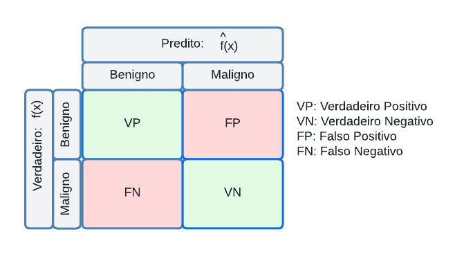

# Classificação de melanoma em imagens de lesões de pele
# Melanoma classification in skin lesions images

## Apresentação

O presente projeto foi originado no contexto das atividades da disciplina de pós-graduação *IA901 - Processamento de Imagens e Reconhecimento de Padrões*, 
oferecida no primeiro semestre de 2023, na Unicamp, sob supervisão da Profa. Dra. Leticia Rittner, do Departamento de Engenharia de Computação e Automação (DCA) da Faculdade de Engenharia Elétrica e de Computação (FEEC).

 |Nome  | RA | Curso|
 |--|--|--|
 | Johsac Isbac Gomez Sanchez  | 216401  | Doutorado em Engenharia Elétrica|
 | Robson Assis Colares  | 264369  | Doutorado em Engenharia Elétrica |
 | Suellen Sena da Silva  | 177261  | Mestrado em Engenharia da Computação|

## Descrição do Projeto

O objetivo do projeto é desenvolver um sistema para classificação de lesões de pele entre malignas e benignas com o uso de arquiteturas de redes neurais convolucionais. O sistema visa fornecer uma ferramenta precisa e eficiente para ajudar na detecção precoce de tumores malignos, contribuindo para o diagnóstico médico e reduzindo a taxa de falsos negativo (ou seja, classificar como benigno lesões que na verdade são malignas). Adicionalmente, garantir que o classificador tenha a sensibilidade (recall) alta também é de extrema importância ao projeto, dado que o tratamento precoce pode ser mais benéfico ao paciente do que não diagnosticá-lo e o tratamento ser tardio. 

  

**Taxa de falso negativo:** 

$$P(\hat{f}(x)=\text{Benigno} | f(x)=\text{Maligno})=\frac{FN}{FN+VN}$$

**Recall:**
$$P(\hat{f}(x)=\text{Maligno} | f(x)=\text{Maligno})=\frac{VN}{FN+VN}$$

Dessa forma, o contexto gerador do projeto consiste no desafio de validar uma arquitetura que consiga classificar lesões de pele em imagens médicas. Com uma base de dados de 33.007 imagens, das quais apenas 582 são de tumores malignos, o projeto enfrenta o desafio de lidar com um conjunto de dados altamente desequilibrado. A classificação precisa dessas imagens é essencial para identificar corretamente os casos malignos e benignos, a fim de fornecer um diagnóstico adequado e tomar decisões de tratamento adequadas.

Portanto, a motivação para esse projeto é a importância da detecção precoce de lesões de pele malignas, como o câncer de pele, que tem maior probabilidade de ser tratado com sucesso se diagnosticado em estágios iniciais. A utilização de arquiteturas de redes neurais convolucionais, combinada com técnicas avançadas de processamento de imagem, permite uma análise mais precisa e automatizada das lesões, reduzindo assim a taxa de falsos negativos. Isso pode auxiliar médicos e especialistas a tomarem decisões mais assertivas, agilizando o processo de diagnóstico e melhorando os resultados dos pacientes.

**Qual problema vocês pretendem solucionar?**

O problema que buscamos resolver é o erro de classificação de lesões malignas classificadas como benignas. Tal erro pode levar a um atraso no diagnóstico e tratamento adequado, o que é fundamental para a saúde e a sobrevida de paciente. Ao desenvolver um sistema de classificação mais preciso, buscamos identificar corretamente os casos de melanoma maligno, o que permitirá a detecção precoce e o tratamento oportuno. 

**Qual a relevância do problema e o impacto da solução do mesmo?**

O câncer de pele é uma das formas mais comuns de câncer em todo o mundo, e a detecção precoce pode gerar um impacto positivo em taxas de mortalidade associadas a lesões malignas de pele. A solução desse problema, por meio do desenvolvimento de um sistema de classificação automatizado, possui certamente um impacto significativo na área médica. Primeiramente, proporciona uma ferramenta automatizada e precisa para auxiliar os médicos no diagnóstico de lesões de pele, aumentando a eficiência e reduzindo a possibilidade de erros humanos. Além disso, ao diminuir a taxa de falsos negativos, o sistema permite uma triagem mais eficiente, identificando corretamente os casos malignos que requerem atenção e tratamento imediato. Essa solução também pode contribuir para a redução dos custos de saúde, uma vez que a detecção precoce e correta pode evitar tratamentos desnecessários e mais invasivos.

# Metodologia

*1. Pré-processamento de dados:*
* Normalização da imagem: aplicar técnicas de normalização para garantir que todas as imagens tenham uma escala e um intervalo de valores consistentes;
* Data augmentation: estudos que avaliam técnicas de aumentação de dados com foco em lesões de pele foram considerados. O conjunto de técnicas envolvem recortes aleatórios na imagem, rotação aleatoria em até 90 graus, cisalhamento, escalar imagens para criar novas formas de lesões, espelhamento e mudança de matiz (Hue). O data augmentation é aplicado com o objetivo de aumentar a diversidade dos dados de treinamento, permitindo que o modelo aprenda a generalizar melhor e a lidar com diferentes variações nos dados de entrada.

*2. Extração de recursos:*

* Extração de recursos baseada em aprendizado profundo: utilização de redes neurais convolucionais (CNNs) pré-treinadas, como ResNet, para extrair recursos de alto nível de imagens.

*3. Avaliação e validação:*

- Divisão de dados: organizar o conjunto de dados em bancos de treinamento, validação e teste para avaliar e validar o desempenho do modelo. 
- Métricas de avaliação: precisão, sensibilidade, acurácia e área sob a curva ROC (AUC) para avaliar a qualidade do discriminador e comparar os resultados obtidos, além da taxa de falsos negativos.

*5. Melhoria e refinamento:*

- Análise de erros: investigar os casos em que nosso modelo cometeu erros e analisaremos as causas subjacentes para identificar possíveis melhorias.

- Ajuste e refinamento do modelo: explorar técnicas relevantes na literatura como esembles, segmentação da lesão na imagem, além de iterações adicionais para ajustar e refinar o modelo com base nos resultados obtidos na etapa validação.

## Bases de Dados e Evolução

Base de Dados | Endereço na Web | Resumo descritivo
----- | ----- | -----
SIIM-ISIC Melanoma Classification | https://www.kaggle.com/competitions/siim-isic-melanoma-classification/data |  O conjunto possui imagens de lesões de pele, tanto de melanomas benignos quanto malignos.

A base possui 88251 imagens do tipo dicom, jpg e tfrecords, totalizando 116.16 GB de tamanho com anotações de identificador exclusivo da imagem, identificador único do paciente, sexo, idade aproximada do paciente no momento da imagem, localização do site com imagem, informações de diagnóstico detalhadas e indicador de malignidade da lesão. Para este projeto, serão utilizadas apenas as imagens jpg, totalizando 33007 arquivos.

Não houve necessidade de reanotação dos dados para o conjunto proposto. No entanto, a base possui 2056 pacientes distintos, onde muitos se repetem por possuir mais de uma lesão de pele. Ainda, é importante ressaltar que, para a separação dos conjuntos de treino e validação, garantiu-se que pacientes repetidos tivessem todas as suas imagens em apenas um dos conjuntos. Dessa forma, não há possibilidade de que a rede treinada confunda a classificação de lesões malignas ou benignas por reconhecer o padrão de pele do paciente nas fotos.

Estatísicas Qualitativas | Proporções
----- | ----- 
Sexo | 52% homens e 48% mulheres
Diagnóstico | 98% benignos e 2% malignos

Estatísticas quantitativas | Mínimo | Máximo | Média
----- | ----- | ----- | -----
Idade | 0 | 90 | 55

# Ferramentas
O projeto será realizado com o auxilio do Google Colab para treinamento das redes com GPUs. Ainda, bibliotecas como:
Keras e Tensorflow, pela facilidade de manuseio dos algoritmos de aprendizado de máquina e processamento de imagens;
Sklearn, para avaliar métricas de resultados dos classificadores;
OS e Shutil, para movimentação dos arquivos entre diretórios;
Numpy, para realização de cálculos diversos;
Matplotlib, utilizada para plotar gráficos variados; e
Draw.IO, para confecção do Workflow.

# Workflow

# Experimentos e Resultados preliminares

Os experimentos foram realizados através de diferentes arquiteturas, tamanhos de batch e transformações de data augmentation. Ainda, devido a quantidade de imagens, os primeiros testes foram realizados em uma amostra de dados menor, visando garantir que as primeiras aplicações iriam ocorrer corretamente ao longo de todo o fluxo de pré processamento, treinamento e validação dos resultados. Dessa forma, os experimentos basearam-se da seguinte forma:

Experimento 1 - CNN com o Conjunto "Benigno" Diminuído 
----- 
Para primeira etapa do projeto, 10% do conjunto foi aleatoriamente selecionado, visando facilitar os primeiros treinamentos e garantir o fluxo do que estava sendo desenvolvido e aplicado. Com o conjunto selecionado e fixado através de uma semente, foi realizada a padronização das imagens, pois o processe garante a normalização das intensidades, reduzir viés e melhorar a estabilidade numérica do processo de treinamento. Ainda, o data augmentation aplicado consiste em testar diferents faixas de deslocamento horizontal e vertical, distorções de cisalhamento aleatórias nas imagens, zoom aleatório e ajustes de brilho e matiz. Por fim, uma rede desenvolvida do zero foi criada, consistindo em camadas convolucionais, normalização por batch, pooling global de média para extrair características da imagem e uma camada densa final para realizar a classificação das imagens. 

Os resultados de acurácia são significativamente bons, porém ainda há o mesmo problema de todas as amostras da classe maligna ser classificada como benigna. 

Experimento 2 - CNN com o Conjunto Completo de Dados
----- 
Com a mesma rede implementada no exemplo anteior, foi realizado o treinamento conjunto de dados completo, considerando exatamente a mesma divisão entre treinamento e validação. Nesse cenário, 24402 imagens foram utilizadas no treinamento da rede e 8608 imagens foram usadas para validação. Também a título de comparação, todas as imagens foram inseridas na rede convolucional com dimensões 224 x 224 e com a aplicação das mesmas técnicas de data augmentation.

Os resultados do experimento anterior persistiram e um dos principais problemas foi o tempo despendido para treinamento da rede neural convolucional. Ainda, obsera-se que a diminuição do desbalanceamento não conduz a um resultado favorável de classificação da classe com menores amostras.

Experimento 3 - Resnet50
----- 
Ao considerar que o nosso principal objetivo é minimizar a taxa de falsos negativos, validamos a aplicação de uma arquitetura mais complexa no conjunto, previamente treinada em imagens. A ResNet50 é uma arquitetura de rede neural convolucional (CNN) proposta em 2015 e ainda muito utilizada. Ela é conhecida por sua capacidade de treinar redes muito profundas com maior eficiência, superando o desafio de degradação do desempenho que ocorre ao aumentar a profundidade da rede. A ResNet50 foi pré-treinada em um grande conjunto de dados chamado ImageNet, que contém mais de um milhão de imagens rotuladas em 1000 classes diferentes. Dessa forma, utilizar essa arquitetura permite aproveitar os recursos de alto nível aprendidos durante o treinamento para extrair características relevantes das imagens e aplicá-las a novas tarefas, como detecção de objetos, segmentação de imagens e muito mais. 

Embora sua complexidade, os resultados apresentados a seguir demonstram a dificuldade de discriminar as lesões de pele entre malignas e benignas. Os ganhos foram de apenas 6 acertos na classe de predizer corretamente lesões malignas. Entretanto, a taxa de falsos positivos foi de 0.04%

# Próximos passos
Estudos recentes avaliam a utilização de arquiteturas de redes neurais com essemble para garantir resultados superiores na classificação de lesões de pele. Dado isso, os próximos passos serao: 

- Construção do ensemble: Crie um ensemble combinando as previsões das redes DenseNet e EfficientNet com o modelo ResNet50. Isso pode ser feito por votação majoritária ou média das probabilidades de classe preditas pelos modelos.
- Validação do ensemble: Avalie o desempenho do ensemble usando o conjunto de validação. Calculando métricas de avaliação e comparando com os resultados obtidos pela ResNet50 individualmente para avaliar se de fato o ensemble melhora a precisão e o desempenho geral do modelo.
- Testar outras técnicas de data augmentation e tamanhos de batch
- Teste e avaliação final: Após ajustar o ensemble e obter resultados satisfatórios na validação, teste o modelo final usando o conjunto de teste separado.

## Referências 
1. Data Augmentation for Skin Lesion Analysis, CoRR 2018, Fábio Perez, Cristina Vasconcelos, Sandra Avila, Eduardo Valle
2. Identifying Melanoma Images using EfficientNet Ensemble: Winning Solution to the SIIM-ISIC Melanoma Classification Challenge, CoRR 2020. Qishen Ha, Bo Liu, Fuxu Liu
3. SIIM-ISIC Melanoma Classification With DenseNet, 2021 IEEE 2nd International Conference on Big Data, Y. Zhang and C. Wang
4. Image classification from scratch,  Kaggle Cats vs Dogs dataset, F. Chollet.
