# `AlzClass - Classificação de Pacientes com Alzheimer e Controles`
# `AlzClass - Classification of Alzheimer and Control Subjects`

## Apresentação

O presente projeto foi originado no contexto das atividades da disciplina de pós-graduação *IA901 - Processamento de Imagens e Reconhecimento de Padrões*, 
oferecida no primeiro semestre de 2023, na Unicamp, sob supervisão da Profa. Dra. Leticia Rittner, do Departamento de Engenharia de Computação e Automação (DCA) da Faculdade de Engenharia Elétrica e de Computação (FEEC).

|Nome  | RA | Curso|
|--|--|--|
| Pedro Piquet | 223251 | Mestrado em Física Aplicada |
| Lais Oliveira  | 159809  | Mestrado em Engenharia Elétrica |
| Fabio Grassiotto  | 890441  | Doutorado em Engenharia Elétrica |

## Descrição do Projeto

A doença de Alzheimer é um transtorno neurodegenerativo progressivo que se manifesta através da deterioração cognitiva e da memória, sintomas neuropsiquiátricos, comprometimento de atividades diárias e alterações na postura comportamental. Quando algumas proteínas do sistema nervoso central do ser humano começam a ter problemas em seu processamento, ocorre uma perda progressiva de neurônios em certas regiões do cérebro, responsáveis pela memória ou pela linguagem, por exemplo. Ou seja, o acometimento dessa doença é diferente do processo de envelhecimento cerebral comum do ser humano. 

A causa do Alzheimer ainda não é conhecida, mas acredita-se que exista a transmissão genética da predisposição para desenvolver a doença e juntamente com outros fatores, é que será determinado se será desencadeada ou não. Uma estimativa é que, hoje, no Brasil, mais de 1 milhão de pessoas vivem com alguma forma de demência e dentro desse 1 milhão, o Alzheimer é responsável por mais da metade dos casos entre as pessoas de idade, principalmente dentro da faixa de 60 a 90 anos. Como já falado, a doença de Alzheimer é progressiva, passando por 4 estágios: estágio 1 -> alterações na memória; estágio 2 -> dificuldade para falar e para coordenar movimentos; estágio 3 -> resistência à execução de tarefas diárias e deficiência motora e estágio 4 -> restrição ao leito. Mesmo sendo possível uma verificação se o paciente se encontra no estágio 1, o período entre os primeiros sintomas e os sintomas mais graves pode ser de cerca de 10 anos.

O diagnóstico da doença é dado através de uma combinação: exclusão de outras doenças através da realização de exames de sangue e de imagem (tomografia ou ressonância magnética) para identificação das modificações cognitivas específicas e acompanhamento de avaliação do estado mental.
Um estudo realizado entre 2015 e 2016 coletou dados que indicaram em sua análise que, em três décadas, a proporção de pessoas com demência aumentou em mais de duas vezes no país. E especificamente a doença de Alzheimer teve um crescimento de 127% na população brasileira, de forma que, continuando nessa crescente, essa doença pode chegar a quadruplicar na população. Cerca de 100 mil novos casos são diagnosticados todo ano e, segundo estimativas, em 2050, poderemos chegar a mais de 130 milhões de pessoas acometidas por essa doença, por conta do envelhecimento da população

Desta forma, este projeto nasceu da motivação de lidarmos com um problema real enfrentado por um grupo de pessoas e oferecer uma solução, de forma a beneficiar a sociedade atual. Nesse contexto, propomos o desenvolvimento de um classificador entre o grupo de pacientes com Alzheimer (nos diferentes níveis) e o grupo de controle, utilizando imagens de ressonância magnética (MRI) e redes neurais.

Imagens de ressonância magnética (MRI) podem ser consideradas como um mapa de energia do próton dentro do tecido do corpo ou partes não ósseas. É uma técnica diferente do raio x ou da tomografia (CT) e as imagens resultantes são imagens anatômicas 3D detalhadas da área que está sendo submetida a essa análise. Essa tecnologia costuma ser usada para detecção de doenças, diagnósticos e também em acompanhamento de tratamentos. 
Hoje em dia, é uma das técnicas mais comumente usadas na área de medical imaging, possibilitando que os especialistas estudem e analisem diversas partes do cérebro e sua anatomia. Acontece da seguinte forma: o próton de hidrogênio dos tecidos do corpo são excitados, de forma que eles emitem sinais eletromagnéticos para a máquina de MRI, a qual identifica a intensidade desse sinais e traduz os mesmos numa imagem MRI em escala de cinza, na qual, as regiões que estão mais brilhantes que a massa cinzenta são hiperintensas e as regiões que estão menos brilhantes são hipointensas.

Nosso objetivo principal é projetar um classificador capaz de classificar os pacientes em quatro categorias: não demente (ND), demente muito leve (MLD), demente leve (LD) e demente moderado (MD). A classificação correta e precisa dos pacientes com Alzheimer é de extrema importância para possibilitar o diagnóstico precoce e o tratamento adequado. Ao aprimorar a acurácia dos resultados obtidos, poderemos contribuir para o avanço da comunidade médica e dos grupos de estudo, proporcionando diagnósticos mais precisos.
A área de classificação de pacientes com Alzheimer tem recebido atenção significativa na comunidade científica, devido à sua relevância no contexto clínico. Nosso projeto visa superar as pesquisas existentes até o momento, buscando obter melhores resultados e oferecer contribuições importantes para aprimorar o diagnóstico por meio de redes neurais dessa condição. Acreditamos que, ao desenvolver um classificador que aperfeiçoe a acurácia dos resultados, poderemos beneficiar os diagnósticos futuros e contribuir para o avanço na área médica e de estudos relacionados ao Alzheimer.

# Metodologia
1. Download & Preparação dos datasets
2. Seleção de slices
3. Balanceamento de classes
4. Data Augmentation
5. Modelos e treinamento
6. Fine tuning
7. Avaliação

Modelos: 
Nós iremos tentar solucionar o problema de classificação utilizando transfer learning, onde arquiteturas de ponta como AlexNet, ResNet e InceptionV4 são inicializadas com pesos pré-treinados provenientes de um treinamento com grandes conjuntos de dados de referência compostos por imagens naturais, e apenas uma parte é ajustada utilizando um pequeno número de imagens de ressonância magnética (MRI). Para essa entrega, iniciamos nossa análise com a AlexNet, por oferecer um bom desempenho comprovado, eficácia na extração de características, capacidade de aprendizado, prevenção de overfitting e acesso a recursos e implementações existentes. Futuramente, nós iremos então, implementar e comparar a performance dessas redes, buscando encontrar qual obtém as melhores métricas de performance em nosso dataset. 

## Bases de Dados e Evolução

Base de Dados | Endereço na Web | Resumo descritivo 
----- | ----- | ----- 
Kaggle Alzheimer MRI Preprocessed Dataset | https://www.kaggle.com/datasets/ sachinkumar413/alzheimer-mri-dataset | O Kaggle é uma plataforma de competições de ciência de dados e uma comunidade online de cientistas de dados e praticantes de aprendizado de máquina.
Open Access Series of Imaging Studies (OASIS) | https://www.oasis-brains.org/ | O OASIS é um projeto que visa tornar conjuntos de dados de neuroimagem do cérebro disponíveis gratuitamente para a comunidade científica. | 
The Alzheimer’s Disease Neuroimaging Initiative (ADNI) | https://adni.loni.usc.edu/about/ | O ADNI é um estudo longitudinal multicêntrico projetado para a detecção precoce e monitoramento da doença de Alzheimer (DA). Permitindo o compartilhamento de dados entre pesquisadores ao redor do mundo. |

- **Kaggle Dataset**

Os dados foram coletados de vários sites/hospitais/repositórios públicos. O conjunto de dados consiste em recortes bidimensionais de imagens MRI pré-processadas (imagem por ressonância magnética). Devido a escassez de informações sobre a origem desse banco de dados, número de indivíduos, pré-processamento e de como foi realizada a seleção das fatias e separação das pastas, optamos por utilizar o Kaggle apenas para uma exploração inicial de nossa tarefa de classificação.

O Dataset tem quatro classes de imagens, com um total de 6.400 fatias bidimensionais selecionados de imagens de ressonância magnética.

- **OASIS Dataset**

O OASIS é uma base de imagens (3D) de ressonância magnética de 416 pacientes entre 18 e 96 anos. Para cada indivíduo, são incluídos 3 ou 4 exames individuais do tipo T1-weighted obtidos em sessões de exame único. Também é providenciado uma imagem pré-processada (Gain-field corrected, atlas registered, brain-masked), gerada a partir da média do sinal dos 3-4 exames de RM, esta foi a imagem que decidimos utilizar em nossa tarefa de classificação. O OASIS possui as mesmas 4 classes que o Kaggle, porém, devido ao baixo número de indivíduos na classe "Demente Moderado", nós decidimos realizar a classificação apenas das 3 classes mais númerosas.

 

*Seleção de fatias*: Escolher os melhores dados possíveis para o treinamento é crucial para o sucesso da classificação. Tipicamente, a partir de um scan de ressonância magnética em 3D, temos um grande número de imagens para escolher. Em muitos dos métodos recentes, as imagens usadas para o treinamento são extraídas aleatoriamente. No entanto, em nosso método proposto, extraímos as fatias mais informativas para treinar a rede. Para isso, calculamos a entropia da imagem de cada fatia. A entropia fornece uma medida de variação em uma fatia. Portanto, se ordenarmos as fatias em termos de entropia em ordem decrescente, as fatias com os maiores valores de entropia podem ser consideradas as imagens mais informativas, e usar essas imagens para treinamento proporcionará robustez ao modelo.

*Balanceamento de classes*: Mesmo reduzindo nossa classificação a 3 classes, ainda havia um grande desbalanceamento entre as classes em certos datasets, para concertar isso, aplicamos um algoritmo de balanceamento de classes. O algoritmo SMOTETomek é uma técnica de amostragem híbrida que combina a Synthetic Minority Over-sampling Technique (SMOTE) e o método Tomek Links. É amplamente utilizado para tratar o desbalanceamento de classes em problemas de classificação. Essa abordagem consiste em duas etapas principais. Primeiro, o algoritmo aplica o SMOTE para gerar novas amostras sintéticas da classe minoritária, a fim de equilibrar a distribuição das classes. Em seguida, ele utiliza o método Tomek Links para identificar e remover amostras ambíguas ou ruidosas presentes nas regiões de sobreposição entre as classes. Isso resulta em um conjunto de dados mais balanceado e de melhor qualidade para treinamento de modelos de aprendizado de máquina. O objetivo final do algoritmo SMOTETomek é melhorar o desempenho dos classificadores ao lidar com problemas de desbalanceamento de classes, proporcionando uma representação mais justa das diferentes classes presentes nos dados.

- **ADNI Dataset**

O ADNI é uma base de imagens (3D) de ressonância magnética de 1154 pacientes entre 60 e 98 anos, separados em 5 classes de acordo com o grau de demência observado em exames clínicos. Para cada indivíduo, possuímos de 4-5 scans individuais do tipo T1-weighted obtidos em sessões de exame distintas. A imagem utilizada em nossa tarefa de classificação foram fatias selecionadas (usando o mesmo método de seleção por entropia) das imagens sem pré-processamento, visto que o subset de imagens já pré-processadas do ADNI não incluiam todos os estágios intermediários que desejávamos classificar. 

# Ferramentas

- Google colaboratory (Google colab) -> https://colab.research.google.com/?hl=pt_BR

Ferramenta utilizada para desenvolvimento dos códigos presentes no projeto. É um ambiente de nuvem hospedado pelo próprio Google, no qual é possível, no mesmo arquivo, ter um código fonte, normalmente escrito em python, e textos descritos, com explicações, imagens, resultados, etc. Esse ambiente também é colaborativo, possibilitando o compartilhamento dos arquivos entre as pessoas. Ele permite que qualquer pessoa com acesso a uma conta Google (gmail) possa criar um arquivo e começar a modificar o mesmo. Essa ferramenta tem sido muito utilizada para pesquisas e projetos de aprendizado de máquina, como também tem sido uma alternativa para aqueles que não desejam ter/rodar/desenvolver esses projetos em suas máquinas locais.

- Nibabel - NeuroImaging in python -> https://nipy.org/nibabel/ 

É um software aberto usado para a manipulação inicial das bases das imagens dos datasets obtidos. Normalmente, ao trabalharmos com imagens, obtemos as mesmas em formatos conhecidos: JPG, PNG. Porém, nos datasets escolhidos para esse projeto, as imagens chegam a nós no formato: nii, por isso a necessidade de usar uma interface específica para isso. Dessa forma, utilizamos essa interface para termos um primeiro acesso às imagens e conseguirmos trabalhar e analisar as mesmas. Para termos uma primeira visualização das imagens, nos baseamos no seguinte link: https://nipy.org/nibabel/nibabel_images.html disponibilizado pelo site da própria interface.

- Pytorch -> https://pytorch.org/ 

Biblioteca usada para o desenvolvimento dos códigos para processamento das imagens, modelo de treinamento e métricas de avaliação. O Pytorch é uma biblioteca Python de código aberto para aprendizado de máquina, implementada em 2016 e sido usada desde então. É uma biblioteca mais fácil de aprender e ajuda em toda a acessibilidade necessária para as redes neurais profundas, seus cálculos e operações. Os cálculos são cálculos de tensores e ela também possibilita a aceleração de GPU. Para ser usado, ele precisa ser instalado na máquina (ou importado para o google colab) e de uma interface para que se possa desenvolver a programação. É necessária também uma base de dados para ser carregada, um modelo de machine learning, um treinamento desse modelo e a avaliação dos resultados.
Para importar o Pytorch e ter um primeiro contato:
https://www.leaky.ai/buildyourfirstneuralnetwork, 
https://colab.research.google.com/github/phlippe/uvadlc_notebooks/blob/master/docs/tutorial_notebooks/tutorial2/Introduction_to_PyTorch.ipynb, 
https://pytorch.org/tutorials/beginner/basics/quickstart_tutorial.html

- TensorFlow -> https://www.tensorflow.org/ 

Biblioteca usada para o desenvolvimento dos códigos para processamento das imagens, modelos de treinamento e métricas de avaliação. O Tensorflow é uma biblioteca de código aberto criada para aprendizado de máquina, sendo hoje uma das principais ferramentas de machine learning e deep learning. Para ser usado, ele precisa ser instalado na máquina (ou importado para o google colab) e de uma interface para que se possa desenvolver a programação. É necessária também uma base de dados para ser carregada, um modelo de machine learning, um treinamento desse modelo e a avaliação dos resultados.
Para importar o tensorflow para o google colab e ter um primeiro contato: 
https://www.tensorflow.org/tutorials/quickstart/beginner?hl=pt-br, 
https://colab.research.google.com/github/tensorflow/docs/blob/master/site/en/tutorials/quickstart/beginner.ipynb

- Keras -> https://keras.io e https://www.tensorflow.org/guide/keras?hl=pt-br

Biblioteca de código aberto de alto nível utilizada para deep learning, para criação de redes neurais e desenvolvida com base no Tensorflow. Para ser usado, ele precisa ser instalado na máquina (ou importado para o google colab) e de uma interface para que se possa desenvolver a programação. É necessária também uma base de dados para ser carregada, um modelo de machine learning, um treinamento desse modelo e a avaliação dos resultados.
Para importar o keras e ter um primeiro contato:
https://didatica.tech/o-que-e-keras-para-que-serve/, 
https://www.tensorflow.org/tutorials/keras/classification?hl=pt-br

- Scikit-learn - https://scikit-learn.org/stable/ 

Biblioteca em python para aplicação de machine learning, utilizada para manipulação das amostras de imagens e métricas de análise.
Para importar e ter um primeiro contato:
https://scikit-learn.org/stable/getting_started.html, 
https://www.tutorialspoint.com/scikit_learn/scikit_learn_quick_guide.htm

- Visual Code Studio - https://code.visualstudio.com/

Ferramenta utilizada para desenvolvimento de código e testes feitos nas máquinas locais dos integrantes do grupo. É um editor de código de código aberto simples e com diversas funcionalidades desenvolvido pela Microsoft.
Tutorial para download e primeiro contato com as funcionalidades:
https://www.devmedia.com.br/introducao-ao-visual-studio-code/34418

- Python - https://www.python.org/

Linguagem de programação de alto nível utilizada para desenvolvimento de códigos utilizados em diversas áreas. Tem uma sintaxe relativamente simples, é de fácil compreensão e hoje em dia é uma das linguagens de programação mais populares nas áreas de tecnologia.
Tutoriais para um primeiro contato:
https://blog.betrybe.com/python/, 
https://www.devmedia.com.br/guia/python/37024

- Google drive -

Serviço de armazenamento na nuvem do Google. Qualquer pessoa que possui um gmail tem acesso ao google drive e pode utilizar de suas funcionalidades

# Workflow
Definimos abaixo o workflow que utilizaremos para a ingestão, pré-processamento e classificação dos dados.

# Experimentos e Resultados preliminares

## Rede AlexNet com a base do Kaggle
Nesta primeira fase do experimento, iremos analisar as imagens disponibilizadas pelo dataset da Kaggle e executaremos classificação utilizando a rede AlexNet, ao longo de 20 épocas.

Os resultados obtidos inicialmente podem ser visualizados nos gráficos abaixo:

Notamos que a melhor acurácia obtida com a base de testes foi de cerca de **0.875**.

## Rede Resnet com a base do Kaggle
Seguindo essa fase do projeto, para fins de comparação, estamos realizando a classificação com a rede Resnet18, ao longo de 20 épocas.

O treinamento com a rede ResNet18 está em fase de testes, para garantirmos que os resultados obtidos não sofreram overfitting. Mas como primeiro resultado, temos que a acurácia obtida foi em torno de **0.97**

# Experimentos e Resultados

Após a exploração do dataset do Kaggle, procedemos aos passos de classificação do dataset do OASIS (OASIS 1) conforme descrito abaixxo.

## Rede pré-treinada AlexNet

Para esta série de experimentos, utilizamos a rede pré-treinada AlexNet executando o *fine-tuning* com as imagens do OASIS.

### Experimento inicial: Classificação de duas classes

Com a base do OASIS, criamos uma divisão simples de duas classes: indivíduos de controle e indivíduos com demência, para validar a eficácia das redes neurais em tratar a classificação.

No arquivo [Classificação 2 classes](/projetos/AlzClass/notebooks/OASIS/unbalanced/redu%C3%A7%C3%A3o%20de%20classes/OASIS_AlexNet_transforms_50epochs_single_2classes.ipynb) executamos esta classificação utilizando para tanto a rede pré-treinada AlexNet. Não foi aplicada nenhuma transformação de imagem nem qualquer otimização de híperparâmetros, para avaliarmos a performance inicial do modelo.

Os resultados de acurácia, perda e acurácia média nas bases de treinamento podem ser visualizados nas imagens a seguir:
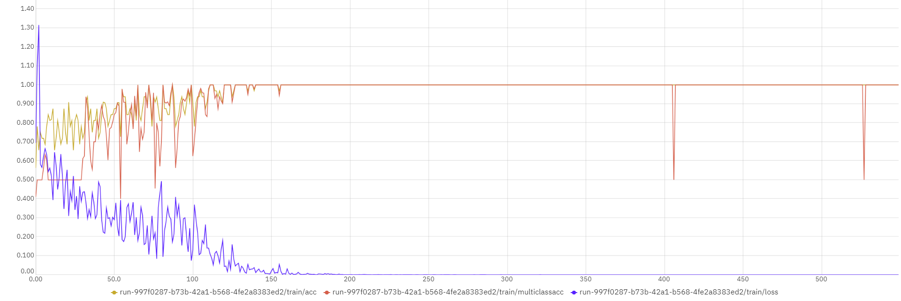
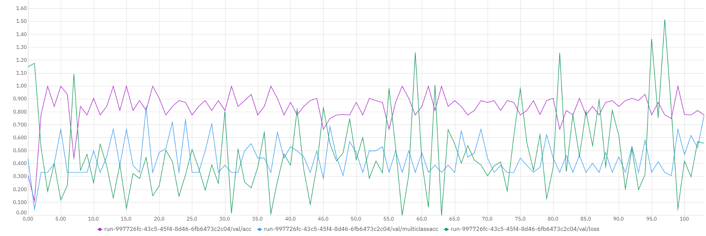

Notamos a convergência rápida na base de treinamento para acurácia de 100%. Na base de validação, o resultado cai ligeiramente, como pode ser verificado no segundo gráfico. Isso se deve ao tamanho da base ser reduzida, o que está trazendo o problema de overfitting na base.

Testando a classificação na base de testes obtemos a matriz de confusão abaixo:
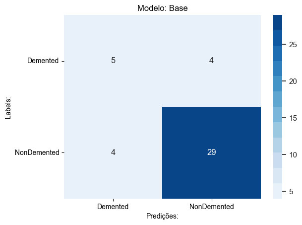

Notamos novamente que a performance inicial da rede neural é muito alta, com um índice de acerto em acima de 80% dos casos.

### Pré-processamento e Ajuste de Híper-Parâmetros

Retornando à base completa do OASIS, que é composta de 4 classes:

- 'MildDemented', com 896 imagens.
- 'ModerateDemented', com 80 imagens.
- 'NonDemented', com 2528 imagens.
- 'VeryMildDemented', com 840 imagens.

Executamos transformações e ajustes de híper-parâmetros do modelo AlexNet.

#### Transformações de imagens

No arquivo [Transformações de imagens](/projetos/AlzClass/notebooks/OASIS/unbalanced/tuning-epochs/OASIS_AlexNet_transforms_50epochs.ipynb) executamos a classificação avaliando o impacto na acurácia, precisão e recall multiclasse ao aplicarmos as transformações/augumentações da base:

- Conversão de imagens para cinza.
- Rotação aleatória de algumas das imagens em até 10 graus.
- Redimensionamento das imagens para o tamanho indicado pela rede AlexNet.
- Centralização das imagens.
- Normalização utilizando média.

Os resultados indicam que a influência de qualquer uma das transformações acima é irrelevante.

**Modelo Base:**

>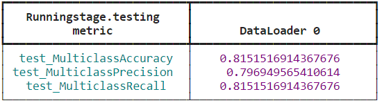

**Tons de Cinza:**

>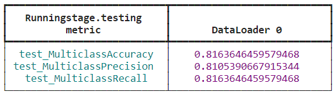

**Rotação Aleatória:**

>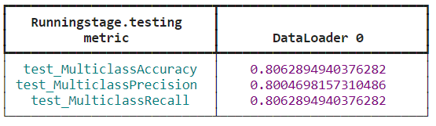

**Centralização:**

>

**Redimensionamento:**

>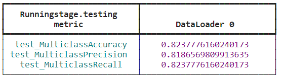

**Normalização:**

>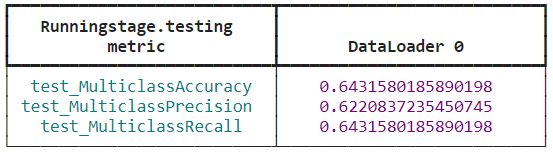

Notamos não só que o impacto de cada uma das transformações é irrelevante como no caso da Normalização temos uma piora sensível no desempenho do modelo.

#### Ajuste da taxa de aprendizado

No arquivo [Taxa de Aprendizado](/projetos/AlzClass/notebooks/OASIS/unbalanced/tuning-lr/OASIS_AlexNet_transforms_50epochs_learn-rate.ipynb)
executamos a classificação avaliando o impacto na acurácia, precisão e recall multiclasse ao modificarmos a taxa de aprendizado utilizada na fase de treinamento.
Para este experimento utilizamos o treinamento em 50 épocas e nenhuma aplicação de transformação de imagens.

**Taxa de aprendizado 0.001**
>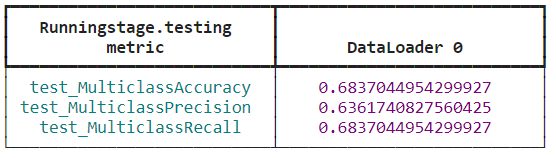

**Taxa de aprendizado 0.0001**
>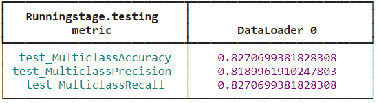

**Taxa de aprendizado 0.00001**
>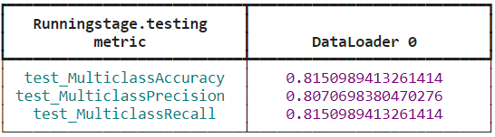

Notamos que o melhor resultado é obtido com a taxa de aprendizado **0.0001**.

#### Ajuste da quantidade de épocas

Na pasta [Ajuste de épocas](/projetos/AlzClass/notebooks/OASIS/unbalanced/tuning-epochs) executamos a classificação avaliando o impacto na acurácia, precisão e recall multiclasse ao modificarmos a quantidade de épocas utilizada no treinamento do modelo.
Para este experimento aplicamos todas as transformações definidas originalmente uma a uma para as quantidades de épocas definidas nos arquivos:

- [50](/projetos/AlzClass/notebooks/OASIS/unbalanced/tuning-epochs/OASIS_AlexNet_transforms_50epochs.ipynb)
- [62](/projetos/AlzClass/notebooks/OASIS/unbalanced/tuning-epochs/OASIS_AlexNet_transforms_62epochs.ipynb)
- [75](/projetos/AlzClass/notebooks/OASIS/unbalanced/tuning-epochs/OASIS_AlexNet_transforms_75epochs.ipynb)
- [87](/projetos/AlzClass/notebooks/OASIS/unbalanced/tuning-epochs/OASIS_AlexNet_transforms_87epochs.ipynb)
- [100](/projetos/AlzClass/notebooks/OASIS/unbalanced/tuning-epochs/OASIS_AlexNet_transforms_100epochs.ipynb)

Os melhores resultados (ainda que com pouca variação em relação ao pior caso) foram obtidos com o treinamento em **62 épocas** e aplicando a transformação de **centralização de imagens**, de acordo com as métricas e a matriz de confusão abaixo.

>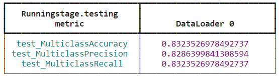
>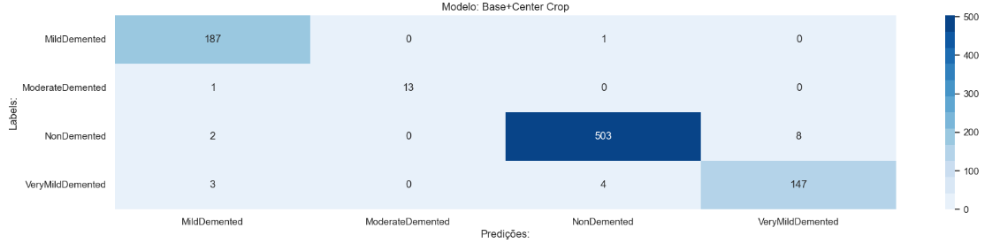

# Discussão 

Durante o desenvolvimento do projeto, a equipe encontrou algumas dificuldades que não estavam claras no período de planejamento. Entre elas podemos destacar a qualidade dos dados disponibilizados de forma pública, o alto desempenho de redes neurais simples no tratamento do problema e a diferença no tratamento das imagens entre as bases. Encontramos, por exemplo, um alto grau de pré-processamento das imagens de ressonância magnética no caso do OASIS, e quase nenhum pré-processamento no caso do ADNI.

Encontramos na literatura algumas metodologias incorretas de manipulação de datasets o que levou à contaminação das bases de teste. Em nossa opinião, isso levou à apresentação de resultados muito acima do real. No início do desenvolvimento do projeto, seguimos algumas dessas orientações incorretas o que levou a resultados incorretos com os experimentos iniciais. Ao analisarmos mais a fundo os nossos códigos computacionais e as metologias empregadas pelos artigos, notamos que haviam imagens pertecentes a um mesmo indivíduo em ambas as bases de treinamento e teste, fazendo com que o modelo aprendesse as características individuais da imagem ao invés das características da categoria. A partir desse conhecimento, empregamos técnicas de separação de pastas para garantir a separação adequada das bases utilizadas. Apesar disso, muitos dos testes iniciais apresentados não puderam ser refeitos diante da limitação de tempo do projeto e portanto devem ser interpretados sabendo da possibilidade de contaminação.

Outro desafio que encontramos foi que as bases disponibilizadas são desbalanceadas, pela própria natureza da patologia. É naturalmente muito difícil encontrar amostras de indivíduos com demência leve nos primeiros estágios da doença, o que leva à dificuldade em obter datasets com um quantidade grande de imagens com esse quadro clínico. Assim como apresentamos na metodologia, empregamos algoritmos de balanceamento de classes e extração de um maior número de fatias para remediar esse problema. Apesar do uso dessas técnicas, aprendemos que um número grande de imagens de um mesmo indivíduo não garante uma maior generalização no processo de treinamento das redes neurais empregadas.

Apesar das dificuldades encontradas, utilizando o banco de dados OASIS conseguimos obter resultados relevantes na classificação das imagens não contaminadas através da classificação binária da patologia. Ademais, conseguimos também uma alta acurácia relativa na separação entre os estágios iniciais e o grupo de controle (classificação de 3 classes).

ADNI...

# Conclusões

- O problema de classificação em Alzheimer é trivial. Redes simples pré-treinadas são capazes de separar classes de pacientes facilmente.
- Os datasets disponíveis de forma aberta fornecem dados com alto nível de pré-processamento o que torna a utilização de outros tipos de pré-processamento de imagem irrelevante para os resultados alcançados.
- Os datasets disponíveis são desbalanceados, o que torna o uso de algoritmos de balanceamento como SMOTE uma alternativa para melhorias de performance dos modelos estudados.

# Trabalhos Futuros

- Sensibilidade de classificação aos estágios iniciais e diagnóstico precoce
- Análise multimodal: imagens funcionais, exames clínicos, idade, gênero, entre outras
- Análise longitudinal e prognósticos 

## Referências
Hon, Marcia, and Naimul Mefraz Khan. "Towards Alzheimer's disease classification through transfer learning." 2017 IEEE International conference on bioinformatics and biomedicine (BIBM). IEEE, 2017.

Szegedy, Christian, et al. "Inception-v4, inception-resnet and the impact of residual connections on learning." Proceedings of the AAAI conference on artificial intelligence. Vol. 31. No. 1. 2017.

Ebrahimi, Amir & Luo, Suhuai. (2021). Convolutional neural networks for Alzheimer’s disease detection on MRI images. Journal of Medical Imaging. 8. 024503. 10.1117/1.JMI.8.2.024503]. 

Bae, J.B., Lee, S., Jung, W. et al. Identification of Alzheimer's disease using a convolutional neural network model based on T1-weighted magnetic resonance imaging. Sci Rep 10, 22252 (2020). https://doi.org/10.1038/s41598-020-79243-9

