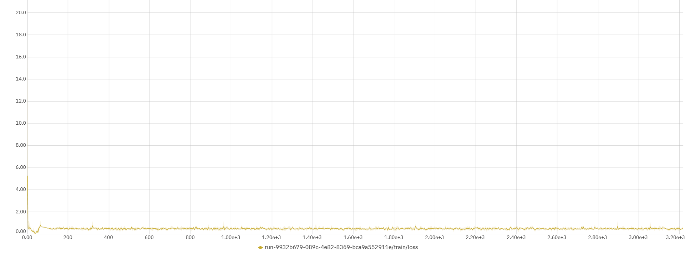
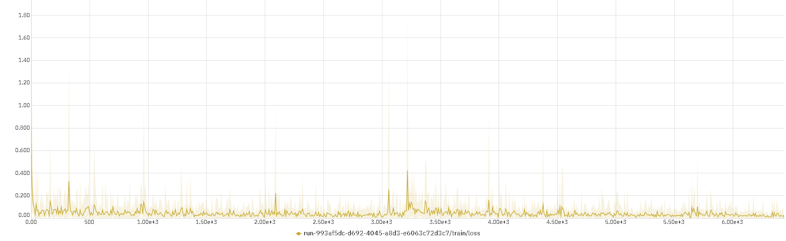

# `AlzClass - Classificação de Pacientes com Alzheimer e Controles`
# `AlzClass - Classification of Alzheimer and Control Subjects`

## Apresentação

O presente projeto foi originado no contexto das atividades da disciplina de pós-graduação *IA901 - Processamento de Imagens e Reconhecimento de Padrões*, 
oferecida no primeiro semestre de 2023, na Unicamp, sob supervisão da Profa. Dra. Leticia Rittner, do Departamento de Engenharia de Computação e Automação (DCA) da Faculdade de Engenharia Elétrica e de Computação (FEEC).

|Nome  | RA | Curso|
|--|--|--|
| Pedro Piquet | 223251 | Mestrado em Física Aplicada |
| Lais Oliveira  | 159809  | Mestrado em Engenharia Elétrica |
| Fabio Grassiotto  | 890441  | Doutorado em Engenharia Elétrica |

## Descrição do Projeto

A doença de Alzheimer é um transtorno neurodegenerativo progressivo que se manifesta através da deterioração cognitiva e da memória, sintomas neuropsiquiátricos, comprometimento de atividades diárias e alterações na postura comportamental. Quando algumas proteínas do sistema nervoso central do ser humano começam a ter problemas em seu processamento, ocorre uma perda progressiva de neurônios em certas regiões do cérebro, responsáveis pela memória ou pela linguagem, por exemplo. Ou seja, o acometimento dessa doença é diferente do processo de envelhecimento cerebral comum do ser humano. 

A causa do Alzheimer ainda não é conhecida, mas acredita-se que exista a transmissão genética da predisposição para desenvolver a doença e juntamente com outros fatores, é que será determinado se será desencadeada ou não. Uma estimativa é que, hoje, no Brasil, mais de 1 milhão de pessoas vivem com alguma forma de demência e dentro desse 1 milhão, o Alzheimer é responsável por mais da metade dos casos entre as pessoas de idade, principalmente dentro da faixa de 60 a 90 anos. Como já falado, a doença de Alzheimer é progressiva, passando por 4 estágios: estágio 1 -> alterações na memória; estágio 2 -> dificuldade para falar e para coordenar movimentos; estágio 3 -> resistência à execução de tarefas diárias e deficiência motora e estágio 4 -> restrição ao leito. Mesmo sendo possível uma verificação se o paciente se encontra no estágio 1, o período entre os primeiros sintomas e os sintomas mais graves pode ser de cerca de 10 anos.

O diagnóstico da doença é dado através de uma combinação: exclusão de outras doenças através da realização de exames de sangue e de imagem (tomografia ou ressonância magnética) para identificação das modificações cognitivas específicas e acompanhamento de avaliação do estado mental.
Um estudo realizado entre 2015 e 2016 coletou dados que indicaram em sua análise que, em três décadas, a proporção de pessoas com demência aumentou em mais de duas vezes no país. E especificamente a doença de Alzheimer teve um crescimento de 127% na população brasileira, de forma que, continuando nessa crescente, essa doença pode chegar a quadruplicar na população. Cerca de 100 mil novos casos são diagnosticados todo ano e, segundo estimativas, em 2050, poderemos chegar a mais de 130 milhões de pessoas acometidas por essa doença, por conta do envelhecimento da população

Desta forma, este projeto nasceu da motivação de lidarmos com um problema real enfrentado por um grupo de pessoas e oferecer uma solução, de forma a beneficiar a sociedade atual. Nesse contexto, propomos o desenvolvimento de um classificador entre o grupo de pacientes com Alzheimer (nos diferentes níveis) e o grupo de controle, utilizando imagens de ressonância magnética (MRI) e redes neurais.

Imagens de ressonância magnética (MRI) podem ser consideradas como um mapa de energia do próton dentro do tecido do corpo ou partes não ósseas. É uma técnica diferente do raio x ou da tomografia (CT) e as imagens resultantes são imagens anatômicas 3D detalhadas da área que está sendo submetida a essa análise. Essa tecnologia costuma ser usada para detecção de doenças, diagnósticos e também em acompanhamento de tratamentos. 
Hoje em dia, é uma das técnicas mais comumente usadas na área de medical imaging, possibilitando que os especialistas estudem e analisem diversas partes do cérebro e sua anatomia. Acontece da seguinte forma: o próton de hidrogênio dos tecidos do corpo são excitados, de forma que eles emitem sinais eletromagnéticos para a máquina de MRI, a qual identifica a intensidade desse sinais e traduz os mesmos numa imagem MRI em escala de cinza, na qual, as regiões que estão mais brilhantes que a massa cinzenta são hiperintensas e as regiões que estão menos brilhantes são hipointensas.

Nosso objetivo principal é projetar um classificador capaz de classificar os pacientes em quatro categorias: não demente (ND), demente muito leve (MLD), demente leve (LD) e demente moderado (MD). A classificação correta e precisa dos pacientes com Alzheimer é de extrema importância para possibilitar o diagnóstico precoce e o tratamento adequado. Ao aprimorar a acurácia dos resultados obtidos, poderemos contribuir para o avanço da comunidade médica e dos grupos de estudo, proporcionando diagnósticos mais precisos.
A área de classificação de pacientes com Alzheimer tem recebido atenção significativa na comunidade científica, devido à sua relevância no contexto clínico. Nosso projeto visa superar as pesquisas existentes até o momento, buscando obter melhores resultados e oferecer contribuições importantes para aprimorar o diagnóstico por meio de redes neurais dessa condição. Acreditamos que, ao desenvolver um classificador que aperfeiçoe a acurácia dos resultados, poderemos beneficiar os diagnósticos futuros e contribuir para o avanço na área médica e de estudos relacionados ao Alzheimer.

# Metodologia
Dataset:
Diversos conjuntos de dados estão disponíveis na internet para classificação de AD. Organizações dedicadas, como ADNI e OASIS, fornecem acesso aos seus conjuntos de dados para fins de pesquisa e educacionais. No entanto, as amostras em ambos os conjuntos de dados estão em formato de imagem tridimensional, e o tamanho dos conjuntos de dados é consideravelmente grande, dificultando o treinamento das redes com os recursos computacionais disponíveis. Dessa forma, para uma análise primária, o conjunto de dados utilizado nesta pesquisa é coletado do Kaggle, o qual contém amostras de pacientes anônimos, apenas com imagens de exames de ressonância magnética (MRI), juntamente com informações sobre suas respectivas classes. Trata-se de um conjunto de dados de várias classes, composto por diferentes visualizações e quatro classes, incluindo uma classe controle ND (Não demente) e outras três classes que representam três diferentes estágios iniciais de AD. Além disso, o tamanho do conjunto de dados é razoável e as imagens já estão limpas, ou seja, redimensionadas e organizadas. O conjunto de dados possui um total de 6400 amostras. As amostras são imagens individuais de três canais (RGB) com dimensões de 176 x 208 pixels, pertencentes a quatro classes diferentes. O número de amostras na classe ND é de 3200. As três classes restantes, MLD (demente muito leve), LD (demente leve) e MD (moderadamente demente), possuem, respectivamente, 2240, 896 e 64 imagens. Um lado negativo desse banco de dados é o desbalance entre o número de amostras das classes, para solucionar esse problema, utilizamos algoritmos que geram dados sintéticos para cada classe desbalanceada (por exemplo, SMOTETOMEK).

Modelos: 
Nós iremos tentar solucionar o problema de classificação utilizando transfer learning, onde arquiteturas de ponta como AlexNet, ResNet e InceptionV4 são inicializadas com pesos pré-treinados provenientes de um treinamento com grandes conjuntos de dados de referência compostos por imagens naturais, e apenas uma parte é ajustada utilizando um pequeno número de imagens de ressonância magnética (MRI). Para essa entrega, iniciamos nossa análise com a AlexNet, por oferecer um bom desempenho comprovado, eficácia na extração de características, capacidade de aprendizado, prevenção de overfitting e acesso a recursos e implementações existentes. Futuramente, nós iremos então, implementar e comparar a performance dessas redes, buscando encontrar qual obtém as melhores métricas de performance em nosso dataset. 

## Bases de Dados e Evolução

Base de Dados | Endereço na Web | Resumo descritivo
----- | ----- | -----
Kaggle Alzheimer MRI Preprocessed Dataset | https://www.kaggle.com/datasets/sachinkumar413/alzheimer-mri-dataset | Dataset do Kaggle para experimentos iniciais
Open Access Series of Imaging Studies (OASIS) | https://www.oasis-brains.org/ | O OASIS (Open Access Series of Imaging Studies) é um projeto que visa tornar conjuntos de dados de neuroimagem do cérebro disponíveis gratuitamente para a comunidade científica. Existem quatro bases disponibilizadas - OASIS 1 a OASIS 4, com OASIS 1 e OASIS 2 consideradas as bases mais apropriadas para projetos acadêmicos.

**Kaggle Dataset**: Os dados são coletados de vários sites/hospitais/repositórios públicos. O conjunto de dados consiste em recortes bidimensionais de imagens MRI pré-processadas (imagem por ressonância magnética). Todas as imagens são redimensionadas em 128 x 128 pixels.

O Dataset tem quatro classes de imagens, com um total de 6.400 imagens de ressonância magnética.
- Classe - 1: Demente Leve (896 imagens)
- Classe - 2: Demente Moderado (64 imagens)
- Classe - 3: Não Demente (3200 imagens)
- Classe - 4: Demente Muito Leve (2240 imagens)

**OASIS1**: De acordo com o website, a OASIS1 é uma base de exames de ressonância magnética de 416 pacientes entre 18 e 96 anos. Para cada indivíduo, são incluídos 3 ou 4 exames individuais do tipo T1-weighted obtidos em sessões de exame único.

Os pacientes são todos destros e incluem homens e mulheres. 100 dos indivíduos incluídos com mais de 60 anos de idade foram diagnosticados clinicamente com doença de Alzheimer (AD) muito leve a moderada. Além disso, um conjunto de dados de confiabilidade é incluído contendo 20 sujeitos não dementes foi adicionado em uma visita subsequente dentro de 90 dias de sua sessão inicial.

**OASIS2**: a OASIS2 é uma base de exames de ressonância magnética de 150 pacientes entre 60 e 96 anos. Cada indivíduo foi escaneado em duas ou mais visitas, separadas por pelo menos um ano, totalizando 373 sessões de imagem. Para cada sujeito, são incluídos 3 ou 4 exames individuais do tipo T1-weighted obtidos em sessões de exame único.

Os pacientes são todos destros e incluem homens e mulheres. 72 dos indivíduos foram caracterizados como não dementes ao longo do estudo, enquanto que 64 dos indivíduos incluídos foram caracterizados como dementes no momento de suas visitas iniciais e permaneceram assim para exames subsequentes, incluindo 51 indivíduos com doença de Alzheimer leve a moderada. Outros 14 indivíduos foram caracterizados como não dementes no momento de sua visita inicial e posteriormente caracterizados como dementes em uma visita posterior.

# Ferramentas

- Google colaboratory (Google colab) -> https://colab.research.google.com/?hl=pt_BR

Ferramenta utilizada para desenvolvimento dos códigos presentes no projeto. É um ambiente de nuvem hospedado pelo próprio Google, no qual é possível, no mesmo arquivo, ter um código fonte, normalmente escrito em python, e textos descritos, com explicações, imagens, resultados, etc. Esse ambiente também é colaborativo, possibilitando o compartilhamento dos arquivos entre as pessoas. Ele permite que qualquer pessoa com acesso a uma conta Google (gmail) possa criar um arquivo e começar a modificar o mesmo. Essa ferramenta tem sido muito utilizada para pesquisas e projetos de aprendizado de máquina, como também tem sido uma alternativa para aqueles que não desejam ter/rodar/desenvolver esses projetos em suas máquinas locais.

- Nibabel - NeuroImaging in python -> https://nipy.org/nibabel/ 

É um software aberto usado para a manipulação inicial das bases das imagens dos datasets obtidos. Normalmente, ao trabalharmos com imagens, obtemos as mesmas em formatos conhecidos: JPG, PNG. Porém, nos datasets escolhidos para esse projeto, as imagens chegam a nós no formato: nii, por isso a necessidade de usar uma interface específica para isso. Dessa forma, utilizamos essa interface para termos um primeiro acesso às imagens e conseguirmos trabalhar e analisar as mesmas. Para termos uma primeira visualização das imagens, nos baseamos no seguinte link: https://nipy.org/nibabel/nibabel_images.html disponibilizado pelo site da própria interface.

- Pytorch -> https://pytorch.org/ 

Biblioteca usada para o desenvolvimento dos códigos para processamento das imagens, modelo de treinamento e métricas de avaliação. O Pytorch é uma biblioteca Python de código aberto para aprendizado de máquina, implementada em 2016 e sido usada desde então. É uma biblioteca mais fácil de aprender e ajuda em toda a acessibilidade necessária para as redes neurais profundas, seus cálculos e operações. Os cálculos são cálculos de tensores e ela também possibilita a aceleração de GPU. Para ser usado, ele precisa ser instalado na máquina (ou importado para o google colab) e de uma interface para que se possa desenvolver a programação. É necessária também uma base de dados para ser carregada, um modelo de machine learning, um treinamento desse modelo e a avaliação dos resultados.
Para importar o Pytorch e ter um primeiro contato:

https://www.leaky.ai/buildyourfirstneuralnetwork
https://colab.research.google.com/github/phlippe/uvadlc_notebooks/blob/master/docs/tutorial_notebooks/tutorial2/Introduction_to_PyTorch.ipynb
https://pytorch.org/tutorials/beginner/basics/quickstart_tutorial.html

- TensorFlow -> https://www.tensorflow.org/ 

Biblioteca usada para o desenvolvimento dos códigos para processamento das imagens, modelos de treinamento e métricas de avaliação. O Tensorflow é uma biblioteca de código aberto criada para aprendizado de máquina, sendo hoje uma das principais ferramentas de machine learning e deep learning. Para ser usado, ele precisa ser instalado na máquina (ou importado para o google colab) e de uma interface para que se possa desenvolver a programação. É necessária também uma base de dados para ser carregada, um modelo de machine learning, um treinamento desse modelo e a avaliação dos resultados.
Para importar o tensorflow para o google colab e ter um primeiro contato: 

https://www.tensorflow.org/tutorials/quickstart/beginner?hl=pt-br
https://colab.research.google.com/github/tensorflow/docs/blob/master/site/en/tutorials/quickstart/beginner.ipynb

- Keras -> https://keras.io e https://www.tensorflow.org/guide/keras?hl=pt-br

Biblioteca de código aberto de alto nível utilizada para deep learning, para criação de redes neurais e desenvolvida com base no Tensorflow. Para ser usado, ele precisa ser instalado na máquina (ou importado para o google colab) e de uma interface para que se possa desenvolver a programação. É necessária também uma base de dados para ser carregada, um modelo de machine learning, um treinamento desse modelo e a avaliação dos resultados.
Para importar o keras e ter um primeiro contato:

https://didatica.tech/o-que-e-keras-para-que-serve/
https://www.tensorflow.org/tutorials/keras/classification?hl=pt-br

- Scikit-learn - https://scikit-learn.org/stable/ 

Biblioteca em python para aplicação de machine learning, utilizada para manipulação das amostras de imagens e métricas de análise.
Para importar e ter um primeiro contato:

https://scikit-learn.org/stable/getting_started.html
https://www.tutorialspoint.com/scikit_learn/scikit_learn_quick_guide.htm

- Visual Code Studio - https://code.visualstudio.com/

Ferramenta utilizada para desenvolvimento de código e testes feitos nas máquinas locais dos integrantes do grupo. É um editor de código de código aberto simples e com diversas funcionalidades desenvolvido pela Microsoft.
Tutorial para download e primeiro contato com as funcionalidades:

https://www.devmedia.com.br/introducao-ao-visual-studio-code/34418

- Python - https://www.python.org/

Linguagem de programação de alto nível utilizada para desenvolvimento de códigos utilizados em diversas áreas. Tem uma sintaxe relativamente simples, é de fácil compreensão e hoje em dia é uma das linguagens de programação mais populares nas áreas de tecnologia.
Tutoriais para um primeiro contato:

https://blog.betrybe.com/python/
https://www.devmedia.com.br/guia/python/37024

- Google drive -

Serviço de armazenamento na nuvem do Google. Qualquer pessoa que possui um gmail tem acesso ao google drive e pode utilizar de suas funcionalidades

# Workflow
Definimos abaixo o workflow que utilizaremos para a ingestão, pré-processamento e classificação dos dados.

# Experimentos e Resultados preliminares

## Rede AlexNet com a base do Kaggle
Nesta primeira fase do experimento, iremos analisar as imagens disponibilizadas pelo dataset da Kaggle e executaremos classificação utilizando a rede AlexNet, ao longo de 20 épocas.

Os resultados obtidos inicialmente podem ser visualizados nos gráficos abaixo:

**Perda na base de treinamento**

**Acurácia na base de treinamento**

**Perda na base de testes**

**Acurácia na base de testes**

Notamos que a melhor acurácia obtida com a base de testes foi de cerca de **0.875**.

## Rede Resnet com a base do Kaggle
Seguindo essa fase do projeto, para fins de comparação, estamos realizando a classificação com a rede Resnet18, ao longo de 20 épocas.

Os resultados são apresentados nos gráficos abaixo:

**Perda na base de treinamento**

**Acurácia na base de treinamento**

**Perda na base de testes**

**Acurácia na base de testes**

O treinamento com a rede ResNet18 está em fase de testes, para garantirmos que os resultados obtidos não sofreram overfitting. Mas como primeiro resultado, temos que a acurácia obtida foi em torno de **0.97**

# Próximos passos
- Treinar e avaliar outras redes neurais (ResNet, InceptionV4) no dataset do kaggle. (1 semana)
- Expandir nossa análise para o dataset do OASIS, desenvolvendo uma pipeline apropriada para a ingestão deste formato de dados. (1 semana)
- Executar o workflow definido pelo projeto na nova base de dados. (1 semana)
- Analisar e apresentar os resultados obtidos com as nova rede e dataset, comparando com os resultados iniciais da base do Kaggle (1 semana)

## Referências
Hon, Marcia, and Naimul Mefraz Khan. "Towards Alzheimer's disease classification through transfer learning." 2017 IEEE International conference on bioinformatics and biomedicine (BIBM). IEEE, 2017.

Szegedy, Christian, et al. "Inception-v4, inception-resnet and the impact of residual connections on learning." Proceedings of the AAAI conference on artificial intelligence. Vol. 31. No. 1. 2017.

Ebrahimi, Amir & Luo, Suhuai. (2021). Convolutional neural networks for Alzheimer’s disease detection on MRI images. Journal of Medical Imaging. 8. 024503. 10.1117/1.JMI.8.2.024503]. 

Bae, J.B., Lee, S., Jung, W. et al. Identification of Alzheimer's disease using a convolutional neural network model based on T1-weighted magnetic resonance imaging. Sci Rep 10, 22252 (2020). https://doi.org/10.1038/s41598-020-79243-9

