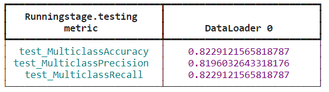

# `AlzClass - Classificação de Pacientes com Alzheimer e Controles`
# `AlzClass - Classification of Alzheimer and Control Subjects`

## Apresentação

O presente projeto foi originado no contexto das atividades da disciplina de pós-graduação *IA901 - Processamento de Imagens e Reconhecimento de Padrões*, 
oferecida no primeiro semestre de 2023, na Unicamp, sob supervisão da Profa. Dra. Leticia Rittner, do Departamento de Engenharia de Computação e Automação (DCA) da Faculdade de Engenharia Elétrica e de Computação (FEEC).

|Nome  | RA | Curso|
|--|--|--|
| Pedro Piquet | 223251 | Mestrado em Física Aplicada |
| Lais Oliveira  | 159809  | Mestrado em Engenharia Elétrica |
| Fabio Grassiotto  | 890441  | Doutorado em Engenharia Elétrica |

## Descrição do Projeto

A doença de Alzheimer é um transtorno neurodegenerativo progressivo que se manifesta através da deterioração cognitiva e da memória, sintomas neuropsiquiátricos, comprometimento de atividades diárias e alterações na postura comportamental. Quando algumas proteínas do sistema nervoso central do ser humano começam a ter problemas em seu processamento, ocorre uma perda progressiva de neurônios em certas regiões do cérebro, responsáveis pela memória ou pela linguagem, por exemplo. Ou seja, o acometimento dessa doença é diferente do processo de envelhecimento cerebral comum do ser humano. 

A causa do Alzheimer ainda não é conhecida, mas acredita-se que exista a transmissão genética da predisposição para desenvolver a doença e juntamente com outros fatores, é que será determinado se será desencadeada ou não. Uma estimativa é que, hoje, no Brasil, mais de 1 milhão de pessoas vivem com alguma forma de demência e dentro desse 1 milhão, o Alzheimer é responsável por mais da metade dos casos entre as pessoas de idade, principalmente dentro da faixa de 60 a 90 anos. Como já falado, a doença de Alzheimer é progressiva, passando por 4 estágios: estágio 1 -> alterações na memória; estágio 2 -> dificuldade para falar e para coordenar movimentos; estágio 3 -> resistência à execução de tarefas diárias e deficiência motora e estágio 4 -> restrição ao leito. Mesmo sendo possível uma verificação se o paciente se encontra no estágio 1, o período entre os primeiros sintomas e os sintomas mais graves pode ser de cerca de 10 anos.

O diagnóstico da doença é dado através de uma combinação: exclusão de outras doenças através da realização de exames de sangue e de imagem (tomografia ou ressonância magnética) para identificação das modificações cognitivas específicas e acompanhamento de avaliação do estado mental.
Um estudo realizado entre 2015 e 2016 coletou dados que indicaram em sua análise que, em três décadas, a proporção de pessoas com demência aumentou em mais de duas vezes no país. E especificamente a doença de Alzheimer teve um crescimento de 127% na população brasileira, de forma que, continuando nessa crescente, essa doença pode chegar a quadruplicar na população. Cerca de 100 mil novos casos são diagnosticados todo ano e, segundo estimativas, em 2050, poderemos chegar a mais de 130 milhões de pessoas acometidas por essa doença, por conta do envelhecimento da população

Desta forma, este projeto nasceu da motivação de lidarmos com um problema real enfrentado por um grupo de pessoas e oferecer uma solução, de forma a beneficiar a sociedade atual. Nesse contexto, propomos o desenvolvimento de um classificador entre o grupo de pacientes com Alzheimer (nos diferentes níveis) e o grupo de controle, utilizando imagens de ressonância magnética (MRI) e redes neurais.

Imagens de ressonância magnética (MRI) podem ser consideradas como um mapa de energia do próton dentro do tecido do corpo ou partes não ósseas. É uma técnica diferente do raio x ou da tomografia (CT) e as imagens resultantes são imagens anatômicas 3D detalhadas da área que está sendo submetida a essa análise. Essa tecnologia costuma ser usada para detecção de doenças, diagnósticos e também em acompanhamento de tratamentos. 
Hoje em dia, é uma das técnicas mais comumente usadas na área de *medical imaging*, possibilitando que os especialistas estudem e analisem diversas partes do cérebro e sua anatomia. Acontece da seguinte forma: o próton de hidrogênio dos tecidos do corpo são excitados, de forma que eles emitem sinais eletromagnéticos para a máquina de MRI, a qual identifica a intensidade desse sinais e traduz os mesmos numa imagem MRI em escala de cinza, na qual, as regiões que estão mais brilhantes que a massa cinzenta são hiperintensas e as regiões que estão menos brilhantes são hipointensas.

Nosso objetivo principal é projetar um classificador capaz de classificar os pacientes em quatro categorias: não demente (ND), demente muito leve (MLD), demente leve (LD) e demente moderado (MD). A classificação correta e precisa dos pacientes com Alzheimer é de extrema importância para possibilitar o diagnóstico precoce e o tratamento adequado. Ao aprimorar a acurácia dos resultados obtidos, poderemos contribuir para o avanço da comunidade médica e dos grupos de estudo, proporcionando diagnósticos mais precisos.
A área de classificação de pacientes com Alzheimer tem recebido atenção significativa na comunidade científica, devido à sua relevância no contexto clínico. Nosso projeto visa superar as pesquisas existentes até o momento, buscando obter melhores resultados e oferecer contribuições importantes para aprimorar o diagnóstico por meio de redes neurais dessa condição. Acreditamos que, ao desenvolver um classificador que aperfeiçoe a acurácia dos resultados, poderemos beneficiar os diagnósticos futuros e contribuir para o avanço na área médica e de estudos relacionados ao Alzheimer.

# Metodologia

Esse projeto foi desenvolvido em etapas que estão destacadas a seguir

1. *Download & Preparação dos datasets*

O *download* dos conjuntos de dados é realizado nos próprios sites do Kaggle, OASIS e ADNI, de forma que os mesmos vêm separado na pasta referente a cada indivíduo. Como preparação/organização do *dataset*, pegamos somente as imagens referentes a ressonância, no formato o qual iremos manipular (por exemplo, no OASIS, usamos as imagens em formato .nii) e adicionamos de todas essas imagens em nossos drive de projeto, para que pudéssemos usá-las no desenvolvimento dos códigos. Cada imagem dos *datasets* escolhidos precisou passar pelas etapas de processamentos descritos nos próximos tópicos, para que as mesmas estivessem padronizadas para que fosse possível a utilização delas no treinamento de redes. A escolha de utilizar fatias bidimensionais invés das imagens volumétricas se deu pelo fato de que o número de imagens tridimensionais ser consideravelmente grande, dificultando o treinamento das redes com os recursos computacionais disponíveis. Além disso, encontramos na literatura, análises comparativas mostrando que a performance de classificação com as fatias 2D era comparável ao uso das imagens 3D. A necessidade do balanceamento de classes se deu pelo fato de que alguns dos conjuntos de dados utilizados apresentavam um desbalance considerável entre as quantidades de amostras de cada classe. A necessidade do pré-processamento se deu pelas exigências relacionadas a redes usadas, para que as imagens estivessem de acordo com o formato reconhecido pelas redes. As técnicas de *data augmentation* nos auxiliaram em todo o processo para diversificar o set de treinamento e evitar *overfitting*, verificamos também sistematicamente a influência dessas transformações no treinamento das redes. Por fim, em todos os resultados apresentados nesse relatório, dividimos o conjunto de dados para o treinamento dos modelos na seguinte proporção: 70% treino, 15% validação e 15% teste. Uma atenção especial a separação das pastas train/val/test se fez necessária para evitar a contaminação das bases. Para isso, empregamos algoritmos semi-aleatórios que separavam os datasets de uma forma que garantia que fatias de um mesmo indivíduo nunca estivessem presentes em mais de uma única base.

2. *Seleção de fatias*

Escolher os melhores dados possíveis para o treinamento é crucial para o sucesso da classificação. Tipicamente, a partir de um *scan* de ressonância magnética em 3D, temos um grande número de imagens para escolher. Em muitos dos métodos recentes, as imagens usadas para o treinamento são extraídas aleatoriamente. No entanto, em nosso método proposto, extraímos as fatias mais informativas para treinar a rede. Para isso, calculamos a entropia da imagem de cada fatia. A entropia fornece uma medida de variação em uma fatia. Portanto, se ordenarmos as fatias em termos de entropia em ordem decrescente, as fatias com os maiores valores de entropia podem ser consideradas as imagens mais informativas, e usar essas imagens para treinamento proporcionará robustez ao modelo.

3. *Balanceamento de classes*

Mesmo reduzindo nossa classificação a 3 classes, ainda havia um grande desbalanceamento entre as classes em certos *datasets* e para consertar isso, aplicamos um algoritmo de balanceamento de classes. O algoritmo SMOTETomek é uma técnica de amostragem híbrida que combina a *Synthetic Minority Over-sampling Technique* (SMOTE) e o método Tomek Links. É amplamente utilizado para tratar o desbalanceamento de classes em problemas de classificação. Essa abordagem consiste em duas etapas principais. Primeiro, o algoritmo aplica o SMOTE para gerar novas amostras sintéticas da classe minoritária, a fim de equilibrar a distribuição das classes. Em seguida, ele utiliza o método Tomek Links para identificar e remover amostras ambíguas ou ruidosas presentes nas regiões de sobreposição entre as classes. Isso resulta em um conjunto de dados mais balanceado e de melhor qualidade para treinamento de modelos de aprendizado de máquina. O objetivo final do algoritmo SMOTETomek é melhorar o desempenho dos classificadores ao lidar com problemas de desbalanceamento de classes, proporcionando uma representação mais justa das diferentes classes presentes nos dados.

4. *Pré-processamento*

Uma das etapas necessárias para prepararmos o conjunto de dados para o treinamento das redes é a etapa de pré-processamento, na qual, técnicas necessárias são aplicadas em cada imagem, para que o treinamento seja possível. Por vezes, sem essa etapa, as imagens não estão padronizadas para o que as redes pedem como entrada, impossibilitando e/ou prejudicando o treinamento e o desempenho da rede. 
Para as redes que escolhemos trabalhar nesse projeto, as imagens precisaram passar por duas etapas de pré-processamento:
- redimensionamento das imagens (*resize*) do *dataset* OASIS para o tamanho 256, para treinar a rede AlexNet (esse pré-processamento é feito quando os pesos pré-treinados da rede são carregados)
- redimensionamento das imagens (*resize*) do *dataset* ADNI e OASIS para o tamanho 176x208, para treinar a rede ADDNet
- redimensionamento das imagens (*resize*) do *dataset* ADNI para o tamanho 256x176, para treinar a rede AlexNet
- normalização das imagens do *dataset* OASIS e ADNI com mean = [0.485, 0.456, 0.406] and std=[0.229, 0.224, 0.225] para o treinamento da rede AlexNet
- normalização das imagens do *dataset* ADNI com a operação 1./255, de forma que os *pixels* das imagens ficam na faixa de [0,1]

5. *Data Augmentation*

Após passar pela etapa de pré-processamento, os conjuntos de dados foram submetidos a uma série de técnicas de *data augmentation* (transformações aplicadas nas imagens), para que pudéssemos analisar quais auxiliam na melhora do desempenho das redes que estavam sendo treinadas. Aplicamos uma a uma dessas transformações, visualizando o antes e o depois das imagens, para garantir que a transformação estava sendo aplicada. E, para cada transformação, realizamos o treinamento das redes e comparamos os resultados obtidos. 
Após a leitura de alguns *papers* e materiais, verificamos que o melhor caminho a seguir na escolha dessas técnicas seria aplicar transformações simples, nada muito elaborado, como por exemplo, adição de um ruído, o processo de *padding*, técnicas simples mas que poderiam auxiliar na melhora do desempenho. Sendo assim, aplicamos as seguintes lista de transformações:
- conversão de imagens para cinza (*grayscale*)
- rotação aleatória de algumas das imagens em até 10 graus
- redimensionamento das imagens para o tamanho indicado pela rede AlexNet
- centralização das imagens
- normalização utilizando média
- adição de ruído gaussiano e *padding* (para o treinamento com a rede ResNet18)

6. *Modelos e treinamento*

Passado por todo o processo de manipulação do conjunto de dados, partimos para a parte de treinamento das redes, para análise do desempenho de cada uma delas. 
Inicialmente, pensamos em testar em mais de uma rede neural e comparar as diferentes performances. Para isso, selecionamos 3 redes: AlexNet, ResNet e Inception V4, sendo essas escolhas, baseadas em papers encontrados durante a primeira fase do projeto. Após a segunda entrega e feedback da professora, escolhemos permanecer somente com a rede AlexNet, pois ela já estava apresentando um bom desempenho e focar nossos esforços nas etapas de pré-processamento das imagens e o estudo da influência das transformações nessas imagens. Um adendo muito importante quanto às redes neurais que havíamos escolhido diz respeito a dificuldade que encontramos de obter informações em relação a rede InceptionV4. Em nossas pesquisas, apesar de nos depararmos com artigos falando sobre o uso da mesma para essa finalidade, tivemos muita dificuldade em encontrar materiais, tutoriais e/ou códigos que nos auxiliassem com informações, principalmente na manipulação da sua última camada, para obter a classificação multiclasses.

Durante o desenvolvimento, nos deparamos com um outro trabalho que também tinha a finalidade de classificação, no qual era proposta e disponibilizada uma nova arquitetura de rede, chamada ADDNet (*Alzheimer’s Disease Detection Network*). Assim, decidimos por testá-la também, para verificar esses primeiros resultados. Porém, no meio do caminho, nos deparamos com um problema em relação a uma possível contaminação dos *datasets* (problema que demoramos um tempo pra identificarmos e isso nos custou algumas semanas do projeto) de forma que os testes realizados com o *dataset* OASIS na rede AlexNet, não tinham melhora nem piora, havíamos chegado a um ponto ótimo. Porém, isso aconteceu logo com o primeiro treinamento e sem nenhuma transformação aplicada às imagens do *dataset*.  
Diante desse resultado, decidimos então testar com mais uma rede, para verificar se o comportamento permanecia o mesmo ou se era simplesmente uma escolha de rede que não estava propícia ao projeto que estávamos desenvolvendo. Assim, escolhemos então por uma ResNet (como pensado inicialmente), para fazer esse teste complementar. Por ser uma rede mais conhecida, muito utilizada no meio, optamos por trilhar esse caminho, selecionando uma ResNet que tivesse um número menor de parâmetros, dentre as opções e com isso, escolhemos a ResNet18. Ao fim, realizamos paralelamente, testes com três redes neurais: AlexNet, ResNet18 e ADDNe, de forma que os testes fossem semelhantes, com o objetivo de termos uma boa base de comparação entre as três.  

Esses testes/treinamentos realizados com as redes foram constituídos de algumas etapas, para que pudéssemos trilhar um caminho para seguir com o projeto e analisar os resultados que eram obtidos etapa a etapa.
- treinamento preliminar: inicialmente, como uma análise primária de modelos e *dataset*, realizamos o treinamento das redes com o conjunto de dados disponibilizado pelo Kaggle (esses resultados preliminares, estão indicados nos resultados preliminares mais a frente neste relatório e também fazem parte da nossa segunda entrega do projeto), o qual contém amostras de pacientes anônimos, apenas com imagens de exames de ressonância magnética (MRI), juntamente com informações sobre suas respectivas classes. Trata-se de um conjunto de dados de várias classes, composto por diferentes visualizações e quatro classes, incluindo uma classe controle ND (Não demente) e outras três classes que representam três diferentes estágios iniciais de doença de Alzheimer. Além disso, o tamanho do conjunto de dados é razoável e as imagens já estão limpas, ou seja, redimensionadas e organizadas.
- treinamento das redes AlexNet e ResNet18 com OASIS: 
  - treinamos as redes com múltiplas fatias das imagens do *dataset* OASIS sem nenhuma transformação, para verificar o desempenho inicial das redes
  - treinamos as redes com múltiplas fatias das imagens do *dataset* OASIS passando por diferentes transformações (indicadas na seção anterior “*Data Augmentation*”), para verificar quais delas melhoraria o desempenho
  - após descobrirmos o problema com a possível contaminação do *dataset*, fizemos a separação das slices e pastas, garantindo que teriam indivíduos únicos em cada pasta e fizemos o treinamento desse novo formato do *dataset* nas redes AlexNet e ResNet18
  - “montamos” um novo conjunto de dados, pegando somente a fatia 01 de cada indivíduo e treinamos as redes AlexNet e ResNet18, para verificar o desempenho das redes, porém, nos deparamos com outro problema nesse caso, pois uma das classes ficou apenas com duas amostras, o que nos impossibilitou de realizar um treinamento eficiente
  - mesmo exigindo recursos computacionais melhores, fizemos o treinamento do *dataset* completo, sem a seleção das fatias
  - fizemos o balanceamento das classes através da função de perda, para verificar se isso influenciaria no desempenho das redes e treinamos as mesmas
  - decidimos por excluir a classe com duas amostras e seguimos com treinamento das redes para três classes
  - reproduzimos alguns testes com taxa de aprendizagem (*learning rate*) menor
  - todos os testes citados acima foram realizados para diversas quantidades de épocas: 20, 50, 75, 100
- treinamento ADDNet com OASIS:
  - treinamos a rede ADDNet com o  *dataset* OASIS com 3 classes (excluindo a classe que tinham duas amostras) sem nenhuma transformação
  - os testes foram realizados para diferentes quantidades de épocas
- treinamento ADDNet com ADNI:
  - treinamos a rede com apenas 10 épocas e sem nenhuma transformação no *dataset*, para verificar o desempenho dessa rede
  - treinamos a rede com o *dataset* usando somente uma fatia de cada imagem
  - treinamos a rede com múltiplas fatias mas garantindo a não contaminação das pastas
  - treinamos a rede utilizando algoritmo de balanceamento (citado anteriormente)
  - os testes foram realizados para diferentes quantidades de épocas

7. *Fine tuning*

A técnica de *fine tuning* carrega os pesos pré-treinados nos conjuntos de dados novos que estão sendo usados para o treinamento das redes. Para o nosso projeto, uma das abordagens foi usar redes pré-treinadas nas amostras do conjunto de dados OASIS. Tanto a rede AlexNet quanto a rede ResNet18, nos possibilitam a opção de usar os pesos do pré-treinamento.

8. *Avaliação*

Temos como última etapa a análise dos resultados obtidos em relação ao desempenho das redes. A cada treinamento realizado, analisamos as métricas de avaliação, para conseguirmos prosseguir com o projeto, entender se estávamos no caminho certo, se as transformações estavam influenciando de alguma forma ou se precisávamos mudar as nossas abordagens. Como comentado anteriormente, a classificação proposta é uma classificação multiclasses na qual os conjuntos de dados utilizados possuem, além da classe de controle, outras classes que representam níveis iniciais da doença de Alzheimer. 
Então, para avaliar os desempenhos obtidos, utilizamos as seguintes métricas apropriadas para a classificação multiclasses:
- Acurácia de multiclasse -> dada pela fórmula: (verdadeiro positivo + verdadeiros negativos)/(número total de previsões)

A acurácia fornece uma primeira estimativa de perfomance, representando o quanto o modelo acertou na classificação de cada classe ou a média entre elas. A acurácia por si só não fornece uma imagem completa do desempenho do modelo, especialmente ao lidar com conjuntos de dados desbalanceados, nos quais a distribuição das classes é desigual. Nesses casos, um valor de acurácia alto pode ser enganoso se o modelo estiver enviesado em relação à classe majoritária e tiver um desempenho ruim na classe minoritária. Dessa forma, torna-se vital para a avaliação de um modelo considerar as diversas métricas expostas abaixo.

- Precisão de multiclasse -> dada pela fórmula: (verdadeiro positivo)/(verdadeiro positivo + falso positivo)

A precisão representa a capacidade de um classificador identificar corretamente instâncias positivas entre todas as instâncias classificadas como positivas. Em outras palavras, a precisão mede a acurácia do classificador na classificação de instâncias positivas.
- *Recall* de multiclasse -> dada pela fórmula: (verdadeiro positivo)/(verdadeiro positivo + falso negativo)

A *recall*, também conhecida como sensibilidade ou taxa de verdadeiros positivos, representa a capacidade de um classificador identificar corretamente todas as instâncias positivas a partir das instâncias positivas reais no conjunto de dados. A *recall* mede a capacidade do classificador em capturar corretamente instâncias positivas.
- *F1-score* de multiclasse -> dada pela fórmula:  2 * (precisão * recall) / (precisão + recall)

O F1-*score* é obtido a partir da média harmônica da precisão e da *recall*, combinando as duas métricas em um único valor. Essa métrica fornece uma avaliação equilibrada do desempenho de um classificador, considerando tanto a precisão quanto a *recall*. O F1-*score* é particularmente útil quando a distribuição das classes é desequilibrada, pois ele dá peso igual à precisão e à *recall*, ambas as quais são afetadas pelo desbalanço de classes.
- Curva *Receiver Operating Characteristic (ROC)*

A Curva ROC no caso de classificação binária é criada traçando-se a taxa de verdadeiros positivos (TPR) no eixo y em relação à taxa de falsos positivos (FPR) no eixo x. A curva ROC fornece uma representação visual do desempenho do classificador para diferentes limiares de discriminação. Quanto mais próxima a curva estiver do canto superior esquerdo do gráfico, melhor será o desempenho do classificador. Esse desempenho é medido pela área abaixo, da curva, a qual assume valor 1 para classificadores perfeitos e 0.5 para um classificador aleatório.

A curva ROC também pode ser estendida para problemas de classificação multiclasse. Existem abordagens diferentes para construir uma curva ROC para problemas multiclasse, incluindo as estratégias um-contra-todos (também conhecida como um-contra-restante) e um-contra-um. Em nosso projeto optamos por utilizar a abordagem um-contra-todos, na qual construímos vários classificadores binários, cada um treinado para distinguir uma classe das demais classes. Em seguida, calculamos a curva ROC para cada classificador binário, tratando-o como um problema de classificação binária separado. As curvas ROC resultantes podem ser plotadas juntas, e o desempenho pode ser avaliado com base na macro-*averaging* ou micro-*averaging* da TPR e FPR entre as classes.

Além dessas métricas, conforme os treinamentos eram realizados, analisamos também a curva de acurácia e de perda, tanto para o conjunto de treinamento quanto para o conjunto de validação, para verificar como estava o comportamento da rede a cada transformação que era realizada. Para completar as análises, usamos também as matrizes de confusão, plotadas para verificarmos quantas amostras estavam sendo classificadas de forma correta e quantas amostras estavam sendo classificadas erradas.

## Bases de Dados e Evolução

Base de Dados | Endereço na Web | Resumo descritivo 
----- | ----- | ----- 
Kaggle Alzheimer MRI Preprocessed Dataset | https://www.kaggle.com/datasets/ sachinkumar413/alzheimer-mri-dataset | O Kaggle é uma plataforma de competições de ciência de dados e uma comunidade online de cientistas de dados e praticantes de aprendizado de máquina.
Open Access Series of Imaging Studies (OASIS) | https://www.oasis-brains.org/ | O OASIS é um projeto que visa tornar conjuntos de dados de neuroimagem do cérebro disponíveis gratuitamente para a comunidade científica. | 
The Alzheimer’s Disease Neuroimaging Initiative (ADNI) | https://adni.loni.usc.edu/about/ | O ADNI é um estudo longitudinal multicêntrico projetado para a detecção precoce e monitoramento da doença de Alzheimer (DA). Permitindo o compartilhamento de dados entre pesquisadores ao redor do mundo. |

- **Kaggle Dataset**

Os dados foram coletados de vários sites/hospitais/repositórios públicos. O conjunto de dados consiste em recortes bidimensionais de imagens MRI pré-processadas (imagem por ressonância magnética). Devido a escassez de informações sobre a origem desse banco de dados, número de indivíduos, pré-processamento e de como foi realizada a seleção das fatias e separação das pastas, optamos por utilizar o Kaggle apenas para uma exploração inicial de nossa tarefa de classificação.

O Dataset tem quatro classes de imagens, com um total de 6.400 fatias bidimensionais selecionados de imagens de ressonância magnética.

- **OASIS Dataset**

O OASIS é uma base de imagens (3D) de ressonância magnética de 416 pacientes entre 18 e 96 anos. Para cada indivíduo, são incluídos 3 ou 4 exames individuais do tipo T1-weighted obtidos em sessões de exame único. Também é providenciado uma imagem pré-processada (Gain-field corrected, atlas registered, brain-masked), gerada a partir da média do sinal dos 3-4 exames de RM, esta foi a imagem que decidimos utilizar em nossa tarefa de classificação. O OASIS possui as mesmas 4 classes que o Kaggle, porém, devido ao baixo número de indivíduos na classe "Demente Moderado", nós decidimos realizar a classificação apenas das 3 classes mais númerosas.

 

Exemplo de fatias retiradas de imagens OASIS pré-processadas e suas respectivas classes:

Exemplo de fatias retiradas de imagens OASIS pré-processadas e suas respectivas classes após transformações de data augmentation:

- **ADNI Dataset**

O ADNI é uma base de imagens (3D) de ressonância magnética de 1154 pacientes entre 60 e 98 anos, separados em 5 classes de acordo com o grau de demência observado em exames clínicos. Para cada indivíduo, possuímos de 4-5 scans individuais do tipo T1-weighted obtidos em sessões de exame distintas. A imagem utilizada em nossa tarefa de classificação foram fatias selecionadas (usando o mesmo método de seleção por entropia) das imagens sem pré-processamento, visto que o subset de imagens já pré-processadas do ADNI não incluiam todos os estágios intermediários que desejávamos classificar. 

Exemplo de fatias retiradas de imagens ADNI sem pré-processamento e suas respectivas classes:

Nota-se que as imagens ADNI, devido a ausência de pré-processamento (sem registramento em atlas e segmentação do volume cerebral), aparentam ser mais heterogêneas e ruídosas, o que pode explicar problemas com overfitting e baixa acurácia de classificação expostos abaixos.

# Ferramentas

- Google colaboratory (Google colab) -> https://colab.research.google.com/?hl=pt_BR  
Ferramenta utilizada para desenvolvimento dos códigos presentes no projeto. É um ambiente de nuvem hospedado pelo próprio Google, no qual é possível, no mesmo arquivo, ter um código fonte, normalmente escrito em python, e textos descritos, com explicações, imagens, resultados, etc. Esse ambiente também é colaborativo, possibilitando o compartilhamento dos arquivos entre as pessoas. Ele permite que qualquer pessoa com acesso a uma conta Google (gmail) possa criar um arquivo e começar a modificar o mesmo. Essa ferramenta tem sido muito utilizada para pesquisas e projetos de aprendizado de máquina, como também tem sido uma alternativa para aqueles que não desejam ter/rodar/desenvolver esses projetos em suas máquinas locais.

- Nibabel - NeuroImaging in python -> https://nipy.org/nibabel/   
É um software aberto usado para a manipulação inicial das bases das imagens dos datasets obtidos. Normalmente, ao trabalharmos com imagens, obtemos as mesmas em formatos conhecidos: JPG, PNG. Porém, nos datasets escolhidos para esse projeto, as imagens chegam a nós no formato: nii, por isso a necessidade de usar uma interface específica para isso. Dessa forma, utilizamos essa interface para termos um primeiro acesso às imagens e conseguirmos trabalhar e analisar as mesmas. Para termos uma primeira visualização das imagens, nos baseamos no seguinte link: https://nipy.org/nibabel/nibabel_images.html disponibilizado pelo site da própria interface.

- Pytorch -> https://pytorch.org/   
Biblioteca usada para o desenvolvimento dos códigos para processamento das imagens, modelo de treinamento e métricas de avaliação. O Pytorch é uma biblioteca Python de código aberto para aprendizado de máquina, implementada em 2016 e sido usada desde então. É uma biblioteca mais fácil de aprender e ajuda em toda a acessibilidade necessária para as redes neurais profundas, seus cálculos e operações. Os cálculos são cálculos de tensores e ela também possibilita a aceleração de GPU. Para ser usado, ele precisa ser instalado na máquina (ou importado para o google colab) e de uma interface para que se possa desenvolver a programação. É necessária também uma base de dados para ser carregada, um modelo de machine learning, um treinamento desse modelo e a avaliação dos resultados.
Para importar o Pytorch e ter um primeiro contato:
https://www.leaky.ai/buildyourfirstneuralnetwork  https://colab.research.google.com/github/phlippe/uvadlc_notebooks/blob/master/docs/tutorial_notebooks/tutorial2/Introduction_to_PyTorch.ipynb   
https://pytorch.org/tutorials/beginner/basics/quickstart_tutorial.html

- TensorFlow -> https://www.tensorflow.org/  
Biblioteca usada para o desenvolvimento dos códigos para processamento das imagens, modelos de treinamento e métricas de avaliação. O Tensorflow é uma biblioteca de código aberto criada para aprendizado de máquina, sendo hoje uma das principais ferramentas de machine learning e deep learning. Para ser usado, ele precisa ser instalado na máquina (ou importado para o google colab) e de uma interface para que se possa desenvolver a programação. É necessária também uma base de dados para ser carregada, um modelo de machine learning, um treinamento desse modelo e a avaliação dos resultados.
Para importar o tensorflow para o google colab e ter um primeiro contato: 
https://www.tensorflow.org/tutorials/quickstart/beginner?hl=pt-br  https://colab.research.google.com/github/tensorflow/docs/blob/master/site/en/tutorials/quickstart/beginner.ipynb

- Keras -> https://keras.io e https://www.tensorflow.org/guide/keras?hl=pt-br  
Biblioteca de código aberto de alto nível utilizada para deep learning, para criação de redes neurais e desenvolvida com base no Tensorflow. Para ser usado, ele precisa ser instalado na máquina (ou importado para o google colab) e de uma interface para que se possa desenvolver a programação. É necessária também uma base de dados para ser carregada, um modelo de machine learning, um treinamento desse modelo e a avaliação dos resultados.
Para importar o keras e ter um primeiro contato:  
https://didatica.tech/o-que-e-keras-para-que-serve/   
https://www.tensorflow.org/tutorials/keras/classification?hl=pt-br

- Scikit-learn - https://scikit-learn.org/stable/  
Biblioteca em python para aplicação de machine learning, utilizada para manipulação das amostras de imagens e métricas de análise.
Para importar e ter um primeiro contato:  
https://scikit-learn.org/stable/getting_started.html   
https://www.tutorialspoint.com/scikit_learn/scikit_learn_quick_guide.htm

- Visual Code Studio - https://code.visualstudio.com/  
Ferramenta utilizada para desenvolvimento de código e testes feitos nas máquinas locais dos integrantes do grupo. É um editor de código de código aberto simples e com diversas funcionalidades desenvolvido pela Microsoft.
Tutorial para download e primeiro contato com as funcionalidades:  
https://www.devmedia.com.br/introducao-ao-visual-studio-code/34418

- Python - https://www.python.org/  
Linguagem de programação de alto nível utilizada para desenvolvimento de códigos utilizados em diversas áreas. Tem uma sintaxe relativamente simples, é de fácil compreensão e hoje em dia é uma das linguagens de programação mais populares nas áreas de tecnologia.
Tutoriais para um primeiro contato:  
https://blog.betrybe.com/python/   
https://www.devmedia.com.br/guia/python/37024

- Google drive  
Serviço de armazenamento na nuvem do Google. Qualquer pessoa que possui um gmail tem acesso ao google drive e pode utilizar de suas funcionalidades

# Workflow
Definimos abaixo o workflow que utilizaremos para a ingestão, pré-processamento e classificação dos dados.

# Experimentos e Resultados

## Resultados preliminares - Entrega 2
Na primeira fase do projeto, analisamos as imagens disponibilizadas pelo *dataset* do Kaggle e executamos uma classificação inicial utilizando as redes AlexNet e ResNet18 ao longo de 20 épocas. Nesses primeiros testes, nos quais tínhamos o objetivo de um primeiro contato com os conjuntos de dados e também uma primeira impressão do desempenho inicial das redes escolhidas, tivemos uma acurácia de cerca de **0.875** para a AlexNet e de **0.97** para a ResNet18. Porém, esse foi um primeiro resultado, o qual não tínhamos ainda entendimento e fomos desbravando durante o desenvolvimento do projeto.

Após a exploração do dataset do Kaggle, procedemos aos passos de classificação do dataset do OASIS (OASIS 1) conforme descrito abaixo. Além disso, os resultados obtidos com o treinamento da ResNet18 não foram apresentados na sequência pois nesse caso, obtivemos os mesmos ressultados tanto para a AlexNet quanto para a ResNEt18. O desempenho estava muito semelhante, nos direcionando a concluirmos os mesmos resultados (até mesmo, alguns resultados inconclusivos), de forma que optamos então, por expor os resultados obtidos com a AlexNet e com a ADDNet

## Rede pré-treinada AlexNet

Para esta série de experimentos, utilizamos a rede pré-treinada AlexNet executando o *fine-tuning* com as imagens do OASIS.

### Experimento inicial: Classificação de duas classes

Com a base do OASIS, criamos uma divisão simples de duas classes: indivíduos de controle e indivíduos com demência, para validar a eficácia das redes neurais em tratar a classificação.

No arquivo [Classificação 2 classes](/projetos/AlzClass/notebooks/OASIS/unbalanced/redu%C3%A7%C3%A3o%20de%20classes/OASIS_AlexNet_transforms_50epochs_single_2classes.ipynb) executamos esta classificação utilizando para tanto a rede pré-treinada AlexNet. Não foi aplicada nenhuma transformação de imagem nem qualquer otimização de híperparâmetros, para avaliarmos a performance inicial do modelo.

Os resultados de acurácia, perda e acurácia média nas bases de treinamento podem ser visualizados nas imagens a seguir:

Notamos a convergência rápida na base de treinamento para acurácia de 100%. Na base de validação, o resultado cai ligeiramente, como pode ser verificado no segundo gráfico. Isso se deve ao tamanho da base ser reduzida, o que está trazendo o problema de overfitting na base.

Testando a classificação na base de testes obtemos a matriz de confusão abaixo:

Notamos novamente que a performance inicial da rede neural é muito alta, com um índice de acerto em acima de 80% dos casos.

### Pré-processamento e Ajuste de Híper-Parâmetros

Retornando à base completa do OASIS, que é composta de 4 classes:

- 'MildDemented', com 896 imagens.
- 'ModerateDemented', com 80 imagens.
- 'NonDemented', com 2528 imagens.
- 'VeryMildDemented', com 840 imagens.

Executamos transformações e ajustes de híper-parâmetros do modelo AlexNet.

#### Transformações de imagens

No arquivo [Transformações de imagens](/projetos/AlzClass/notebooks/OASIS/unbalanced/tuning-epochs/OASIS_AlexNet_transforms_50epochs.ipynb) executamos a classificação avaliando o impacto na acurácia, precisão e recall multiclasse ao aplicarmos as transformações/augumentações da base:

- Conversão de imagens para cinza.
- Rotação aleatória de algumas das imagens em até 10 graus.
- Redimensionamento das imagens para o tamanho indicado pela rede AlexNet.
- Centralização das imagens.
- Normalização utilizando média.

Os resultados indicam que a influência de qualquer uma das transformações acima é irrelevante.

**Modelo Base:**

>

**Tons de Cinza:**

>

**Rotação Aleatória:**

>

**Centralização:**

>

**Redimensionamento:**

>

**Normalização:**

>

Notamos não só que o impacto de cada uma das transformações é irrelevante como no caso da Normalização temos uma piora sensível no desempenho do modelo.

#### Ajuste da taxa de aprendizado

No arquivo [Taxa de Aprendizado](/projetos/AlzClass/notebooks/OASIS/unbalanced/tuning-lr/OASIS_AlexNet_transforms_50epochs_learn-rate.ipynb)
executamos a classificação avaliando o impacto na acurácia, precisão e recall multiclasse ao modificarmos a taxa de aprendizado utilizada na fase de treinamento.
Para este experimento utilizamos o treinamento em 50 épocas e nenhuma aplicação de transformação de imagens.

**Taxa de aprendizado 0.001**
>

**Taxa de aprendizado 0.0001**
>

**Taxa de aprendizado 0.00001**
>

Notamos que o melhor resultado é obtido com a taxa de aprendizado **0.0001**.

#### Ajuste da quantidade de épocas

Na pasta [Ajuste de épocas](/projetos/AlzClass/notebooks/OASIS/unbalanced/tuning-epochs) executamos a classificação avaliando o impacto na acurácia, precisão e recall multiclasse ao modificarmos a quantidade de épocas utilizada no treinamento do modelo.
Para este experimento aplicamos todas as transformações definidas originalmente uma a uma para as quantidades de épocas definidas nos arquivos:

- [50](/projetos/AlzClass/notebooks/OASIS/unbalanced/tuning-epochs/OASIS_AlexNet_transforms_50epochs.ipynb)
- [62](/projetos/AlzClass/notebooks/OASIS/unbalanced/tuning-epochs/OASIS_AlexNet_transforms_62epochs.ipynb)
- [75](/projetos/AlzClass/notebooks/OASIS/unbalanced/tuning-epochs/OASIS_AlexNet_transforms_75epochs.ipynb)
- [87](/projetos/AlzClass/notebooks/OASIS/unbalanced/tuning-epochs/OASIS_AlexNet_transforms_87epochs.ipynb)
- [100](/projetos/AlzClass/notebooks/OASIS/unbalanced/tuning-epochs/OASIS_AlexNet_transforms_100epochs.ipynb)

Os melhores resultados (ainda que com pouca variação em relação ao pior caso) foram obtidos com o treinamento em **62 épocas** e aplicando a transformação de **centralização de imagens**, de acordo com as métricas e a matriz de confusão abaixo.

>
>

## Rede Convolucional ADDNet

Para esta série de experimentos, utilizamos a rede convolucional ADD-Net. A ADD-Net proposta é composta por quatro blocos convolucionais, e cada bloco convolucional possui uma função de ativação Rectified Linear Unit (ReLU) e uma camada de pooling médio 2D, duas camadas de dropout, duas camadas densas e uma camada de classificação SoftMax. 

### Experimento inicial: Classificação de duas classes

Com a base do OASIS, criamos uma divisão simples de duas classes: indivíduos de controle e indivíduos com demência, para validar a eficácia das redes neurais em tratar a classificação binária. Os resultados abaixos foram adquiridos com algumas transformações de data augmentation, balanceamento de classes, e garantia de ausência de contaminação.

Os resultados das métricas de avaliação do modelo nos sets de train e validation durante o treinamento do modelo podem ser visualizados nas imagens a seguir:

Testando a classificação na base de testes obtemos a matriz de confusão abaixo:

E por fim, temos a seguinte curva ROC:

### Classificação dos estágios iniciais vs. controle

Com o sucesso da classificação binária, seguimos em frente para o objetivo do projeto de identificar e distinguir os estágios iniciais do Alzheimer de grupos controle. Para isso, realizamos o treinamento da rede com as classes Demente Muito Leve, Demente Leve e Controle. Os resultados abaixos foram adquiridos com algumas transformações de data augmentation, balanceamento de classes, e garantia de ausência de contaminação.

Os resultados das métricas de avaliação do modelo nos sets de train e validation durante o treinamento do modelo podem ser visualizados nas imagens a seguir:

Testando a classificação na base de testes obtemos a matriz de confusão abaixo:

E por fim, temos a seguinte curva ROC para multiclasses:

Nota-se que as curvas ROC com a maior área correspondem as classes controle e demente leve, aos quais, como esperado, seriam as mais facílmente identificadas por serem extremos mais distantes da patologia, enquanto os estágios intermediários como Demente muito Leve são mais díficeis de classificar.

### Classificação multiclasses (ADNI)

Após os resultados de classificação bem sucedidos no OASIS, seguimos para a classificação de 5 classes no ADNI. 
Para ilustrar os efeitos de contaminação nas métricas de performance de um modelo, escolhemos incluir neste relatório os resultados de nossos treinamentos iniciais, no qual não havíamos realizado a separação adequada das pastas. 

Os resultados das métricas de avaliação do modelo nos sets de train e validation durante o treinamento do modelo e a matrix de confusão, *com contaminação*, podem ser visualizados nas imagens abaixo:

Nota-se que apesar da complexidade do problema, a acurácia durante o treinamento e na base de teste são altíssimas. Isso ocorre pois no treinamento com contaminação, o modelo aprende a identificar e relacionar características indivíduais as classes de imagens no grupo de treino (overfitting) e como esses mesmos indivíduos encontram-se também nos grupos de validação e de teste, a rede é capaz de classificar com sucesso as imagens. Após identificarmos o problema de contaminação, realizamos o treinamento da exata mesma forma com a devida separação, e portanto *sem contaminação* obtendo os resultados abaixo: 

Notamos que 

# Discussão 

Durante o desenvolvimento do projeto, a equipe encontrou algumas dificuldades que não estavam claras no período de planejamento. Entre elas podemos destacar a qualidade dos dados disponibilizados de forma pública, o alto desempenho de redes neurais simples no tratamento do problema e a diferença no tratamento das imagens entre as bases. Encontramos, por exemplo, um alto grau de pré-processamento das imagens de ressonância magnética no caso do OASIS, e quase nenhum pré-processamento no caso do ADNI.

Encontramos na literatura algumas metodologias incorretas de manipulação de datasets o que levou à contaminação das bases de teste. Em nossa opinião, isso levou à apresentação de resultados muito acima do real. No início do desenvolvimento do projeto, seguimos algumas dessas orientações incorretas o que levou a resultados incorretos com os experimentos iniciais. Ao analisarmos mais a fundo os nossos códigos computacionais e as metologias empregadas pelos artigos, notamos que haviam imagens pertecentes a um mesmo indivíduo em ambas as bases de treinamento e teste, fazendo com que o modelo aprendesse as características individuais da imagem ao invés das características da categoria. A partir desse conhecimento, empregamos técnicas de separação de pastas para garantir a separação adequada das bases utilizadas. Apesar disso, muitos dos testes iniciais apresentados não puderam ser refeitos diante da limitação de tempo do projeto e portanto devem ser interpretados sabendo da possibilidade de contaminação.

Outro desafio que encontramos foi que as bases disponibilizadas são desbalanceadas, pela própria natureza da patologia. É naturalmente muito difícil encontrar amostras de indivíduos com demência leve nos primeiros estágios da doença, o que leva à dificuldade em obter datasets com um quantidade grande de imagens com esse quadro clínico. Assim como apresentamos na metodologia, empregamos algoritmos de balanceamento de classes e extração de um maior número de fatias para remediar esse problema. Apesar do uso dessas técnicas, aprendemos que um número grande de imagens de um mesmo indivíduo não garante uma maior generalização no processo de treinamento das redes neurais empregadas.

Apesar das dificuldades encontradas, utilizando o banco de dados OASIS conseguimos obter resultados relevantes na classificação das imagens não contaminadas através da classificação binária da patologia. Ademais, conseguimos também uma alta acurácia relativa na separação entre os estágios iniciais e o grupo de controle (classificação de 3 classes).

ADNI...

# Conclusões

- O problema de classificação em Alzheimer é trivial. Redes simples pré-treinadas são capazes de separar classes de pacientes facilmente.
- Os datasets disponíveis de forma aberta fornecem dados com alto nível de pré-processamento o que torna a utilização de outros tipos de pré-processamento de imagem irrelevante para os resultados alcançados.
- Os datasets disponíveis são desbalanceados, o que torna o uso de algoritmos de balanceamento como SMOTE uma alternativa para melhorias de performance dos modelos estudados.

# Trabalhos Futuros

- Sensibilidade de classificação aos estágios iniciais e diagnóstico precoce
- Análise multimodal: imagens funcionais, exames clínicos, idade, gênero, entre outras
- Análise longitudinal e prognósticos 

## Referências
Hon, Marcia, and Naimul Mefraz Khan. "Towards Alzheimer's disease classification through transfer learning." 2017 IEEE International conference on bioinformatics and biomedicine (BIBM). IEEE, 2017.

Szegedy, Christian, et al. "Inception-v4, inception-resnet and the impact of residual connections on learning." Proceedings of the AAAI conference on artificial intelligence. Vol. 31. No. 1. 2017.

Ebrahimi, Amir & Luo, Suhuai. (2021). Convolutional neural networks for Alzheimer’s disease detection on MRI images. Journal of Medical Imaging. 8. 024503. 10.1117/1.JMI.8.2.024503]. 

Bae, J.B., Lee, S., Jung, W. et al. Identification of Alzheimer's disease using a convolutional neural network model based on T1-weighted magnetic resonance imaging. Sci Rep 10, 22252 (2020). https://doi.org/10.1038/s41598-020-79243-9

Marcus, DS, Wang, TH, Parker, J, Csernansky, JG, Morris, JC, Buckner, RL. Open Access Series of Imaging Studies (OASIS): Cross-Sectional MRI Data in Young, Middle Aged, Nondemented, and Demented Older Adults
Journal of Cognitive Neuroscience, 19, 1498-1507. doi: 10.1162/jocn.2007.19.9.1498

Weiner MW, Aisen PS, Jack CR Jr, Jagust WJ, Trojanowski JQ, Shaw L, Saykin AJ, Morris JC, Cairns N, Beckett LA, Toga A, Green R, Walter S, Soares H, Snyder P, Siemers E, Potter W, Cole PE, Schmidt M; Alzheimer's Disease Neuroimaging Initiative. The Alzheimer's disease neuroimaging initiative: progress report and future plans. Alzheimers Dement. 2010 May;6(3):202-11.e7. doi: 10.1016/j.jalz.2010.03.007. PMID: 20451868; PMCID: PMC2927112.

Ministério da saúde. Doença de Alzheimer. Disponível em: <https://www.gov.br/saude/pt-br/assuntos/saude-de-a-a-z/a/alzheimer>. Acesso em 23 de jun. de 2023.

Hospital Israelita Albert Einstein. Vida saudável, o blog do Einstein, 2017. Doença de Alzheimer: principais informações. Disponível em: <https://vidasaudavel.einstein.br/alzheimer-principais-informacoes/>. Acesso em 23 de jun. de 2023.

Proporção de brasileiros com Alzheimer cresceu 127% em 30 anos. Revista Galileu, 15 de abr. de 2021. Disponível em: <https://revistagalileu.globo.com/Ciencia/Saude/noticia/2021/04/proporcao-de-brasileiros-com-alzheimer-cresceu-127-em-30-anos.html>. Acesso em 23 de jun. de 2023.

Alzheimer’s association. Alz.org | Brasil: Informações sobre Alzheimer e demência. Página inicial. Disponível em: <https://www.alz.org/br/demencia-alzheimer-brasil.asp>. Acesso em 23 de jun. de 2023

Lloyd-Jones, Graham.  What are MRI images?. Radiology masterclass, 2017. Disponível em: <https://www.radiologymasterclass.co.uk/tutorials/mri/mri_images>. Acesso em 23 de jun. de 2023.

Vaskovic, Jana. Normal Brain MRI. Kenhub, 2023. Disponível em: <https://www.kenhub.com/en/library/anatomy/normal-brain-mri>. Acesso em 23 de jun. de 2023

National Institute of Biomedical Imaging and Bioengineering. Nibib. Magnetic Resonance Imaging (MRI). Disponível em: <https://www.nibib.nih.gov/science-education/science-topics/magnetic-resonance-imaging-mri>. Acesso em 23 de jun. de 2023.

