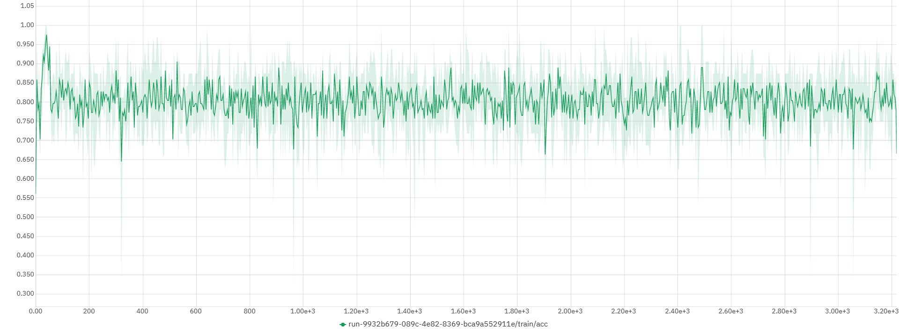
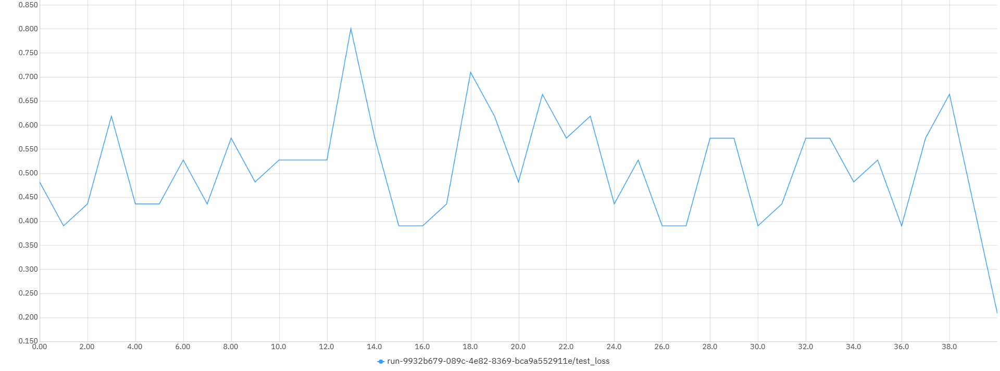
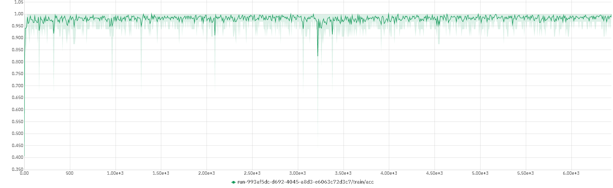

# `AlzClass - Classificação de Pacientes com Alzheimer e Controles`
# `AlzClass - Classification of Alzheimer and Control Subjects`

## Apresentação

O presente projeto foi originado no contexto das atividades da disciplina de pós-graduação *IA901 - Processamento de Imagens e Reconhecimento de Padrões*, 
oferecida no primeiro semestre de 2023, na Unicamp, sob supervisão da Profa. Dra. Leticia Rittner, do Departamento de Engenharia de Computação e Automação (DCA) da Faculdade de Engenharia Elétrica e de Computação (FEEC).

|Nome  | RA | Curso|
|--|--|--|
| Pedro Piquet | 223251 | Mestrado em Física Aplicada |
| Lais Oliveira  | 159809  | Mestrado em Engenharia Elétrica |
| Fabio Grassiotto  | 890441  | Doutorado em Engenharia Elétrica |

## Descrição do Projeto
Este projeto nasceu da motivação de criar algo que pudesse beneficiar a sociedade, abordando um problema enfrentado por um grupo de pessoas e oferecendo uma solução. Nesse contexto, propomos o desenvolvimento de um classificador de pacientes com Alzheimer e controle, utilizando imagens de ressonância magnética e redes neurais.

Nosso objetivo principal é projetar um classificador capaz de classificar os pacientes em quatro categorias: não demente (ND), demente muito leve (MLD), demente leve (LD) e demente moderado (MD). A classificação correta e precisa dos pacientes com Alzheimer é de extrema importância para possibilitar o diagnóstico precoce e o tratamento adequado. Ao aprimorar a acurácia dos resultados obtidos, poderemos contribuir para o avanço da comunidade médica e dos grupos de estudo, proporcionando diagnósticos mais precisos.

A área de classificação de pacientes com Alzheimer tem recebido atenção significativa na comunidade cientifíca, devido à sua relevância no contexto clínico. Nosso projeto visa superar as pesquisas existentes até o momento, buscando obter melhores resultados e oferecer contribuições importantes para aprimorar o diagnóstico por meio de redes neurais dessa condição. Acreditamos que, ao desenvolver um classificador que aperfeiçoe a acurácia dos resultados, poderemos beneficiar os diagnósticos futuros e contribuir para o avanço na área médica e de estudos relacionados ao Alzheimer.

# Metodologia
Dataset:
Diversos conjuntos de dados estão disponíveis na internet para classificação de AD. Organizações dedicadas, como ADNI e OASIS, fornecem acesso aos seus conjuntos de dados para fins de pesquisa e educacionais. No entanto, as amostras em ambos os conjuntos de dados estão em formato de imagem tridimensional, e o tamanho dos conjuntos de dados é consideravelmente grande, dificultando o treinamento das redes com os recursos computacionais disponíveis. Dessa forma, para uma análise primária, o conjunto de dados utilizado nesta pesquisa é coletado do Kaggle, o qual contém amostras de pacientes anônimos, apenas com imagens de exames de ressonância magnética (MRI), juntamente com informações sobre suas respectivas classes. Trata-se de um conjunto de dados de várias classes, composto por diferentes visualizações e quatro classes, incluindo uma classe controle ND (Não demente) e outras três classes que representam três diferentes estágios iniciais de AD. Além disso, o tamanho do conjunto de dados é razoável e as imagens já estão limpas, ou seja, redimensionadas e organizadas. O conjunto de dados possui um total de 6400 amostras. As amostras são imagens individuais de três canais (RGB) com dimensões de 176 x 208 pixels, pertencentes a quatro classes diferentes. O número de amostras na classe ND é de 3200. As três classes restantes, MLD (demente muito leve), LD (demente leve) e MD (moderadamente demente), possuem, respectivamente, 2240, 896 e 64 imagens. Um lado negativo desse banco de dados é o desbalance entre o número de amostras das classes, para solucionar esse problema, utilizamos algoritmos que geram dados sintéticos para cada classe desbalanceada (por exemplo, SMOTETOMEK).

Modelos: 
Nós iremos tentar solucionar o problema de classificação utilizando transfer learning, onde arquiteturas de ponta como AlexNet, ResNet e InceptionV4 são inicializadas com pesos pré-treinados provenientes de um treinamento com grandes conjuntos de dados de referência compostos por imagens naturais, e apenas uma parte é ajustada utilizando um pequeno número de imagens de ressonância magnética (MRI). Para essa entrega, iniciamos nossa análise com a AlexNet, por oferecer um bom desempenho comprovado, eficácia na extração de características, capacidade de aprendizado, prevenção de overfitting e acesso a recursos e implementações existentes. Futuramente, nós iremos então, implementar e comparar a performance dessas redes, buscando encontrar qual obtém as melhores métricas de performance em nosso dataset. 

## Bases de Dados e Evolução

Base de Dados | Endereço na Web | Resumo descritivo
----- | ----- | -----
Kaggle Alzheimer MRI Preprocessed Dataset | https://www.kaggle.com/datasets/sachinkumar413/alzheimer-mri-dataset | Dataset do Kaggle para experimentos iniciais
Open Access Series of Imaging Studies (OASIS) | https://www.oasis-brains.org/ | O OASIS (Open Access Series of Imaging Studies) é um projeto que visa tornar conjuntos de dados de neuroimagem do cérebro disponíveis gratuitamente para a comunidade científica. Existem quatro bases disponibilizadas - OASIS 1 a OASIS 4, com OASIS 1 e OASIS 2 consideradas as bases mais apropriadas para projetos acadêmicos.

**Kaggle Dataset**: Os dados são coletados de vários sites/hospitais/repositórios públicos. O conjunto de dados consiste em recortes bidimensionais de imagens MRI pré-processadas (imagem por ressonância magnética). Todas as imagens são redimensionadas em 128 x 128 pixels.

O Dataset tem quatro classes de imagens, com um total de 6.400 imagens de ressonância magnética.
- Classe - 1: Demente Leve (896 imagens)
- Classe - 2: Demente Moderado (64 imagens)
- Classe - 3: Não Demente (3200 imagens)
- Classe - 4: Demente Muito Leve (2240 imagens)

**OASIS1**: De acordo com o website, a OASIS1 é uma base de exames de ressonância magnética de 416 pacientes entre 18 e 96 anos. Para cada indivíduo, são incluídos 3 ou 4 exames individuais do tipo T1-weighted obtidos em sessões de exame único.

Os pacientes são todos destros e incluem homens e mulheres. 100 dos indivíduos incluídos com mais de 60 anos de idade foram diagnosticados clinicamente com doença de Alzheimer (AD) muito leve a moderada. Além disso, um conjunto de dados de confiabilidade é incluído contendo 20 sujeitos não dementes foi adicionado em uma visita subsequente dentro de 90 dias de sua sessão inicial.

**OASIS2**: a OASIS2 é uma base de exames de ressonância magnética de 150 pacientes entre 60 e 96 anos. Cada indivíduo foi escaneado em duas ou mais visitas, separadas por pelo menos um ano, totalizando 373 sessões de imagem. Para cada sujeito, são incluídos 3 ou 4 exames individuais do tipo T1-weighted obtidos em sessões de exame único.

Os pacientes são todos destros e incluem homens e mulheres. 72 dos indivíduos foram caracterizados como não dementes ao longo do estudo, enquanto que 64 dos indivíduos incluídos foram caracterizados como dementes no momento de suas visitas iniciais e permaneceram assim para exames subsequentes, incluindo 51 indivíduos com doença de Alzheimer leve a moderada. Outros 14 indivíduos foram caracterizados como não dementes no momento de sua visita inicial e posteriormente caracterizados como dementes em uma visita posterior.

# Ferramentas

- Nibabel - NeuroImaging em Python - https://nipy.org/nibabel/, para a manipulação das bases de imagens.
- Pytorch (framework de machine/deep learning) - https://pytorch.org/
- TensorFlow (biblioteca de código aberto para machine learning) - https://www.tensorflow.org/
- Keras (biblioteca para deep learning implementada utilizando TensorFlow) - https://keras.io e https://www.tensorflow.org/guide/keras?hl=pt-br

# Workflow
Definimos abaixo o workflow que utilizaremos para a ingestão, pré-processamento e classificação dos dados.

# Experimentos e Resultados preliminares

## Rede AlexNet com a base do Kaggle
Nesta primeira fase do experimento, iremos analisar as imagens disponibilizadas pelo dataset da Kaggle e executaremos classificação utilizando a rede AlexNet, ao longo de 20 épocas.

Os resultados obtidos inicialmente podem ser visualizados nos gráficos abaixo:

**Perda na base de treinamento**

**Acurácia na base de treinamento**

**Perda na base de testes**

**Acurácia na base de testes**

Notamos que a melhor acurácia obtida com a base de testes foi de cerca de **0.875**.

## Rede Resnet com a base do Kaggle
Seguindo essa fase do projeto, para fins de comparação, estamos realizando a classificação com a rede Resnet18, ao longo de 20 épocas.

Os resultados são apresentados nos gráficos abaixo:

**Perda na base de treinamento**

**Acurácia na base de treinamento**

**Perda na base de testes**

**Acurácia na base de testes**

O treinamento com a rede ResNet18 está em fase de testes, para garantirmos que os resultados obtidos não sofreram overfitting. Mas como primeiro resultado, temos que a acurácia obtida foi em torno de **0.97**

# Próximos passos
Treinar e avaliar outras redes neurais (ResNet, InceptionV4) no dataset do kaggle. (1 semana)
Expandir nossa análise para o dataset do OASIS, desenvolvendo uma pipeline apropriada para a ingestão deste formato de dados. (1 semana)
Executar o workflow definido pelo projeto na nova base de dados. (1 semana)
Analisar e apresentar os resultados obtidos com as nova rede e dataset, comparando com os resultados iniciais da base do Kaggle (1 semana)

## Referências
Hon, Marcia, and Naimul Mefraz Khan. "Towards Alzheimer's disease classification through transfer learning." 2017 IEEE International conference on bioinformatics and biomedicine (BIBM). IEEE, 2017.

Szegedy, Christian, et al. "Inception-v4, inception-resnet and the impact of residual connections on learning." Proceedings of the AAAI conference on artificial intelligence. Vol. 31. No. 1. 2017.

Ebrahimi, Amir & Luo, Suhuai. (2021). Convolutional neural networks for Alzheimer’s disease detection on MRI images. Journal of Medical Imaging. 8. 024503. 10.1117/1.JMI.8.2.024503]. 

Bae, J.B., Lee, S., Jung, W. et al. Identification of Alzheimer's disease using a convolutional neural network model based on T1-weighted magnetic resonance imaging. Sci Rep 10, 22252 (2020). https://doi.org/10.1038/s41598-020-79243-9

