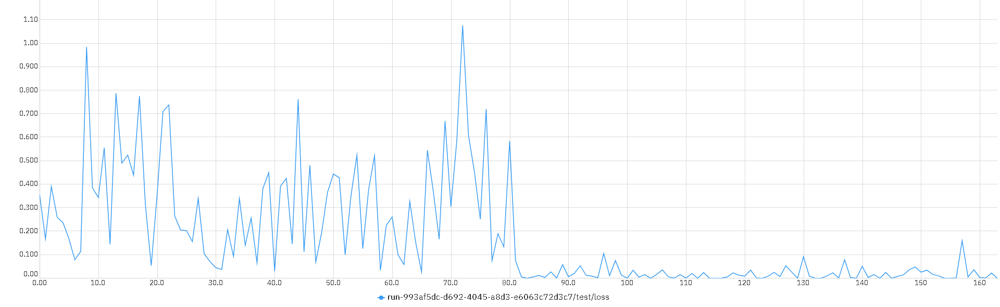

# `AlzClass - Classificação de Pacientes com Alzheimer e Controles`
# `AlzClass - Classification of Alzheimer and Control Subjects`

## Apresentação

O presente projeto foi originado no contexto das atividades da disciplina de pós-graduação *IA901 - Processamento de Imagens e Reconhecimento de Padrões*, 
oferecida no primeiro semestre de 2023, na Unicamp, sob supervisão da Profa. Dra. Leticia Rittner, do Departamento de Engenharia de Computação e Automação (DCA) da Faculdade de Engenharia Elétrica e de Computação (FEEC).

|Nome  | RA | Curso|
|--|--|--|
| Pedro Piquet | 223251 | Mestrado em Física Aplicada |
| Lais Oliveira  | 159809  | Mestrado em Engenharia Elétrica |
| Fabio Grassiotto  | 890441  | Doutorado em Engenharia Elétrica |

## Descrição do Projeto
Esse projeto parte da motivação de se realizar algo que pudesse, de alguma forma, ser feito em prol da sociedade (ou, no caso, de um grupo dela). Indo de encontro a um problema ou questão enfrentada por um grupo de pessoas e poder responder a essa questão. Dessa forma, temos como projeto um classificador de pacientes com Alzheimer e controle. Utilizando imagens de ressonância magnética, a ideia é primeiramente, projetarmos um classificador binário entre pacientes do grupo com Alzheimer e pacientes do grupo de controle. E após isso, solucionar o problema central desse projeto: projetar um classificador capaz de classificar as 4 classes existentes (demente leve, demente moderado, não demente e demente muito leve).

Um classificador de pacientes com Alzheimer é algo que tem se desenvolvido na comunidade, pois é uma realidade recorrente da sociedade atual e partimos da ideia de projetarmos um classificador no qual consigamos obter uma acurácia melhor do que encontramos em nossas pesquisas até aqui. O diagnóstico precoce correto é extremante necessário, de forma que, toda melhoria obtida para proporcionar um diagnóstico cada vez mais seguro é muito importante para o avanço da comunidade médica e dos grupos de estudo. Assim, acreditamos que sendo possível projetar esse classificador em busca dessa melhoria na acurácia dos resultados, será possível aplicar essa melhoria nos diagnósticos futuros.

# Metodologia
Para iniciar este projeto procuramos determinar qual o dataset mais apropriado para este projeto. Encontramos um conjunto rico de imagens de ressonância magnética disponíveis com acesso livre no site do OASIS (Open Access Series of Imaging Studies), que definimos como o dataset base para o desenvolvimento do projeto.
Em uma análise preliminar dos dados no OASIS notamos que o processamento das imagens é custoso e portanto definimos que a exploração inicial seria realizada em uma base mais simples como as disponíveis no Kaggle, e em particular escolhemos a Kaggle Alzheimer MRI Preprocessed Dataset.
Para a exploração inicial utilizamos códigos de livre acesso disponíveis no site.

Propomos como próximos passos para o projeto:
* Definição de etapas de pré-processamento de imagens para melhorar as métricas de classificação.
* Uso de técnicas de balanceamento de classes no dataset para melhoria de métricas de classificação.
* Exploração e comparação entre arquiteturas de redes neurais para a solução do problema de classificação (AlexNet, ResNet e InceptionV4). Em especial, selecionamos estas arquiteturas ....
* Comparação dos resultados utilizando a base disponível no OASIS (OASIS 1).
* Comparação com resultados disponíveis na literatura.

## Bases de Dados e Evolução

Base de Dados | Endereço na Web | Resumo descritivo
----- | ----- | -----
Kaggle Alzheimer MRI Preprocessed Dataset | https://www.kaggle.com/datasets/sachinkumar413/alzheimer-mri-dataset | Dataset do Kaggle para experimentos iniciais
Open Access Series of Imaging Studies (OASIS) | https://www.oasis-brains.org/ | O OASIS (Open Access Series of Imaging Studies) é um projeto que visa tornar conjuntos de dados de neuroimagem do cérebro disponíveis gratuitamente para a comunidade científica. Existem quatro bases disponibilizadas - OASIS 1 a OASIS 4, com OASIS 1 e OASIS 2 consideradas as bases mais apropriadas para projetos acadêmicos.

**Kaggle Dataset**: Os dados são coletados de vários sites/hospitais/repositórios públicos. O conjunto de dados consiste em recortes bidimensionais de imagens MRI pré-processadas (imagem por ressonância magnética). Todas as imagens são redimensionadas em 128 x 128 pixels.

O Dataset tem quatro classes de imagens, com um total de 6.400 imagens de ressonância magnética.
- Classe - 1: Demente Leve (896 imagens)
- Classe - 2: Demente Moderado (64 imagens)
- Classe - 3: Não Demente (3200 imagens)
- Classe - 4: Demente Muito Leve (2240 imagens)

**OASIS1**: De acordo com o website, a OASIS1 é uma base de exames de ressonância magnética de 416 pacientes entre 18 e 96 anos. Para cada indivíduo, são incluídos 3 ou 4 exames individuais do tipo T1-weighted obtidos em sessões de exame único.

Os pacientes são todos destros e incluem homens e mulheres. 100 dos indivíduos incluídos com mais de 60 anos de idade foram diagnosticados clinicamente com doença de Alzheimer (AD) muito leve a moderada. Além disso, um conjunto de dados de confiabilidade é incluído contendo 20 sujeitos não dementes foi adicionado em uma visita subsequente dentro de 90 dias de sua sessão inicial.

**OASIS2**: a OASIS2 é uma base de exames de ressonância magnética de 150 pacientes entre 60 e 96 anos. Cada indivíduo foi escaneado em duas ou mais visitas, separadas por pelo menos um ano, totalizando 373 sessões de imagem. Para cada sujeito, são incluídos 3 ou 4 exames individuais do tipo T1-weighted obtidos em sessões de exame único.

Os pacientes são todos destros e incluem homens e mulheres. 72 dos indivíduos foram caracterizados como não dementes ao longo do estudo, enquanto que 64 dos indivíduos incluídos foram caracterizados como dementes no momento de suas visitas iniciais e permaneceram assim para exames subsequentes, incluindo 51 indivíduos com doença de Alzheimer leve a moderada. Outros 14 indivíduos foram caracterizados como não dementes no momento de sua visita inicial e posteriormente caracterizados como dementes em uma visita posterior.

# Ferramentas

- Nibabel - NeuroImaging em Python - https://nipy.org/nibabel/, para a manipulação das bases de imagens.
- Pytorch (framework de machine/deep learning) - https://pytorch.org/
- TensorFlow (biblioteca de código aberto para machine learning) - https://www.tensorflow.org/
- Keras (biblioteca para deep learning implementada utilizando TensorFlow) - https://keras.io e https://www.tensorflow.org/guide/keras?hl=pt-br

# Workflow
Definimos abaixo o workflow que utilizaremos para a ingestão, pré-processamento e classificação dos dados.

# Experimentos e Resultados preliminares

## Rede AlexNet com a base do Kaggle
Nesta primeira fase do experimento, iremos analisar as imagens disponibilizadas pelo dataset da Kaggle e executaremos classificação utilizando a rede AlexNet, ao longo de 20 épocas.

Os resultados obtidos inicialmente podem ser visualizados nos gráficos abaixo:

**Perda na base de treinamento**

**Acurácia na base de treinamento**

**Perda na base de testes**

**Acurácia na base de testes**

Notamos que a melhor acurácia obtida com a base de testes foi de cerca de **0.875**.

## Rede Resnet com a base do Kaggle
Seguindo essa fase do projeto, para fins de comparação, estamos realizando a classificação com a rede Resnet18, ao longo de 20 épocas.

Os resultados são apresentados nos gráficos abaixo:

**Perda na base de treinamento**

**Acurácia na base de treinamento**

**Perda na base de testes**

**Acurácia na base de testes**

O treinamento com a rede ResNet18 está em fase de testes, para garantirmos que os resultados obtidos não sofreram overfitting. Mas como primeiro resultado, temos que a acurácia obtida foi em torno de **0.97**

# Próximos passos
- Migração para o dataset do OASIS, criando um dataloader apropriado. (estimativa: 1 semana)
- Executar o workflow definido pelo projeto na nova base, utilizando para classificação a rede InceptionV4 (estimativa: 2 semanas)
- Analisar e apresentar os resultados obtidos com a nova rede, comparando com os resultados iniciais da base do Kaggle (estimativa: 1 semana)

## Referências (ATUALIZAR SE NECESSÁRIO)
> Seção obrigatória. Inclua aqui referências utilizadas no projeto.

