# `Reconhecimento de ação humana em imagens de veículos aéreos não tripulados (UAVs)`
# `Recognition of human action in Unmanned Aerial Vehicles (UAVs) images`

## Apresentação

O presente projeto foi originado no contexto das atividades da disciplina de pós-graduação *IA901 - Processamento de Imagens e Reconhecimento de Padrões*, oferecida no primeiro semestre de 2023, na Unicamp, sob supervisão da Profa. Dra. Leticia Rittner, do Departamento de Engenharia de Computação e Automação (DCA) da Faculdade de Engenharia Elétrica e de Computação (FEEC).

|Nome  | RA | Curso|
|--|--|--|
| Débora Simões  | 263621  | Doutorado em Engenharia Civil|
| Lucas Ueda  | 156368  | Doutorado em Engenharia Elétrica|
| Wesna de Araujo  | 225843  | Graduação em Engenharia Elétrica|

## Descrição do Projeto

Os Veículos Aéreos Não Tripulados (VANTs), popularmente conhecidos como drones, têm sido amplamente adotados em diferentes aplicações, como mapeamento, logística, vigilância, agricultura, dentre outras. No entanto, o grande número de UAVs no espaço aéreo mundial levanta preocupações relacionadas ao gerenciamento do espaço aéreo e à segurança das pessoas próximas às operações. Em todo o mundo, existem regulamentações sobre o acesso e o controle do espaço aéreo, buscando minimizar os riscos que as operações com UAVs envolvem. Dentre tais regras, há uma preocupação com as pessoas, especialmente àquelas não envolvidas com a operação UAV. No Brasil (BRASIL, 2020), por exemplo, deve ser mantida uma distância mínima de 30 m entre as pessoas e a projeção do UAV no terreno.

Nesse caso, a identificação de pessoas em tempo real em um voo de UAV torna-se crucial para manter a segurança de uma operação, principalmente nas operações em que a roteirização dos UAVs é online: a aeronave identifica mudanças no ambiente e é capaz de reagir a elas, atualizando sua rota em tempo real (ZHAO; ZHENG; LIU, 2018). Após detectar uma pessoa no terreno, o drone deve ser capaz de replanejar sua rota em tempo real e desviar-se para não sobrevoar pessoas, o que garante a segurança nas operações com UAV. Reconhecer se a pessoa está caminhando, por exemplo, também é importante para que a rota do UAV seja evitada na direção para onde a pessoa está indo. Assim, reconhecer o comportamento da pessoa também contribuiu para o planejamento de rotas seguras para o UAV.

Outra aplicação em que é importante detectar e reconhecer o comportamento humano é a vigilância de cidades inteligentes, como mostra o trabalho de Del Rosario et al. (2021), em que é necessário identificar e rastrear pessoas.

Nesse contexto, o objetivo do presente projeto é detectar pessoas e reconhecer o seu comportamento em imagens obtidas com drones, adotando a arquitetura YOLOv7 (WANG; BOCHKOVSKIY; LIAO, 2022). Como há diferentes comportamentos para as pessoas nas imagens aéreas e, dependendo da altura de voo, pode ser difícil detectar se o objeto nessa imagem é um humano, são realizados pré-processamentos nas imagens de drone a fim de melhorar a precisão obtida ao detectar e reconhecer a ação humana. 

# Metodologia

Para desenvolvimento deste projeto, é adotada a base de dados “NTUT 4K Drone Photo Dataset for Human Detection”, descrita com mais detalhes na seção a seguir (“Bases de Dados e Evolução”).

**1 - Organização dos dados** 

Para a detecção de pessoas, observou-se que, no conjunto de dados de treinamento, há 2156 imagens de drone. Já que em uma mesma imagem pode haver mais de uma pessoa, considerando todos os registros (labels) correspondentes às poses humanas, tem-se 31805 amostras no conjunto de treinamento, sendo que cada amostra corresponde a uma pessoa detectada na imagem. Em cada um desses 31805 dados, são registrados: o nome da imagem em que a pessoa está sendo detectada, as coordenadas digitais que definem o bounding box, e o rótulo correspondente à pose em que a pessoa se encontra. 

Como algumas classes correspondentes às poses humanas eram indefinidas (registradas como “id_” ou “block_”), os dados foram analisados e, considerando as classes com maior número de amostras, definiram-se quatro classes a serem adotadas no presente projeto:

- Walk: 6155 amostras;
- Stand: 2551 amostras;
- Sit: 424 amostras;
- Riding: 2487 amostras.

Filtrados os dados com base nas quatro classes estabelecidas, dividiu-se os dados de treino em Treino (80%) e Validação (20%). Os dados de teste, já disponíveis no dataset “NTUT 4K Drone Photo Dataset for Human Detection” e com 20920 amostras, também foram filtrados com base nas quatro classes. 

Dispondo, portanto, dos conjuntos de treino (1677 imagens), teste (1266 imagens) e validação (1006 imagens), definiram-se os arquivos (.txt) correspondentes aos labels das quatro classes, considerando as imagens que foram mantidas após a filtragem. Nos arquivos "label_train.txt", "label_val.txt" e "label_test.txt" são registrados: nome da imagem (image), coordenadas em pixels do bounding box (xmin, ymin, xmax, ymax) e o rótulo da classe (label).

**2 - Pré-processamento dos dados**

As imagens originais do dataset “NTUT 4K Drone Photo Dataset for Human Detection” são coloridas (RBG). A fim de reduzir o tempo computacional durante a etapa de treinamento do modelo, principalmente, converteram-se as imagens para níveis de cinza. 

Além disso, com o objetivo de melhorar as métricas de avaliação do modelo, considerando as imagens grayscale, adotou-se três filtragens no domínio espacial (filtro de Sobel, filtro de Prewitt e filtro de Laplace), que possibilitam a detecção de bordas. Ao adotar tais filtragens, esperou-se que as bordas referentes às pessoas presentes nas imagens fossem realçadas, o que poderia auxiliar o modelo. 

Portanto, quatro pré-processamentos foram realizados no conjunto de dados originais, cada um adotado separadamente para treinamento do modelo:

  1) Conversão das imagens RGB para imagens em níveis de cinza;
  2) Filtragem no domínio espacial adotando o filtro de Sobel (aplicou-se o gradiente obtido a partir das duas máscaras de Sobel - horizontal e vertical) (GONZALES; WOODS, 2009);
  3) Filtragem no domínio espacial adotando o filtro de Prewitt (aplicou-se o gradiente obtido a partir das duas máscaras de Prewitt - horizontal e vertical) (GONZALES; WOODS, 2009).
  4) Filtragem no domínio espacial adotando o filtro de Laplace (GONZALES; WOODS, 2009).

Cabe destacar que, em função do resultado obtido após a filtragem laplaciana, optou-se por não utilizá-las para treinamento do modelo.

**3 - Treinamento do modelo**

***3.1. Treinamentos iniciais***

Inicialmente, quatro conjunto de dados foram adotados para treinamento do modelo: imagens RGB (originais), imagens em níveis de cinza, imagens obtidas da filtragem de Sobel e imagens obtidas da filtragem de Prewitt.

A partir desses dados, realizou-se o treinamento do modelo adotando a arquitetura Yolov7. Tanto para a detecção das pessoas nas imagens de drone quanto  para a classificação de suas poses, adotou-se a arquitetura YOLOv7, que, segundo Wang, Bochkovskiy e Liao (2022), supera todos os detectores de objetos conhecidos em velocidade e precisão (tem menos parâmetros, menor custo computacional e alcança maior precisão). No presente projeto, adaptou-se o código da YOLOv7, disponível em <https://github.com/WongKinYiu/yolov7>.

Para o treinamento do modelo, inicialmente, criou-se um arquivo (.txt) para cada uma das imagens, com as informações de "ids" das classes presentes naquela imagem ('walk': 0, 'riding': 1, 'stand': 2, 'sit': 3), as coordenadas do centro do "bouding box" normalizadas (x_center e y_center) e a largura (w) e altura(h) do "bounding box" normalizado. Para cada conjunto de imagens obtido após os pré-processamentos dos conjuntos de imagens de treino, teste e validação, copiou-se o arquivo (.txt) correspondente às labels, bem como os arquivos gerados para cada uma das imagens (com as informações de: "ids", coordenadas do centro do "bounding box" normalizadas, e a largura e altura do "bounding box" normalizado).

As imagens foram redimensionadas para 640x640 pixels durante o treinamento, de acordo com as especificações do modelo adotado. Os hiperparâmetros definidos foram: tamanho dos mini batches (BATCH_SIZE = 16 imagens) e número de épocas (inicialmente, adotou-se 10 épocas e, em seguida, 30 épocas).

***3.2. Balanceamento do número de amostras por classe***

A partir dos resultados obtidos com os quatro treinamentos iniciais (adotando: 1 - imagens RBG; 2 - imagens em níveis de cinza; 3 - imagens filtradas com Filtro de Sobel; e 4 - imagens oriundas da filtragem de Prewitt), observou-se, como uma das opções para melhoria das métricas avaliativas do modelo, o balanceamento do número de amostras por classe considerada.

Até o momento, exitia um número muito maior de amostras para a classe "walk", do que para as demais. Assim, uma alternativa escolhida foi excluir do dataset de treino algumas imagens em que fossem detectadas somente pessoas em estado "walk". 

A figura a seguir, apresenta a quantidade de amostras para as classes antes e após o balanceamento realizado.

    

Como, nos treinamentos iniciais, o conjunto de imagens que apresentou melhores resultados foram as imagens em níveis de cinza, transformou-se as imagens selecionadas após o balanceamento dos dados em níveis de cinza e, adotando-as, realizou um novo treinamento.

***3.3. Data Augmentation***

Como o balanceamento dos dados (seção 3.2) não surtiu os resultados esperados, realizou-se uma aumentação nos dados de treino. Adotando o conjunto de imagens em níveis de cinza, foram aplicadas seis transformações para aumentação dos dados, considerando, para cada uma delas, um conjunto aleatório de 230 imagens pertencentes ao dataset de treino.

As seguintes transformações foram adotadas para aumentação dos dados (PYTORCH, 2023):

- ColorJitter: altera aleatoriamente o brilho, contraste, saturação e matiz de uma imagem. Nesse caso, modificou-se brilho e matiz (brightness=0.9, hue=0.5);
- RandomInvert: inverte aleatoriamente as cores da imagem fornecida;
- RandomPosterize: reduz o número de bits para cada canal de cor (altera a resolução radiométrica da imagem). Nesse caso, alterou-se as imagens para 4 bits de resolução;
- RandomSolarize: inverte todos os valores de pixel acima de um limite. Nesse caso, adotou-se o limite igual a 20 após testes realizados;
- RandomAdjustSharpness: ajusta a nitidez da imagem aleatoriamente com uma determinada probabilidade.
- RandomEqualize: equaliza o histograma da imagem fornecida.

Outras três transformações foram testadas para aumentação de dados, porém não foram adotadas para aumentação dos dados porque rotacionam, escalonavam e/ou translavam a imagem e, desse modo, comprometeriam os labels da imagem, os quais dependem das coordenadas do bounding box (x_min, x_max, y_min, y_max). 

Assim, a cada transformação, 230 novas imagens foram adicionadas ao dataset de treino, para serem adotadas durante o treinamento dos dados. Os rótulos correspondentes a cada imagem também foram salvos (com as mesmas informações dos labels das imagens originais, mas modificando o nome da imagem de acordo com a transformação aplicada).

Ressalta-se que realizou-se a aumentação dos dados somente para o conjunto de dados de treino correspondentes às imagens em nível de cinza, uma vez que as mesmas apresentaram métricas semelhantes às imagens RBG nos treinamentos realizados inicialmente, porém com tempo computacional reduzido (cerca de 3 vezes menor).

***3.4. Métricas avaliativas***

Para avaliar o modelo, foram adotadas as seguintes métricas:

- Precisão: mede a proporção de positivos previstos que estão realmente corretos - Precisão = TP/(TP + FP). O valor varia de 0 a 1 (KUKIL, 2022b);

- Recall: mede a proporção de positivos reais que foram previstos corretamente - Recall = TP / (TP + FN). Varia de 0 a 1 (KUKIL, 2022b); 

- Mean Average Precision (mAP): é a média das "Precisão média (AP)" calculadas para todas as classes - mAP = 1/n * soma(APs), onde n é o número de classes (KUKIL, 2022b).

A *Precisão média (AP)* é definida como a área sob a curva de rechamada de precisão, sendo igual a soma dos valores de precisão interpolados em 11 valores de chamada, dividido por 11 (AP = 1/11 * Soma de 11 valores de precisão interpolados). AP é definida para cada uma das classes (KUKIL, 2022b). Nesse projeto, adotou-se para avaliação dos resultados:
- mAP@.5: os verdadeiros positivos são definidos considerando o limite IoU** de 0.5 (50%);
- mAP@.95: os verdadeiros positivos são definidos considerando o limite IoU** de 0.95 (95%).

** *Intersection over Union (IoU)*: métrica que quantifica o grau de sobreposição entre duas regiões. Essa métrica avalia a exatidão de uma previsão e seu valor varia de 0 a 1. Com a ajuda do valor limite IoU, define-se se uma previsão é Verdadeiro Positivo, Falso Positivo ou Falso Negativo (KAKIL, 2022a). Como exemplo, se o limite IoU é de 0.5, a previsão é considerada Verdadeiro Positivo se houver 50% ou mais de sobreposição entre o bounding box predito pelo modelo e o bouding box correto (*Ground Truth*).

## Bases de Dados e Evolução
<!--
> Elencar bases de dados utilizadas no projeto.
> Para cada base, coloque uma mini-tabela no modelo a seguir e depois detalhamento sobre como ela foi analisada/usada, conforme exemplo a seguir.-->
A tabela abaixo mostra resumidamente algumas informações sobre o banco de dados utilizado no desenvolvimento do projeto.

Base de Dados | Endereço na Web | Resumo descritivo
----- | :-----: | -----
NTUT 4K Drone Photo Dataset for Human Detection | [Link](https://www.kaggle.com/datasets/kuantinglai/ntut-4k-drone-photo-dataset-for-human-detection) | <!--Breve resumo (duas ou três linhas) sobre a base.--> Esse banco de dados é formado por imagens de alta resolução extraídas de vídeos gravados por drones em Taiwan. Para cada imagem, estão disponíveis as coordenadas digitais que definem o *bounding box* em torno de uma pessoa detectada, bem como o rótulo que identifica a pose do indivíduo detectado.
---
A base de dados NTUT 4K Drone Photo Dataset for Human Detection, como comentado anteriormente, é formada por 4095 imagens de drone coletadas em Taiwan com dimensões 3840 x 2160 pixels, sendo as imagens organizadas em pastas de acordo com o cenário, altura de voo e orientação da câmera. Dessa quantidade, 2156 imagens (53% do conjunto de dados) foram separadas para treino enquanto que 1939 (47% do conjunto de dados) foram destinados para teste. Como em cada imagem pode haver mais de uma pessoa realizando ações distintas o conjunto de treino passa a ter ao todo 31805 amostras, ao passo que o conjunto de teste tem 20920 amostras. Além disso, todas as imagens estão em formato jpg.

Como forma de rotulação, cada pasta vem acompanhada de um arquivo csv que informa para cada amostra as coordenadas do centro do *bounding box* em torno de uma pessoa detectada, isto é, (Xmin, Ymin, Xmax e Ymax) e ainda traz a informação sobre a pose da pessoa detectada (walk, push, stand, etc).

Através de uma análise considerando todas as classes existentes nos conjuntos de treino e teste, chegou-se aos seguintes valores:

Classes | Dados de Treino | Dados de teste
----- | :-----: | :-----:
walk  |     6155    |   4858 
stand |     2551    |   1752 
push  |    143      |   34
watchphone  |     167     |   0
baseball  |     118     |   0
sit  |    424      |    481 
riding  |    2487      |    72 
outros  |    19760      |   13723 

Note que a classe "outros" é referente a rotulações que não especificam diretamente a pose da pessoa detectada, ao invés disso nomeia com o termo id_ seguido de um número ou usa a palavra block. Assim, considerando o tamanho do conjunto e a fim de evitar as classes não nomeadas, optou-se por utilizar as 4 classes mais numerosas de modo a obter um conjunto de dados mais balanceado. Dessa forma, foram selecionadas apenas as classes walk, stand, sit e riding. 

Além disso, foi necessário separar os dados de treino, teste e validação. Em relação ao conjunto de teste após a filtragem das classes obteve-se um total de 6271 amostras (1266 imagens). Como o banco de dados bruto possui apenas o conjunto de treino, sem considerar validação, foi definido que 20% dos dados de treino já selecionados com as 4 classes seriam destinados ao conjunto de validação enquanto que os 80% restante formariam o conjunto de treino. Assim, 8422 amostras foram destinadas para treino (1407 imagens) e 2180 amostras ficaram para a validação (348 imagens). É importante mencionar, que como uma mesma imagem pode ser rotulada com mais de uma classe tomou-se o cuidado para que durante a divisão entre treino e validação imagens iguais pertencessem ao mesmo conjunto.

O histograma abaixo ilustra a distribuição de dados do conjunto de treino, teste e validação que serão utilizados durante o projeto.

    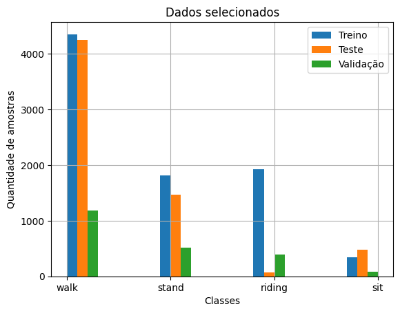

Ademais é importante destacar que as classes walk, stand, sit e riding foram remapeadas com valores númericos para se adequar ao algoritmo da rede YOLOv7. A tabela abaixo mostra a nova identificação.

Classe Original | Classe YOLOv7
:-----: | :-----: | 
walk  |     0   
riding |    1
stand |     2
sit   |     3

Por fim, os valores do *bounding box* foram normalizados para atender também as especificações da rede YOLOv7.

<!--
> Faça uma descrição sobre o que concluiu sobre esta base. Sugere-se que respondam perguntas ou forneçam informações indicadas a seguir:
> * Qual o formato dessa base, tamanho, tipo de anotação?
> * Quais as transformações e tratamentos feitos? Limpeza, reanotação, etc.
> * Inclua um sumário com estatísticas descritivas da(s) base(s) de estudo.
> * Utilize tabelas e/ou gráficos que descrevam os aspectos principais da base que são relevantes para o projeto.-->

# Ferramentas

Ferramentas adotadas no desenvolvimento do projeto:

- **Google Colab**, ou "Colaboratory": permitiu escrever e executar Python no navegador, além de contar com acesso a GPUs sem custo financeiro, que foram adotadas para o treinamento do modelo. Acesso ao [Google Colab](https://colab.research.google.com/#scrollTo=5fCEDCU_qrC0) (versão do Google Colab utilizada: atualizada em 24/06/2023);
- **Google Drive**: tanto os dados brutos (dataset "NTUT 4K Drone Photo Dataset for Human Detection") quanto os dados filtrados e aqueles resultados dos pré-processados foram armazenados no Google Drive. Os notebooks desenvolvidos no Google Colab também encontram-se salvos no Google Drive (acesso ao [Google Drive](https://drive.google.com/drive/my-drive));
- **Github**: um repositório no [Github](https://github.com/) foi criado e contém todos os arquivos do projeto, histórico de revisão e discussões dos colaboradores (Versão do Github adotada: atualizada em 08/2022).
- **Draw.io**: é um software de desenho gráfico online que permitiu organizar um workflow com os passos para a utilização dos notebooks e dados. Acesso ao [Draw.io](https://app.diagrams.net/).

Em relação as bibliotecas usadas destacam-se, em especial, as bibliotecas utilizadas para a manipulação dos dados. Assim, tem-se:

- **OpenCV**: que auxiliou na visualização das imagens;
- **matplotlib.pyplot**: usada para plotar gráficos, com o intuito de verificar a distribuição de labels;
- **pandas**: utilizada para manipular dataframes;
- **numpy**: utilizada para operações matemáticas e calculos envolvendo arrays provenientes dos dataframes;
- **torchvision**: usada para as transformações de imagens (data augmentation);
- **Scipy**: para a etapa de pré-processamento que necessitava do uso de convoluções;
- **os**: usada para operações do sistema, como acessar o conteúdo de pastas;
- **shutil.copy**: utilizada para copiar imagens de uma pasta para outra.
  
Quanto às bibliotecas adotadas pela própria arquitetura YOLOv7, todas se encontram definidas no arquivo ["requirements.txt"](
https://drive.google.com/file/d/11c1_tUSCeSvkG8aUJiVq-PQIpSXtAFUh/view?usp=sharing).

# Workflow
<!-- > Use uma ferramenta que permita desenhar o workflow e salvá-lo como uma imagem (Draw.io, por exemplo). Insira a imagem nessa seção.
> Você pode optar por usar um gerenciador de workflow (Sacred, Pachyderm, etc) e nesse caso use o gerenciador para gerar uma figura para você.
> Lembre-se que o objetivo de desenhar o workflow é ajudar a quem quiser reproduzir seus experimentos. 
>  -->

    

O workflow dos nossos procedimentos é apresentado na figura acima. Inicialmente os dados são baixados da plataforma Kaggle e colocados em uma pasta do GoogleDrive compartilhada entre os membros do projeto. A partir disso, um notebook [Dados.ipynb](../Reconhecimento_acao_humana_imagem_drone/notebooks/Dados.ipynb) é rodado para uma seleção e filtragem prévia dos dados, retirando-se imagens com rótulos diferentes de ['walk','stand','sit','riding'], separando o dataset nos conjuntos de treino, validação e teste. Isto tudo engloba o bloco "Data Wrangling I". Em seguida, opcionalmente, um [pre processamento](../Reconhecimento_acao_humana_imagem_drone/notebooks/Pre_processing.ipynb) é rodado nas imagens (transformações de cor, aplicação de filtros, etc). Esta etapa é chamada de "Data Pre-Processing", e é opcional pois é possível rodar com os dados crus. Por fim, a etapa de "Data Wrangling II" é rodada ("[Creating labels from folders.ipynb](../Reconhecimento_acao_humana_imagem_drone/notebooks/Creating_labels_from_folders.ipynb)") para formatar os dados de acordo com a pipeline da Yolov7, isto é, formatação das labels por imagem e organização das pastas. Por fim, podemos rodar o [training_template.ipynb](../Reconhecimento_acao_humana_imagem_drone/notebooks/Template_tutorial.ipynb) para treinar o modelo e [inference.ipynb](../Reconhecimento_acao_humana_imagem_drone/notebooks/Inference_notebook.ipynb) para a avaliação dos resultados.

# Experimentos, Resultados e Discussão

**1 - Resultados dos treinamentos do modelo**

***1.1. Treinamentos com 10 épocas***

Primeiramente, quatro treinamentos foram realizados adotando como dados: imagens RGB, imagens em nível de cinza, imagens resultantes da filtragem com Filtro de Sobel e imagens resultantes do Filtro de Prewitt. 

A tabela a seguir apresenta os resultados de precisão, recall e mAP@0.5 obtidos para esses treinamentos do modelo Yolov7.

Processamento dos Dados | Precisão | Recall | mAP@0.5
:-----: | :-----: | :-----: | :-----: |
Dados brutos filtrados  |    0.32    |   0.211  | 0.0625
Escala de Cinza |  0.526   |  0.0168 | 0.00558  |
Filtro Sobel |     0.555    |  0.131  |  0.0341 |
Filtro de Prewitt   |  0.277   | 0.073  | 0.0117

Conforme pode-se ver na tabela anterior, as métricas obtidas adotando apenas 10 épocas de treinamento são ruins, especialmente a mAP@0.5. 

Adotando as imagens em escala de cinza, tem-se o modelo com melhor precisão. Porém, o modelo com melhor recall corresponde ao treinamento com os dados brutos (imagens RBG). As figuras a seguir apresentam a precisão e recall desses dois treinamentos para cada uma das classes.  

*Resultados do treinamento com imagens RGB - 10 épocas*

    

*Resultados do treinamento com imagens em nível de cinza - 10 épocas*

    

Verifica-se que a classe com melhor desempenho é "walk" - que possui maior número de amostras. No entanto, mesmo para essa classe, o valor da mAP@0.5 ainda é muito baixo em ambos os modelos.

***1.2. Treinamentos com 30 épocas***

Como os treinamentos com 10 épocas apresentaram resultados insatisfatórios para as métricas avaliativas, retreinou-se o modelo com 30 épocas, adotando os mesmos dados dos treinamentos anteriores (imagens RGB, imagens em nível de cinza, imagens resultantes da filtragem com Filtro de Sobel e imagens resultantes do Filtro de Prewitt). 

A tabela a seguir apresenta os resultados de precisão, recall e mAP@0.5 obtidos para esses treinamentos com 30 épocas.

Processamento dos Dados | Precisão | Recall | mAP@0.5  
:-----: | :-----: | :-----: | :-----: |
Dados brutos filtrados  |    0.52    |   0.308  | 0.261
Escala de Cinza |  0.564   |  0.307 | 0.289  |
Filtro Sobel |   0.399      |  0.0824  |  0.0459 | 
Filtro de Prewitt   |  0.391   | 0.172  | 0.0848

Os resultados dos treinamentos com 30 épocas foram melhores que os anteriores, com exceção do treinamento adotando as imagens obtidas com o Filtro de Sobel. Especialmente ao adotar os dados brutos (imagens RGB) e as imagens em nível de cinza, observa-se melhoria no modelo. 

Considerando que mAP@0.5 leva em consideração a precisão e o recall do modelo, o treinamento adotando as imagens em escala de cinza se mostrou o melhor. A figura a seguir apresenta as curvas definidas a partir dos valores de precisão e recall desse modelo para todas as classes, considerando 30 épocas de treinamento.

*Resultados do treinamento com imagens em nível de cinza - 30 épocas*

    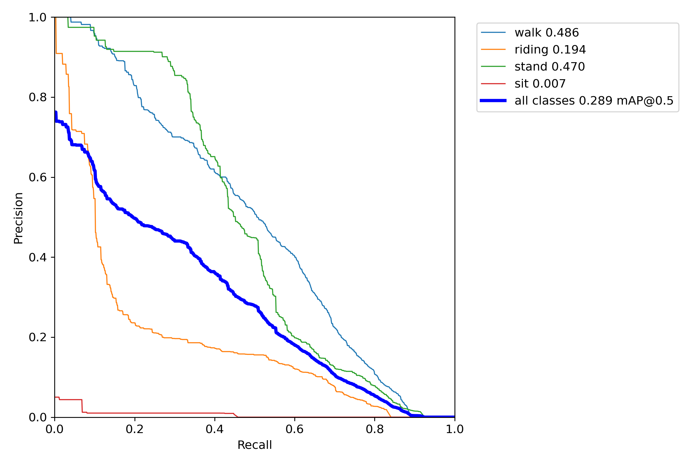

Observa-se que as classes "walk" e "stand" são as que apresentam melhor mAP@0.5. A classe "walk" possui a maior quantidade de amostras, enquanto a classe "sit", com pior mAP@0.5, é a que possui menos amostras. Nesse sentido, presumiu-se que realizando-se um balanceamento das amostras, conforme descrito na metodologia, ter-se-ia melhor mAP@0.5 para o modelo como um todo.

***1.3. Treinamento após o balanceamento dos dados***

Como descrito na metodologia, a fim de obter um melhor modelo, realizou-se um treinamento excluindo-se parte das imagens em que somente a classe "walk" fosse encontrada. Como os melhores resultados, até o momento, referiam-se ao treinamento com 30 épocas adotando as imagens em níveis de cinza, converteu-se as imagens em nível de cinza após o balanceamento dos dados e executou-se um novo treinamento com 30 épocas. 

A seguir, apresenta-se os resultados obtidos ao adotar os dados balanceados, em comparação com os resultados alcançados ao adotar o conjunto de imagens filtradas em nível de cinza (descritos em "1.2. Treinamentos com 30 épocas").

Processamento dos Dados | Precisão | Recall | mAP@0.5
:-----: | :-----: | :-----: | :-----: |
Escala de cinza (dados filtrados)  |    0.564    |   0.307  | 0.289
Escala de cinza (dados balanceados) |  0.448   |  0.238 | 0.153  |

Observa-se que o balanceamento dos dados piorou os resultados. Conforme apresenta a figura a seguir, todas as classes tiveram pior desempenho, com exceção da classe "sit". No entanto, considerando que houve pior desempenho do modelo em geral (mAP@0.5 menor ao adotar dados balanceados), concluiu-se que o balanceamento realizado não teve êxito. Assim, para os próximos treinamentos,  passou-se a utilizar somente os dados filtrados em escala de cinza (considerando o conjunto completo de dados, sem a exclusão de imagens).

*Resultados do treinamento após o balanceamento dos dados*

    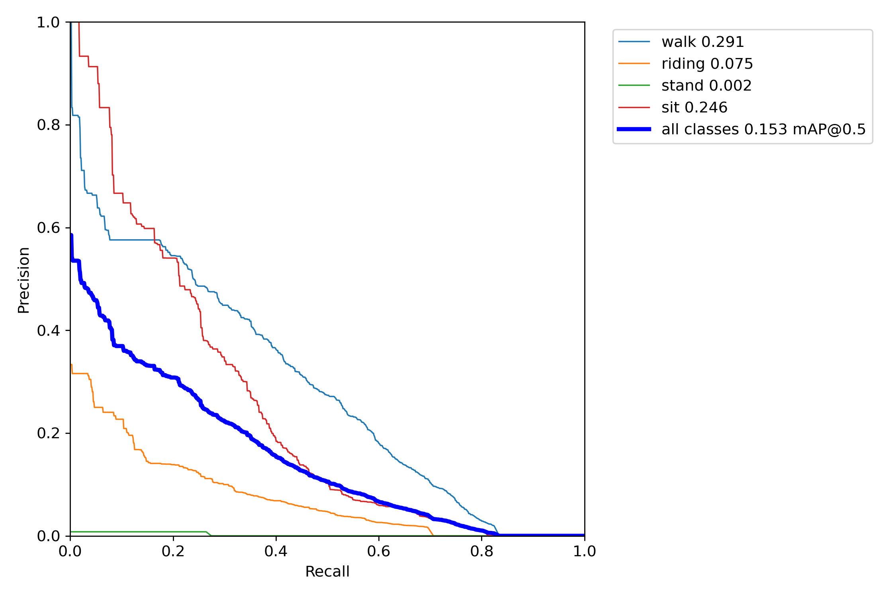

***1.4. Treinamento após a aumentação dos dados***

Adotando todas as imagens (dados filtrados) em nível de cinza, realizou-se a aumentação dos dados adotando as seis transformações citadas anteriormente. Com o conjunto de dados aumentado (dados filtrados + imagens obtidas a partir das técnicas de *data augmentation*), realizou-se um novo treinamento com 30 épocas. Os resultados são apresentados a seguir, comparados ao resultado do treinamento ao adotar os dados filtrados apenas em escala de cinza (sem aumentação).

Processamento dos Dados | Precisão | Recall | mAP@0.5
:-----: | :-----: | :-----: | :-----: |
Escala de cinza (dados filtrados)  |    0.564    |   0.307  | 0.289
Escala de cinza (dados aumentados) |  0.545   | 0.471  | 0.55  |

Apesar da precisão ter sido um pouco reduzida se comparada à precisão do modelo treinado apenas com os dados filtrados (redução de 1.9%), o recall obtido ao adotar os dados aumentados é melhor. Consequentemente, houve uma melhoria considerável na mAP@0.5, que, nesse modelo, é de 55%.

A figura a seguir apresenta a mAP@0.5 para as quatro classes considerando os modelos treinados com dados filtrados e dados aumentados. Verifica-se que mAP@0.5 é bem melhor para todas as classes. Apenas a classe "sit" obteve mAP@0.5 menor de 50%, o que pode ser ocasionado pela pequena quantidade de amostras originais dessa classe.

*Resultados do treinamento com dados aumentados*

    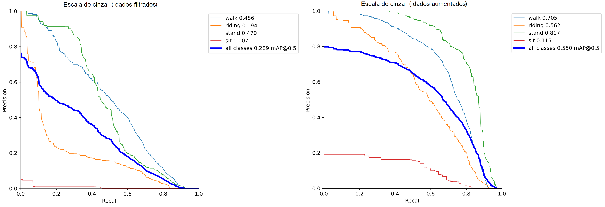

As curvas de precisão, recall e mAP@0.5 do modelo resultante dos dados aumentados, obtidas com as 30 épocas de treinamento, são ilustradas na figura a seguir.

*Precisão, recall e mAP@0.5 para o melhor modelo obtido*

    

Dessa forma, considera-se que o melhor modelo obtido é resultante do treinamento ao adotar os dados aumentados. Apesar de não apresentar excelentes métricas, as métricas desse modelo podem ser consideradas satisfatórias frente aos modelos inicialmente treinados. 

**2 - Resultados obtidos para o conjunto de Teste**

Após o treinamento dos modelos, testou-se todos os modelos definidos adotando o conjunto de dados de Teste correspondente à cada conjunto de dados oriundos do dataset original (dados filtrados, dados filtrados em escala de cinza, dados filtrados e resultantes do filtro de Sobel, dados filtrados e resultantes do filtro de Prewitt, dados balanceados em escala de cinza e dados aumentados em escala de cinza).

A tabela a seguir apresenta os resultados de mAP@0.5 e mAP@0.95 obtidos para cada um dos modelos, considerando três níveis de confiança ao definir a que classe pertence a ação humana: 25% (já que se tem quatro classes, isto é, 100% / 4 = 25%), 10% e 0.1% (toda pessoa detectada é classificada em alguma das classes).

Modelo | Confiança (%) | mAP@0.5 | mAP@0.95
:-----: | :-----: | :-----: | :-----: |
RGB (dados filtrados)  |    25 10 0.1    |   0.0337 0.0483 0.0603  | 0.0103 0.0142 0.0171
Escala de cinza (dados filtrados)  |    25 10 0.1    |   0.0452 0.0548 0.0694 | 0.0150 0.0175 0.0211
Escala de cinza (dados aumentados) |  25 10 0.1   | 0.0499 0.0584 0.0694  | 0.0180 0.0204 0.0231  |
Escala de cinza (dados balanceados) |  25 10 0.1   | 0.0207 0.0341 0.0436  | 0.0064 0.0099 0.0119  |
Filtro de Prewitt (dados filtrados) |  25 10 0.1   | 0.0022 0.0046 0.0558  | 0.0009 0.0017 0.0115  |
Filtro de Sobel (dados filtrados) |  25 10 0.1   | NaN NaN 0.0074  | NaN NaN 0.0022  |

Pelos dados acima, verifica-se que todos os modelos apresentam baixo desempenho para o conjunto de teste. O modelo com o desempenho menos pior dentre todos é o modelo treinado a partir dos dados aumentados, como já era esperado de acordo com os resultados obtidos nos treinamentos do modelo. 

No entanto, observa-se que os resultados são muito piores do que os resultados obtidos para o modelo correspondente durante o treinamento. Isso pode indicar o overfitting do modelo.

COMPLETAR. VERIFICAR.

**3 - Inferência: uso do modelo em caso real**

Após os testes descritos na seção anterior e tendo comprovado que, apesar dos resultados insatisfatórios, o melhor modelo é o obtido a partir do treinamento com os dados aumentados (escala de cinza), realizou-se a inferência do modelo adotando dois conjuntos de dados: 

- 1 - Imagens escolhidas aleatoriamente do conjunto de teste original (NTUT), convertidas em nível de cinza;
- 2 - Imagens adquiridas com Phantom 4 Pro, convertidas em nível de cinza.

Para cada conjunto de dados, inferiu-se o modelo em um nível de confiança de 25% e 10%. A seguir apresenta-se os resultados obtidos.

- 1 - Inferência com imagens do dataset de teste (NTUT)

    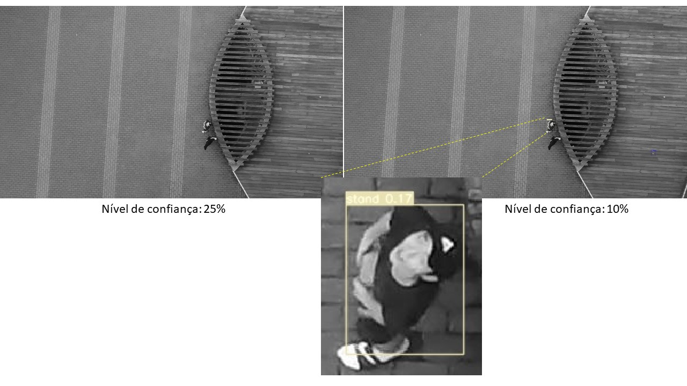

    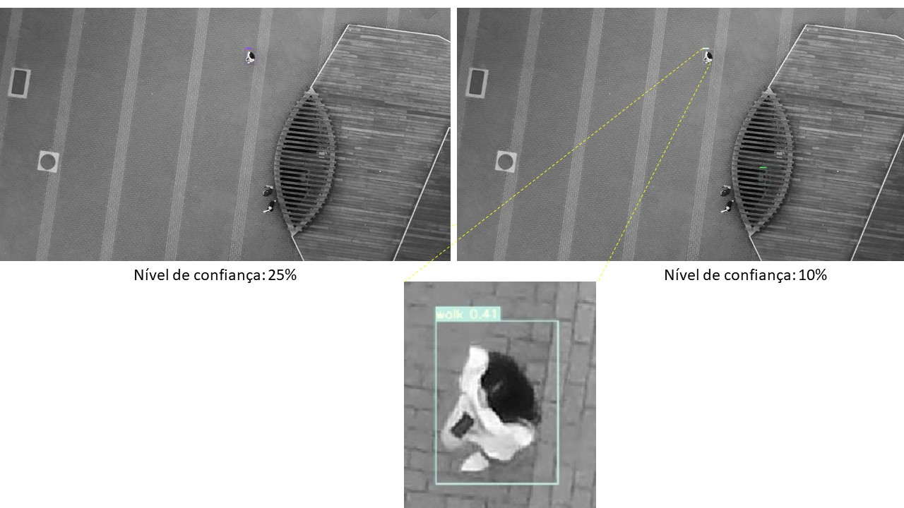

    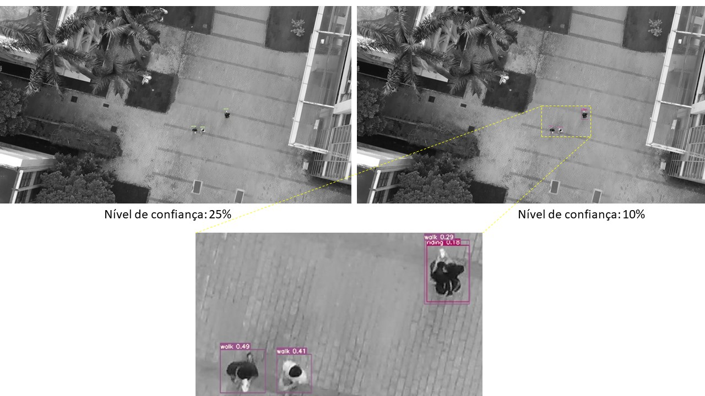

    

    

    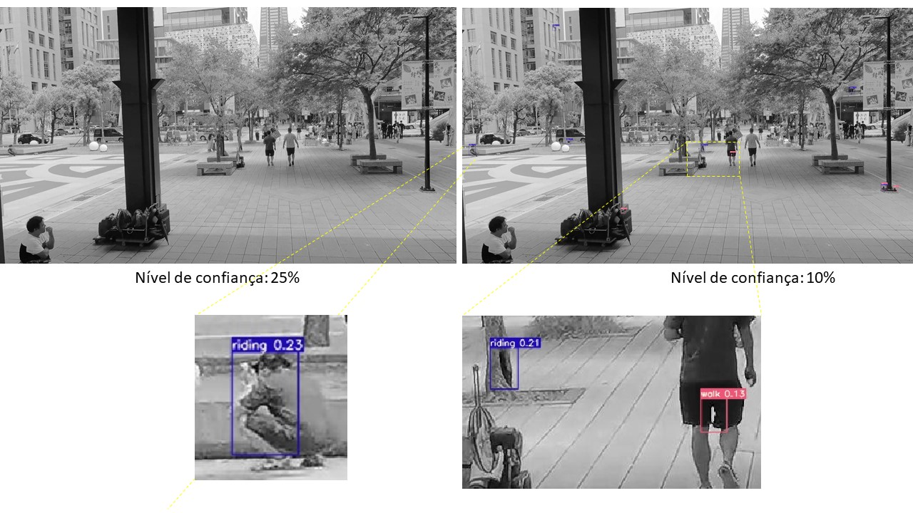

    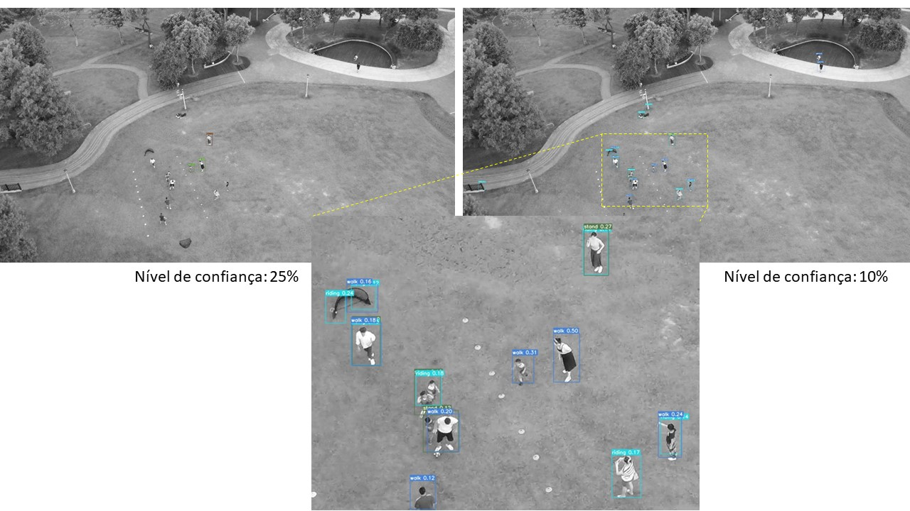

    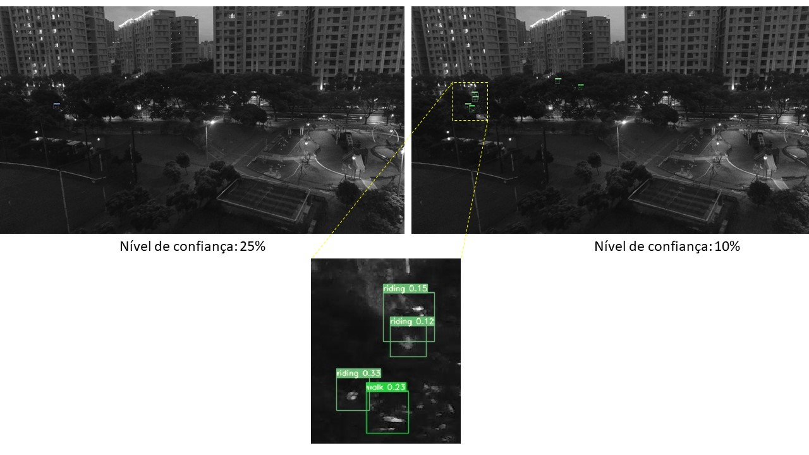

Como pode-se visualizar nos exemplos acima, o modelo não produz bons resultados, o que corrobora com as métricas extraídas dos testes (descrito em "2 - Resultados obtidos para o conjunto de Teste").

De modo geral, apesar de existirem classificações corretas, há muitas pessoas não detectadas na imagem e, consequentemente, cuja ação não é reconhecida, especialmente considerando o nível de confiança de 25%. Além disso, há diversos objetos reconhecidos como pessoas que não são humanos de fato, principalmente ao considerar o nível de confiança de 10%. Outro problema observado é que, ao considerar o nível de confiança de 10%, há casos em que é reconhecida mais de uma ação humana para uma única pessoa. 
  
- 2 - Inferência com imagens de Phantom 4 Pro

    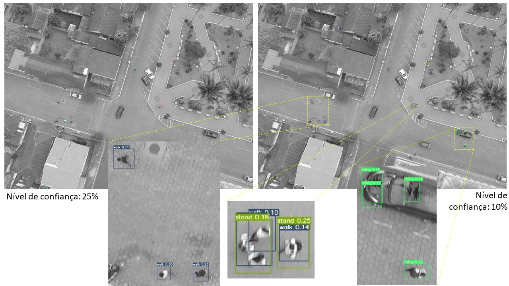

    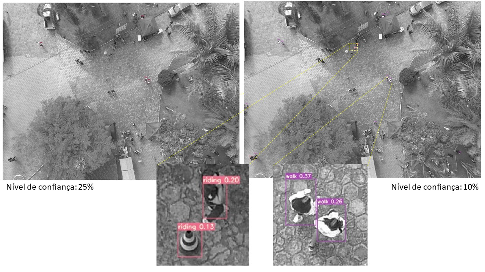

    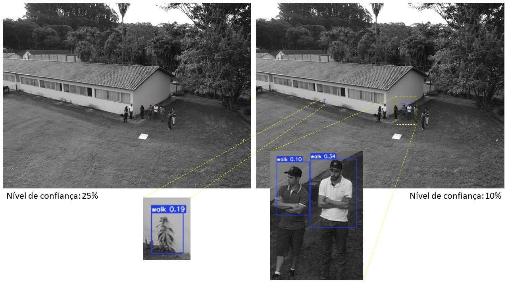

    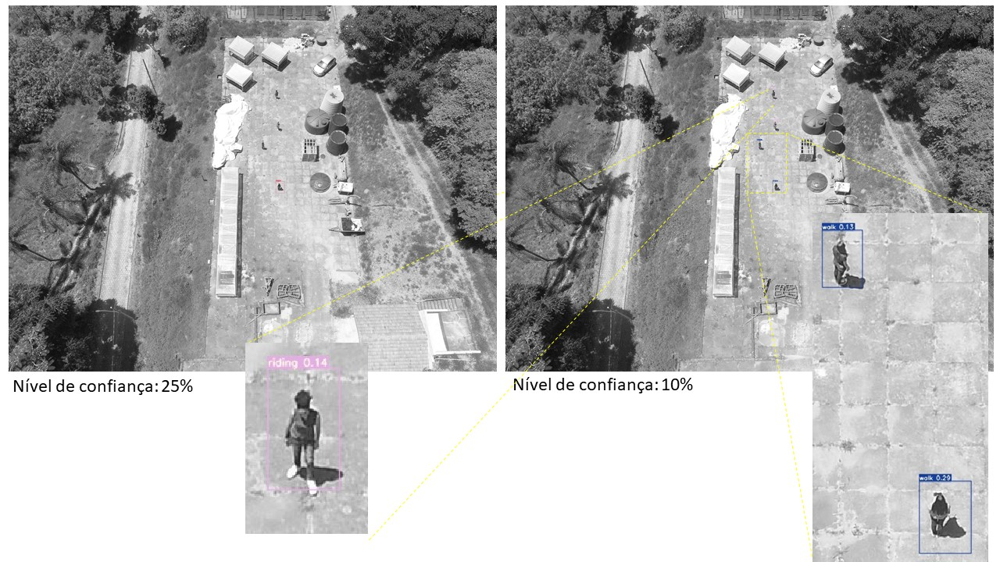

    

Os exemplos acima mostram que, ao adotar imagens de um drone diferente daquele adotado para aquisição do conjunto de treino e validação, os resultados da inferência são piores do que quando se adota imagens do mesmo drone (como as imagens mostrada em "1 - Inferência com imagens do dataset de teste (NTUT)"). Verifica-se isso pois, para as imagens do Phantom 4 Pro, além dos mesmos problemas citados para as imagens de teste do conjunto original de dados, observa-se que a detecção de pessoas é pequena, principalmente ao nível de confiança de 25%. Ao diminuir o nível de confiança para 10%, muitos objetos que não são pessoas são classificados como tal.

Esses resultados podem derivar do fato de que as imagens originais do conjunto de dados ("NTUT 4K Drone Photo Dataset for Human Detection") tem dimensão distinta das imagens do Phantom 4 Pro (4000x5000 pixels). Portanto, presume-se que o ideal seja realizar o treinamento com imagens do mesmo sensor ou, pelo menos, de mesma dimensão das imagens que se deseja realizar a inferência para obter resultados mais satisfatórios.

# Conclusão

Ao longo do desenvolvimento do trabalho foi possível perceber a importância da etapa de pré processamento das imagens antes de ser usada como entrada para qualquer arquitetura. Embora a rede YOLOv7 tenha como foco o reconhecimento de pessoas, a simples utilização das imagens de forma bruta não foi o suficiente para garantir bons resultados. Dessa forma, algumas técnicas de pré processamento foram aplicadas (escala de cinza, filtro de sobel, filtro de prewitt) sendo a técnica que trouxe o maior desempenho e eficiência para o modelo a escala de cinza. No entanto, devido ao desbalanceamento de dados e talvez uma quantidade não muito densa dos mesmos, após a aplicaçao de Data Augmentation o modelo atingiu seu maior desempenho de 55% para a métrica mAP@0.5.

Além disso, ao aplicar o modelo treinado em imagens nunca antes vistas (conjunto de teste e imagens de outro banco de dados) percebeu-se um desempenho pior em relação as métricas obtidas no conjunto de validação, o que pode estar associado ao overfitting. Ademais, como um todo a rede YOLOv7 conseguia reconhecer pessoas (ou objetos) mais do que acertava a classificação.

De maneira geral, os principais desafios enfrentados foram às limitações do uso da plataforma Google Collaboratory, o tamanho das imagens, o que implicava na demora dos treinamentos, no rearranjo do conjunto de dados escolhido para se adequar a rede YOLOv7 e principalmente na escolha de um pré processamento que melhorasse o desempenho da rede.

# Trabalhos futuros

ESCREVER.

## Referências

BRASIL. Departamento de Controle do Espaço Aéreo. Aeronaves Não Tripuladas e o Acesso ao Espaço Aéreo Brasileiro. ICA 100-40.  Ministério da Defesa, 2020. Disponível em: <https://publicacoes.decea.mil.br/publicacao/ica-100-40>. Acesso em 13 mai. 2023.

DEL ROSARIO, J. R. B. et al. Development of a Multi-Object Detection and Human Tracking System from Cooperative Dual Cameras in an Unmanned Aerial Vehicle. In: 2021 IEEE 13th International Conference on Humanoid, Nanotechnology, Information Technology, Communication and Control, Environment, and Management (HNICEM). IEEE, 2021. pág. 1-4. Disponível em: <https://doi.org/10.1109/HNICEM54116.2021.9732035>.

GONZALEZ, R. ; WOODS, R. E. Processamento Digital de Imagens. 3 ed. Pearson, 2009.

KUKIL. Intersection over Union (IoU) in Object Detection & Segmentation. 2022a. Disponível em: https://learnopencv.com/intersection-over-union-iou-in-object-detection-and-segmentation/. Acesso em: 16 maio 2023.

KUKIL. Mean Average Precision (mAP) in Object Detection. 2022b. Disponível em: https://learnopencv.com/mean-average-precision-map-object-detection-model-evaluation-metric/. Acesso em: 16 maio 2023.

PYTORCH. Transforming and augmenting images. Disponível em: <https://pytorch.org/vision/0.12/transforms.html>. Acesso em: 22 jun. 2023.

WANG, C.; BOCHKOVSKIY, A.; LIAO, H. M. YOLOv7: Trainable bag-of-freebies sets new state-of-the-art for real-time object detectors. arXiv preprint arXiv:2207.02696, 2022. Disponível em: 
<https://doi.org/10.48550/arXiv.2207.02696>.

ZHAO, Y.; ZHENG, Z.; LIU, Y. Survey on computational-intelligence-based UAV path planning. Knowledge-Based Systems, v. 158, p. 54–64, 2018. Elsevier. Disponível em: <https://doi.org/10.1016/j.knosys.2018.05.033>.

