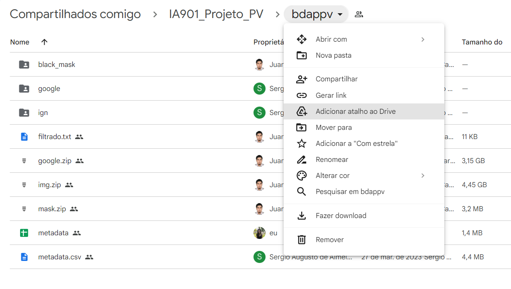
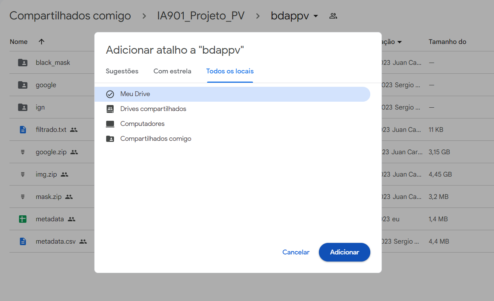
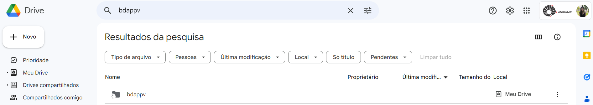

# Instructions for Notebook Usage

## Prerequisites:

### 1 - Have an active UNICAMP user

### 2 - Download the folder "Segmentacao_de_paineis_solares_utilizando_imagens_de_satelite" available on GitHub and upload it to the main folder on Google Drive

### 3 - Create a shortcut in Google Drive to the folder containing the database

Add shortcut to the path: Segmentacao_de_paineis_solares_utilizando_imagens_de_satelite/data/raw

The database is available to the academic community of UNICAMP through the link: [https://drive.google.com/drive/folders/1Jca80MO1lM_8Jb6cTlM9RcwiVCRQd7td?usp=sharing](https://drive.google.com/drive/folders/1Jca80MO1lM_8Jb6cTlM9RcwiVCRQd7td?usp=sharing)

## Step-by-step guide to create the shortcut

#### Step 1: Open the link, click on the arrow next to bdappv, and then click on "Add shortcut to Drive"

#### Step 2: In the shortcut pop-up, select "My Drive/Segmentacao_de_paineis_solares_utilizando_imagens_de_satelite/data/raw" as the destination for the shortcut by choosing "All locations" from the top menu. Click on Add.
 

#### Step 3: Verify if the shortcut (folder with an arrow icon) has been created in your Drive. To do this, access [https://drive.google.com/](https://drive.google.com/) and navigate to the subfolders Segmentacao_de_paineis_solares_utilizando_imagens_de_satelite / data / raw (make sure you are using your UNICAMP Google account)

### With the shortcut created, the notebooks can be executed.
