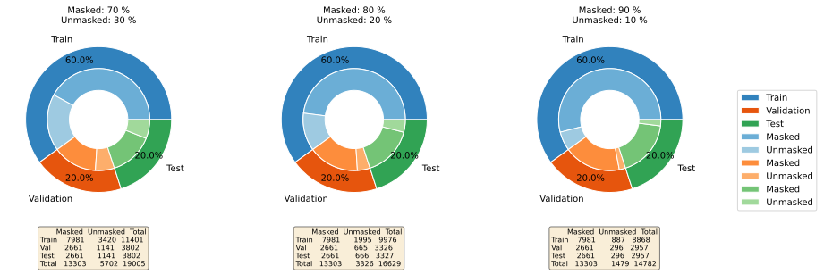

# `Solar panels segmentation using satellite imagery`
# `Segmentação de painéis solares utilizando imagens de satélite`

## Presentation

This project was developed in the post-graduate class *IA901 - Image Processing and Pattern Recognition*, offered in the first semester of 2023 at the University of Campinas (UNICAMP), supervised by Prof. Letícia Rittner, Ph.D., from the Department of Computer Engineering and Automation (DCA) of the School of Electrical and Computer Engineering (FEEC). 

<!---
Incluir nome RA e foco de especialização de cada membro do grupo. Os projetos devem ser desenvolvidos em trios. . . 
-->

Group:
|Names                                   | Academic Record |  Course                                         |
|----------------------------------------|-----------------|-------------------------------------------------|
| Juan Carlos Cortez Aucapiña            | 265568          | 
Ph.D. Student of Electrical Engineering   (Energy)
|
| Luiza Higino Silva Santos              | 264535          | 
Ph.D. Student of Electrical Engineering   (Energy)
|
| Sérgio Augusto de Almeida Christoforo  | 249522          | 
M.Sc. Student of Electrical Engineering   (Telecommunications and Telematics)
|

## Project Description 
<!---
> Descrição do objetivo principal do projeto, incluindo contexto gerador, motivação.
> Qual problema vocês pretendem solucionar?
> Qual a relevância do problema e o impacto da solução do mesmo?
-->
 
Modernizing electrical systems results from technological development, primarily driven by the pursuit of renewable energy sources. As a result, there has been a significant increase in the use of distributed energy resources, such as solar photovoltaic generation. Photovoltaic generation is the most widespread in residential areas worldwide due to its renewable nature and low acquisition cost compared to other renewable sources.

Given that the modernization of power systems allows users to play an active role by injecting power into the system, energy distribution companies must monitor the adoption of these technologies for planning improvements and expansions. Photovoltaic generation is mainly installed on rooftops or in medium/large-scale solar farms. Since the sun is the energy source, satellite images can provide information on the locations of these photovoltaic panels.

Therefore, this project aims to segment solar panels in satellite images using image analysis and pattern recognition techniques. 

 <!--- Subsequently, the aim is to estimate the system's generation using neural networks.-->

 
## Methodology 
<!---
> Proposta de metodologia incluindo especificação de quais técnicas pretende-se explorar. Espera-se que nesta entrega você já seja capaz de descrever de maneira mais específica (do que na Entrega 1) quais as técnicas a serem empregadas em cada etapa do projeto.
-->
 
The methodology of the project adopted so far (as of May 22, 2023) involved the use of an annotated dataset provided in a scientific article and convolutional networks (U-Net, Resnet) for solar panel segmentation. Convolutional networks are used to learn filters that result in the desired segmentation.

Thus, a mini U-Net was trained from scratch, and its performance was evaluated on the Google dataset. On the other hand, a pre-trained Resnet 50 underwent a fine-tuning process using the Google dataset to segment the solar panels. The Resnet50 was also tested with the IGN images.

After the first evaluations, the final CNN configuration was U-net + Resnet50 and the train method consisted in using only google imagery. 
 
##  Databases and evolution
<!---
> Elencar bases de dados utilizadas no projeto.
> Para cada base, coloque uma mini-tabela no modelo a seguir e depois detalhamento sobre como ela foi analisada/usada, conforme exemplo a seguir.
-->
 
Database| Link|Descriptive Summary
----- | ----- | -----
A crowdsourced dataset of aerial images with annotated solar photovoltaic  arrays and installation metadata  | https://zenodo.org/record/7358126#.ZDVdg3bMK39 | - Installation metadata for more than 28000 installations   - Ground truth segmentation masks for 13000 installations, including 7000 with annotations for two different image providers (Google and IGN).   - Installation metadata that matches the annotation for more than 8000 installations.   - Dataset applications include end-to-end PV registry construction, robust PV installations mapping, and analysis of crowdsourced datasets.

Information is provided in the reference article of the dataset.

### A crowdsourced dataset of aerial images with annotated solar photovoltaic  arrays and installation metadata  
<!---
> Faça uma descrição sobre o que concluiu sobre esta base. Sugere-se que respondam perguntas ou forneçam informações indicadas a seguir:
> * Qual o formato dessa base, tamanho, tipo de anotação?
> * Quais as transformações e tratamentos feitos? Limpeza, reanotação, etc.
> * Inclua um sumário com estatísticas descritivas da(s) base(s) de estudo.
> * Utilize tabelas e/ou gráficos que descrevam os aspectos principais da base que são relevantes para o projeto.
-->

The database contains satellite images from both Google and IGN, as well as a metadata spreadsheet. Each of the image providers has two folders named 'img' and 'mask'. The 'img' folder contains several satellite images, while the 'mask' folder contains the corresponding segmentations. However, there are images without solar panels that do not have a mask. 

| Exemplos | Image | Mask | Error |
| -------- |-------|------| ----- | 
|Google  |  | | |
|IGN     |        |  | |

Besides that, there is a metadata csv file containing information about the PV arrays, inversor power, pannel type, etc. 

Here is presented a little information about the images from each Image Provider. 

|Image Provider    |Images | Notes     |
|------------------|-------|-----------|
|Google| Satellite Images: 28825  Masks: 13303 Error Images: 177| Sattelite Images opened with PIL, type 'P'|
|IGN   | Sattelite Images: 17334  Masks: 7685 Error Images: 95 |Satellite Images opened with PIL type 'RGBA'|

For the training of the convolutional network using the datasets, the sets for training, validation, and testing were divided as shown in the images below. It is important to note that in this initial stage, we are not using the IGN dataset.

#### Google
<!---
MUDAR MUDAR MUDAR
-->

# Tools
<!---
> Ferramentas e/ou bibliotecas utilizadas.
-->
| Library           | Version | Description                                                                                                                                                                                            |
|-------------------|---------|--------------------------------------------------------------------------------------------------------------------------------------------------------------------------------------------------------|
| google            | 2.0.3   | The Google library was chosen for its wide range of functionality related to Google services (Drive and COLAB).                                                                                 |
| jsonpickle        | 3.0.1   | jsonpickle was chosen for its efficient method of storing partial and final results. JSON was selected as the data storage format, allowing for seamless integration with Google Drive and efficient data querying.            |
| jupyter-client    | 6.1.12  | Jupyter was selected for its interactive and collaborative environment, enhancing productivity and facilitating data exploration, analysis, and documentation.                                         |
| keras             | 2.12.0  | We utilized Keras for training and testing machine learning models, opting for its user-friendly and powerful framework that facilitates efficient model development and evaluation.                  |
| LucidApp          | -       | LucidApp was used to create images illustrating the workflow and process. It provided a user-friendly interface and a variety of visual elements to effectively communicate the steps and concepts involved in the project. |
| notebook          | 6.4.8   | We chose the notebook library because it provides a convenient and interactive environment for data analysis, code development, and collaboration through Jupyter notebooks.                           |
| numpy             | 1.22.4  | numpy is a critical library for numerical computing in Python. We chose it due to the wide range of well-implemented solutions and functionalities that it offers for numerical operations.                   |
| pandas            | 1.5.3   | pandas is a library for data manipulation and analysis, selected for its efficient handling of structured data. It provided data structures and functions that enhanced the handling and analysis of data.         |
| Pillow            | 8.4.0   | Pillow is a Python imaging library that enhances support for opening, manipulating, and saving various image file formats. We utilized this library to visually inspect the masks created through machine learning algorithms. |
| pip-tools         | 6.13.0  | This choice ensures efficient management and reproducibility of the project, making it easier to maintain a consistent and stable development environment.                                                |
| Python            | 3.11.4  | Python is widely recognized for its simplicity, readability, and efficient implementation. It was chosen as the programming language for its extensive standard library.                                |
| scikit-image      | 0.19.3  | scikit-image, a powerful image processing library in Python, was chosen for its comprehensive collection of algorithms for tasks such as segmentation.                                        |
| scikit-learn      | 1.2.2   | scikit-learn, a widely-used machine learning library in Python, was chosen for its extensive range of supervised and unsupervised learning algorithms.                                                |
| scipy             | 1.10.1  | scipy was utilized for mathematical manipulation and analysis. This powerful library for scientific and technical computing in Python was chosen for its extensive functionality and seamless integration with other libraries. |
| seaborn           | 0.12.2  | seaborn was chosen for its high-level interface, which enables the creation of informative and visually appealing statistical graphics. It is a data visualization library based on matplotlib, providing enhanced functionality and aesthetics for our statistical visualization needs. |
| sklearn-pandas    | 2.2.0   | Chosen for seamless integration of scikit-learn and pandas in the code. |
| tabulate          | 0.8.10  | tabulate was chosen as a computationally lightweight option for generating simple tables to represent the defined sets. It provides an efficient and straightforward way to display tabular data in a visually organized manner. |
| tensorflow        | 2.12.0  | TensorFlow, an open-source deep learning framework, was chosen for its flexible and efficient ecosystem for building and training machine learning models, providing essential tools for deep learning tasks. |
| zipp              | 3.15.0  | We chose zipp as an option for working with compressed files to preserve file characteristics and minimize storage space in the cloud with our database. |

# Workflow 
<!---
> Use uma ferramenta que permita desenhar o workflow e salvá-lo como uma imagem (Draw.io, por exemplo). Insira a imagem nessa seção.
> Você pode optar por usar um gerenciador de workflow (Sacred, Pachyderm, etc) e nesse caso use o gerenciador para gerar uma figura para você.
> Lembre-se que o objetivo de desenhar o workflow é ajudar a quem quiser reproduzir seus experimentos. 
-->

| File               | Description                                                                                                                                                                                                                                                                                                                                                                                                                                                                                                                                                                             |
|--------------------|-----------------------------------------------------------------------------------------------------------------------------------------------------------------------------------------------------------------------------------------------------------------------------------------------------------------------------------------------------------------------------------------------------------------------------------------------------------------------------------------------------------------------------------------------------------------------------------------|
| dataset_prep.ipynb | This notebook contains a collection of functions for handling and analyzing images and masks from a compressed directory (zip file) database. The functions include file listing, data categorization, filtering and cleaning criteria application, mask creation, object counting in masks, creation of balanced training, testing, and validation sets, and the generation of charts for visualizing class distribution.                                                                                             |
| train_model.ipynb  | In this notebook, we perform data preprocessing for data augmentation and generate data batches for training using TensorFlow's tf.data API. We also build the U-Net + ResNet50 model and save the best training results based on metrics such as Dice-Score and the confusion matrix.                                                                                                                                                                                                                                                                                                                                                                                                  |
| test_model.ipynb   | This notebook provides a quantitative evaluation of saved models, offering information through visual models such as tables and heatmaps. Additionally, the notebook utilizes predefined metrics to compare different models, providing a comprehensive understanding of their performance. By leveraging these visual models and comparative metrics, users gain valuable insights into the strengths and weaknesses of each model.                                                                        
<!---                                                                                                                                                                                |
- bdappv: database containing imagery from google and ign
- ds_statistics.ipynb: (description)
- cnn.ipynb: (description) 
- black_mask.png: mask for the imagery without solar panels
- (to be continued)...
-->

# Experiments and Preliminary Results 
<!---
> Descreva de forma sucinta e organizada os experimentos realizados
> Para cada experimento, apresente os principais resultados obtidos
> Aponte os problemas encontrados nas soluções testadas até aqui
-->

| Experiment       | Results          | Notes |
| -------------------------------------------- | -------------------------| ----------|
| U-Net trained from scratch with Google Imagery | Params: 487 297   Cross-entropy Binary Loss: Train - 0.0135 / Val - 0.016   AVG DICE Score Test: 0.7672 | In this experiment, the evaluation with google imagery showed a low dice score, and because of that we decided to use a bigger convolutional neural network (CNN), like Resnet50, and see if there was an improvement in the metrics|
| Resnet50 + mini U-Net fine-tunned with Google Imagery |Params: 20 676 545  Cross-entropy Binary Loss: Train - 0.0078 / Val - 0.0092  AVG DICE Score Test: 0.9330   Base IGN - AVG DICE Score: 0.5888 | There was an improvement with the metrics, however, the Resnet50 was trained with google Imagery, and when tested with IGN imagery presented a low average DICE Score. In that sense, we decided to focus only on google imagery for training and testing |

The results using Resnet50 to test the segmentation of IGN imagery made us realize that some metrics regarding masks with more than one panel should be monitored. 

# Data Augmentation
Random rotation and flip: 
Random zoom:
Random brightness, contrast, and saturation adjustments

# Final results

Based on the training parameters used, including a batch size of 8, a learning rate of 1e-4, and an 80/20 data split for training and validation sets, the final results were very promising. The model achieved an F1 Score of 0.9837 and 0.9818 on the validation and test sets, respectively. Additionally, the model demonstrated a DICE Score of 0.9107 on the validation set and 0.9049 on the test set.

These results indicate high performance and validate the effectiveness of the trained model for the task of photovoltaic panel segmentation in Google satellite images. However, it is important to highlight that there were some inconsistencies observed both in the model's classification and the annotated data. The model struggles with correctly classifying panels that have colors very similar to roofs, which can result in segmentation errors. Furthermore, cases were identified where the presence of panels does not correspond to an appropriate mask. Despite the limitations, the obtained results show significant potential for the application of photovoltaic panel segmentation in satellite images.

# Next steps 
<!---
> Liste as próximas etapas planejadas para conclusão do projeto, com uma estimativa de tempo para cada etapa
-->
- [x] Delivery 1 - Forms with general project information
- [x] Delivery 2:
    - [x] Script 1: Identification of images with errors and dataset information | Selecting data for training, validation and test 
    - [x] Script 2: Convolutional network training/testing for segmentation 
    - [x] Preliminary GitHub organization 
- [x] Delivery 3:
    - [x] Convolutional network for segmentation
        - [x] Integration of the two scripts from Delivery 2
        - [x] Data augmentation on input images for improved results
        - [x] Aditional notebook for data augmentation visualization
        - [x] Aditional notebook for statistical info about the database
        - [x] Optimization of convolutional network hyperparameters (grid search)
    - [x] Quantitative and qualitative evaluations (segmentation)
    - [x] Git update (readme, workflow, notebooks)
- [x] Project finished  :tada: 

## Future Work!
- [ ]  Pre and post-processing the images and segmentation masks
- [ ] Training and testing of the neural network for photovoltaic generation power estimation
    - [ ] Definition of input data
    - [ ] Evaluation of results
    - [ ] Optimization of neural network hyperparameters
        
## References
<!---
> Seção obrigatória. Inclua aqui referências utilizadas no projeto.
-->

"A crowdsourced dataset of aerial images with annotated solar photovoltaic  arrays and installation metadata" - https://www.nature.com/articles/s41597-023-01951-4 

"Segmentation of Satellite Images of Solar Panels Using Fast Deep Learning Model" - https://www.ijrer.org/ijrer/index.php/ijrer/article/view/11607/pdf

"Estimation of rooftop solar energy generation using Satellite Image Segmentation" - https://ieeexplore.ieee.org/document/8971578 

"Panel Segmentation: A Python Package for Automated Solar Array Metadata Extraction Using Satellite Imagery" - https://ieeexplore.ieee.org/document/10008194 

"SolarFinder: Automatic Detection of Solar Photovoltaic Arrays" - https://ieeexplore.ieee.org/abstract/document/9111006?casa_token=BRGGve63_NgAAAAA:hV2kmVbSGPzD9zfckkhISndDHbweEyD1FR4axwkAbxfs6EhkRfY2yR5Y0expG1xTn7-3nbiymck 

"Multi-resolution dataset for photovoltaic panel segmentation from satellite and aerial imagery" - https://essd.copernicus.org/articles/13/5389/2021/ 
