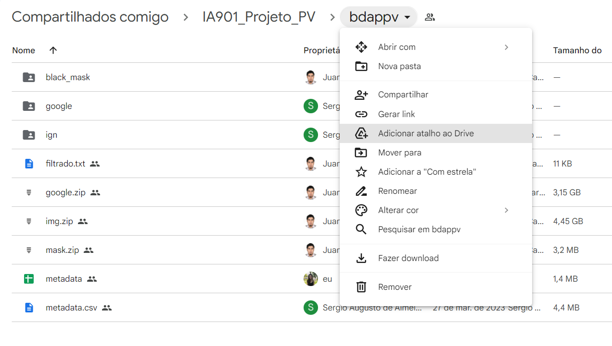
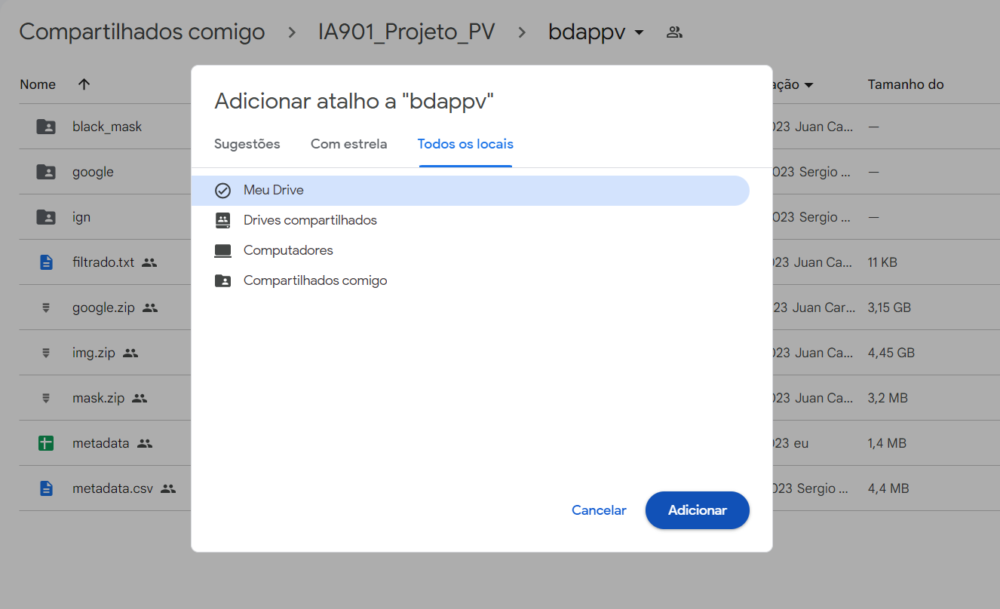
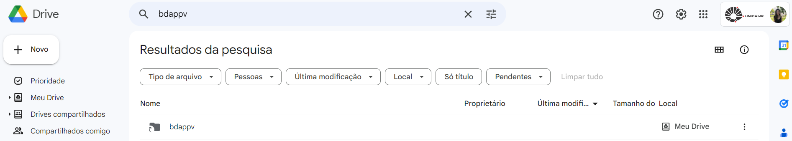

# Instruções para Uso do Notebook

## Pré-requisitos: 

### Ter usuário ativo da UNICAMP
### Criar um atalho no Google Drive para a pasta com a base de dados, disponível no link https://drive.google.com/drive/folders/1Jca80MO1lM_8Jb6cTlM9RcwiVCRQd7td?usp=sharing

#### Passo 1: abrir o link, clicar na seta ao lado de bdappv e clicar novamente em "Adicionar atalho ao drive"

#### Passo 2: no pop-up do atalho, selecionar no menu superior "Todos os locais" e em seguida "Meu drive", como destino do atalho. Clicar em Adicionar.
 
#### Passo 3: verificar se o atalho (pasta com uma seta no ícone) foi criado no seu drive. Para isso, acesse https://drive.google.com/ e procure a pasta com nome bdappv (certifique-se de estar com a conta google da UNICAMP)

### Com o atalho criado, o notebook pode ser rodado.
