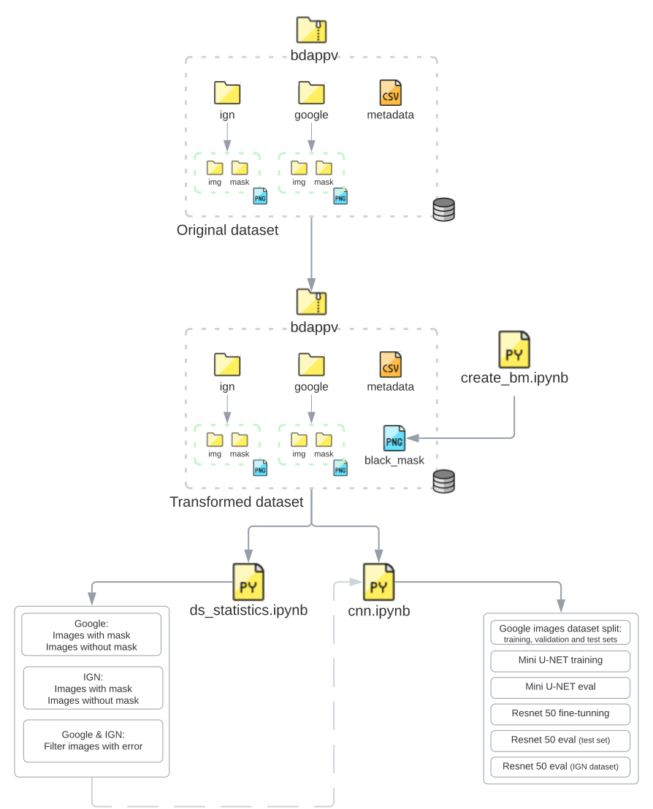

# `Segmentação e estimação da Potência de painéis solares utilizando imagens de satélite`
#  `Solar panels segmentation and power estimation using satellite imagery`

This readme has the project description in English as well :sunglasses:

## Apresentação    Presentation 

O presente projeto foi originado no contexto das atividades da disciplina de pós-graduação *IA901 - Processamento de Imagens e Reconhecimento de Padrões*, 
oferecida no primeiro semestre de 2023, na Unicamp, sob supervisão da Profa. Dra. Leticia Rittner, do Departamento de Engenharia de Computação e Automação (DCA) da Faculdade de Engenharia Elétrica e de Computação (FEEC).

 This project was developed in the post-graduate class *IA901 - Image Processing and Pattern Recognition*, offered in the first semester of 2023 at the University of Campinas (UNICAMP), supervised by Prof. Letícia Rittner, Ph.D., from the Department of Computer Engineering and Automation (DCA) of the School of Electrical and Computer Engineering (FEEC). 

<!---
Incluir nome RA e foco de especialização de cada membro do grupo. Os projetos devem ser desenvolvidos em trios.
-->

Grupo    Group: 
|Nome   Name             | RA      | Curso    Course                                                                              |
|----------------------------------------|---------|--------------------------------------------------------------------------------------------------------------|
| Juan Carlos Cortez Aucapiña            | 265568  | Doutorado em Engenharia Elétrica (Energia)   Ph.D. Student of Electrical Engineering (Energy)|
| Luiza Higino Silva Santos              | 264535  | Doutorado em Engenharia Elétrica (Energia)   Ph.D. Student of Electrical Engineering (Energy)|
| Sérgio Augusto de Almeida Christoforo  | 249522  | Mestrado em Engenharia Elétrica (Energia)    M.Sc. Student of Electrical Engineering (Energy)|

## Descrição do Projeto     Project Description 
<!---
> Descrição do objetivo principal do projeto, incluindo contexto gerador, motivação.
> Qual problema vocês pretendem solucionar?
> Qual a relevância do problema e o impacto da solução do mesmo?
-->
 
A modernização dos sistemas elétricos é decorrente do desenvolvimento tecnológico, causado principalmente pela busca de fontes de energia renováveis. Com isso, nos últimos anos, houve um aumento considerável no uso de recursos distribuídos de energia, como geração solar fotovoltaica. A geração fotovoltaica é a mais difundida nas residências de todo o mundo, pelo seu caráter renovável e pelo baixo custo de aquisição, quando comparada com outras fontes renováveis. 
 
Uma vez que a modernização dos sistemas elétricos de potência permite que seus usuários tenham agora um papel ativo, injetando potência no sistema, é de extrema importância para as empresas distribuidoras de energia acompanharem a adoção destas tecnologias, para o planejamento de melhorias e expansão. A geração fotovoltaica é, em sua maioria, instalada no telhados de casas ou com médias/grandes usinas. Sendo o sol a fonte de energia, imagens de satélite permitem saber onde estão estes painéis fotovoltaicos.
 
Dessa forma, pretende-se, neste projeto, segmentar painéis solares em imagens de satélite utilizando técnicas de análise de imagem e reconhecimento de padrões. Em seguida, pretende-se estimar a geração do sistema em questão, ustilizando redes neurais. 

 Modernizing electrical systems results from technological development, primarily driven by the pursuit of renewable energy sources. As a result, there has been a significant increase in the use of distributed energy resources, such as solar photovoltaic generation. Photovoltaic generation is the most widespread in residential areas worldwide due to its renewable nature and low acquisition cost compared to other renewable sources.
 
Given that the modernization of power systems allows users to play an active role by injecting power into the system, energy distribution companies must monitor the adoption of these technologies for planning improvements and expansions. Photovoltaic generation is mainly installed on rooftops or in medium/large-scale solar farms. Since the sun is the energy source, satellite images can provide information on the locations of these photovoltaic panels.
 
Therefore, this project aims to segment solar panels in satellite images using image analysis and pattern recognition techniques. Subsequently, the aim is to estimate the system's generation using neural networks.

 
# Metodologia     Methodology 
<!---
> Proposta de metodologia incluindo especificação de quais técnicas pretende-se explorar. Espera-se que nesta entrega você já seja capaz de descrever de maneira mais específica (do que na Entrega 1) quais as técnicas a serem empregadas em cada etapa do projeto.
-->
 
A metodologia do projeto adotada até agora (22 de maio de 2023) contou com o uso de um dataset anotado disponibilizado num artigo científico, e com redes convolucionais (U-Net, Resnet) para segmentação dos painéis solares. 

Uma mini U-Net foi treinada do zero, enquanto uma Resnet já treinada apenas teve atualização dos pesos sinápticos. 
 
## Bases de Dados e Evolução     Databases and evolution 
<!---
> Elencar bases de dados utilizadas no projeto.
> Para cada base, coloque uma mini-tabela no modelo a seguir e depois detalhamento sobre como ela foi analisada/usada, conforme exemplo a seguir.
-->
 
Base de Dados  Database| Endereço na Web  Link | Resumo descritivo  Descriptive Summary
----- | ----- | -----
A crowdsourced dataset of aerial images with annotated solar photovoltaic  arrays and installation metadata | https://zenodo.org/record/7358126#.ZDVdg3bMK39 | - Installation metadata for more than 28000 installations   - Ground truth segmentation masks for 13000 installations, including 7000 with annotations for two different image providers.   - Installation metadata that matches the annotation for more than 8000 installations.   - Dataset applications include end-to-end PV registry construction, robust PV installations mapping, and analysis of crowdsourced datasets.

### A crowdsourced dataset of aerial images with annotated solar photovoltaic  arrays and installation metadata  
<!---
> Faça uma descrição sobre o que concluiu sobre esta base. Sugere-se que respondam perguntas ou forneçam informações indicadas a seguir:
> * Qual o formato dessa base, tamanho, tipo de anotação?
> * Quais as transformações e tratamentos feitos? Limpeza, reanotação, etc.
> * Inclua um sumário com estatísticas descritivas da(s) base(s) de estudo.
> * Utilize tabelas e/ou gráficos que descrevam os aspectos principais da base que são relevantes para o projeto.
-->
GRÁFICOS E TABELAS -- JUAN CARLOS

# Ferramentas     Tools 
<!---
> Ferramentas e/ou bibliotecas já utilizadas e/ou ainda a serem utilizadas (com base na visão atual do grupo sobre o projeto).
-->
- TensorFlow 
- Sk Learn
- Matplotlib
- LucidChart 
- ...

# Workflow 
<!---
> Use uma ferramenta que permita desenhar o workflow e salvá-lo como uma imagem (Draw.io, por exemplo). Insira a imagem nessa seção.
> Você pode optar por usar um gerenciador de workflow (Sacred, Pachyderm, etc) e nesse caso use o gerenciador para gerar uma figura para você.
> Lembre-se que o objetivo de desenhar o workflow é ajudar a quem quiser reproduzir seus experimentos. 
-->

# Experimentos e Resultados preliminares     Experiments and Preliminary Results 
<!---
> Descreva de forma sucinta e organizada os experimentos realizados
> Para cada experimento, apresente os principais resultados obtidos
> Aponte os problemas encontrados nas soluções testadas até aqui
-->
Experimento  Experiment        | Resultados  Results             |
| -------------------------------------------- | ------------------------------------------------| 
| U-Net treinada do zero com imagens do Google |Params: 487 297   Cross-entropy Binary Loss: Train - 0.0135 / Val - 0.016   AVG DICE Score Test: 0.7672 |
| ResNet 50 fine-tunning com imagens do Google |Params: 20 676 545  Cross-entropy Binary Loss: Train - 0.0078 / Val - 0.0092  AVG DICE Score Test: 0.9330   Base IGN - AVG DICE Score: 0.5888 |

# Próximos passos     Next steps 
<!---
> Liste as próximas etapas planejadas para conclusão do projeto, com uma estimativa de tempo para cada etapa
-->
- [x] Entrega 1 - Formulário com informações gerais do projeto (Sérgio, Juan Carlos e Luiza)
- [x] Entrega 2: 
    - [x] Script 1: remoção de imagens com erro e separação dos conjuntos de treinamento, validação e teste(Sérgio)
    - [x] Script 2: para treinamento/teste das redes convolucionais para segmentação (Juan Carlos)
    - [x] Organização preliminar GitHub (Luiza) 
- [ ] Entrega 3: 
    - [ ] Rede convolucional para segmentação
        - [ ] Junção dos dois scripts da Entrega 2
        - [ ] Data-augmentation nas imagens de entrada para melhoria de resultados 
        - [ ] Otimização dos hiperparâmetros da rede convolucional (grid-search)
        - [ ] Pós-processamento da segmentação realizada
    - [ ] Treinamento e teste da rede neural para estimação da potência da geração fotovoltaica
        - [ ] Definição dos dados de entrada
        - [ ] Avaliação dos resultados
        - [ ] Melhorias nos hiperparâmetros da rede neural 
    - [ ] Avaliações quantitativas (segmentação e estimação) e qualitativas (segmentação)
    - [ ] Nova atualização do Git (readme, workflow, notebooks) 
- [ ] Finalização do projeto :tada:

## Referências    References 
<!---
> Seção obrigatória. Inclua aqui referências utilizadas no projeto.
-->

"A crowdsourced dataset of aerial images with annotated solar photovoltaic  arrays and installation metadata" - https://www.nature.com/articles/s41597-023-01951-4 

"Segmentation of Satellite Images of Solar Panels Using Fast Deep Learning Model" - https://www.ijrer.org/ijrer/index.php/ijrer/article/view/11607/pdf

"Estimation of rooftop solar energy generation using Satellite Image Segmentation" - https://ieeexplore.ieee.org/document/8971578 

"Panel Segmentation: A Python Package for Automated Solar Array Metadata Extraction Using Satellite Imagery" - https://ieeexplore.ieee.org/document/10008194 

"SolarFinder: Automatic Detection of Solar Photovoltaic Arrays" - https://ieeexplore.ieee.org/abstract/document/9111006?casa_token=BRGGve63_NgAAAAA:hV2kmVbSGPzD9zfckkhISndDHbweEyD1FR4axwkAbxfs6EhkRfY2yR5Y0expG1xTn7-3nbiymck 

"Multi-resolution dataset for photovoltaic panel segmentation from satellite and aerial imagery" - https://essd.copernicus.org/articles/13/5389/2021/ 
