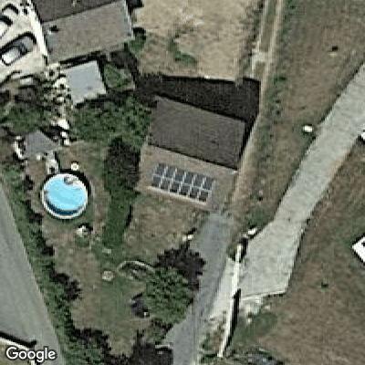
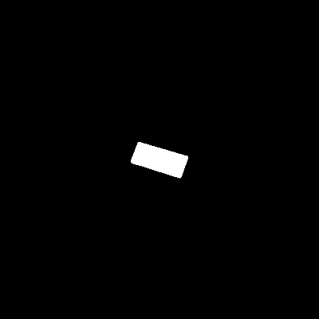
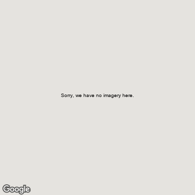
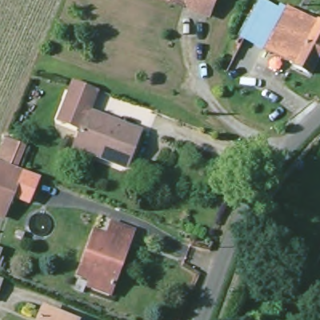
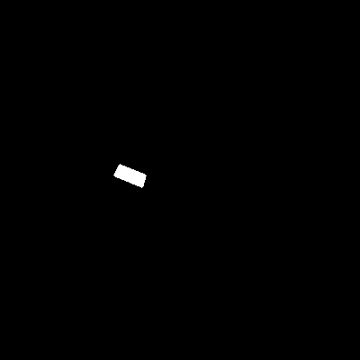
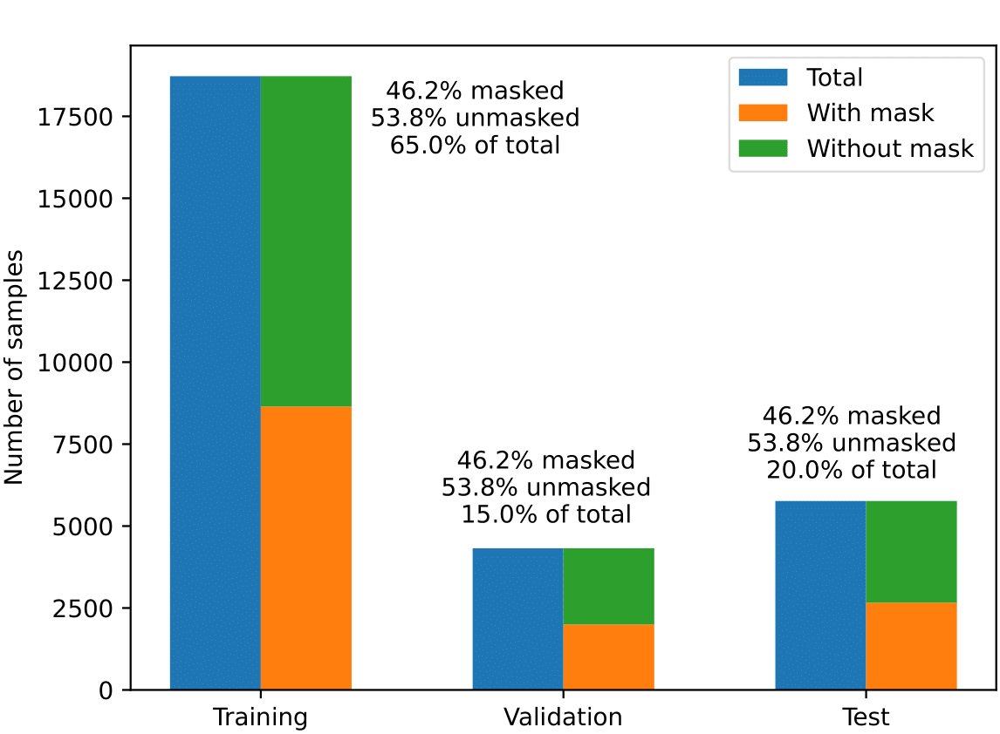
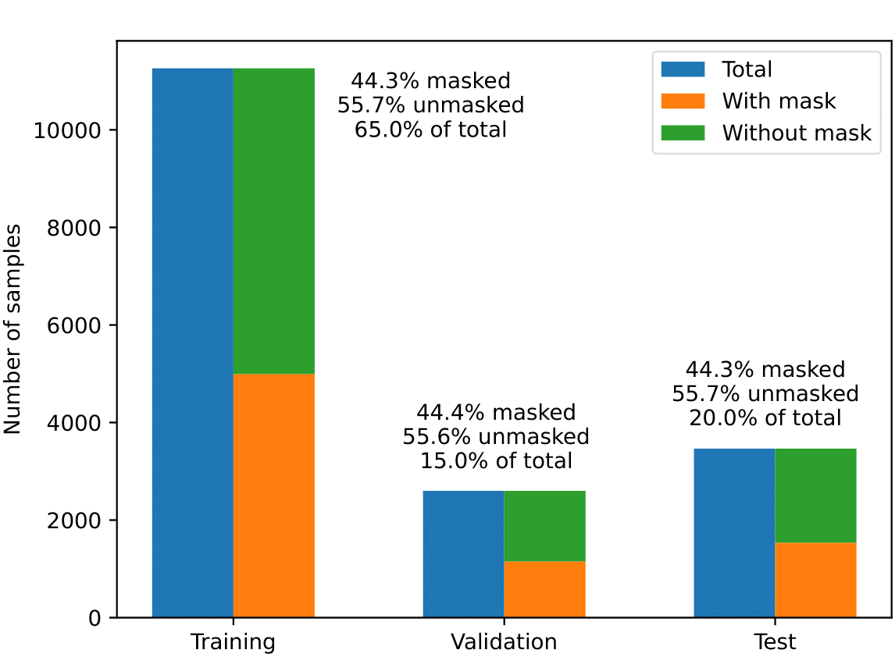

# `Solar panels segmentation and power estimation using satellite imagery`
# `Segmentação e estimação da Potência de painéis solares utilizando imagens de satélite`

## Presentation

This project was developed in the post-graduate class *IA901 - Image Processing and Pattern Recognition*, offered in the first semester of 2023 at the University of Campinas (UNICAMP), supervised by Prof. Letícia Rittner, Ph.D., from the Department of Computer Engineering and Automation (DCA) of the School of Electrical and Computer Engineering (FEEC). 

<!---
Incluir nome RA e foco de especialização de cada membro do grupo. Os projetos devem ser desenvolvidos em trios.
-->

Group:
|Names                                   | Academic Record |  Course                                         |
|----------------------------------------|-----------------|-------------------------------------------------|
| Juan Carlos Cortez Aucapiña            | 265568          | Ph.D. Student of Electrical Engineering (Energy)|
| Luiza Higino Silva Santos              | 264535          | Ph.D. Student of Electrical Engineering (Energy)|
| Sérgio Augusto de Almeida Christoforo  | 249522          | M.Sc. Student of Electrical Engineering (Energy)|

## Project Description 
<!---
> Descrição do objetivo principal do projeto, incluindo contexto gerador, motivação.
> Qual problema vocês pretendem solucionar?
> Qual a relevância do problema e o impacto da solução do mesmo?
-->
 
Modernizing electrical systems results from technological development, primarily driven by the pursuit of renewable energy sources. As a result, there has been a significant increase in the use of distributed energy resources, such as solar photovoltaic generation. Photovoltaic generation is the most widespread in residential areas worldwide due to its renewable nature and low acquisition cost compared to other renewable sources.

Given that the modernization of power systems allows users to play an active role by injecting power into the system, energy distribution companies must monitor the adoption of these technologies for planning improvements and expansions. Photovoltaic generation is mainly installed on rooftops or in medium/large-scale solar farms. Since the sun is the energy source, satellite images can provide information on the locations of these photovoltaic panels.

Therefore, this project aims to segment solar panels in satellite images using image analysis and pattern recognition techniques. Subsequently, the aim is to estimate the system's generation using neural networks.

 
# Methodology 
<!---
> Proposta de metodologia incluindo especificação de quais técnicas pretende-se explorar. Espera-se que nesta entrega você já seja capaz de descrever de maneira mais específica (do que na Entrega 1) quais as técnicas a serem empregadas em cada etapa do projeto.
-->
 
The methodology of the project adopted so far (as of May 22, 2023) involved the use of an annotated dataset provided in a scientific article and convolutional networks (U-Net, Resnet) for solar panel segmentation. Convolutional networks are used to learn filters that result in the desired segmentation.

Thus, a mini U-Net was trained from scratch, and its performance was evaluated on the Google dataset. On the other hand, a pre-trained Resnet 50 underwent a fine-tuning process using the Google dataset to segment the solar panels. The Resnet50 was also tested with the IGN images.
 
##  Databases and evolution
<!---
> Elencar bases de dados utilizadas no projeto.
> Para cada base, coloque uma mini-tabela no modelo a seguir e depois detalhamento sobre como ela foi analisada/usada, conforme exemplo a seguir.
-->
 
Database| Link|Descriptive Summary
----- | ----- | -----
A crowdsourced dataset of aerial images with annotated solar photovoltaic  arrays and installation metadata  | https://zenodo.org/record/7358126#.ZDVdg3bMK39 | - Installation metadata for more than 28000 installations   - Ground truth segmentation masks for 13000 installations, including 7000 with annotations for two different image providers (Google and IGN).   - Installation metadata that matches the annotation for more than 8000 installations.   - Dataset applications include end-to-end PV registry construction, robust PV installations mapping, and analysis of crowdsourced datasets.

Information provided in the reference article of the dataset.

### A crowdsourced dataset of aerial images with annotated solar photovoltaic  arrays and installation metadata  
<!---
> Faça uma descrição sobre o que concluiu sobre esta base. Sugere-se que respondam perguntas ou forneçam informações indicadas a seguir:
> * Qual o formato dessa base, tamanho, tipo de anotação?
> * Quais as transformações e tratamentos feitos? Limpeza, reanotação, etc.
> * Inclua um sumário com estatísticas descritivas da(s) base(s) de estudo.
> * Utilize tabelas e/ou gráficos que descrevam os aspectos principais da base que são relevantes para o projeto.
-->

The database contains satellite images from both Google and IGN, as well as a metadata spreadsheet. Each of the image providers has two folders named 'img' and 'mask'. The 'img' folder contains several satellite images, while the 'mask' folder contains the corresponding segmentations. However, there are images without solar panels that do not have a mask. 

| Exemplos | Image | Mask | Error |
| -------- |-------|------| ----- | 
|Google  |  | | |
|IGN     |        |  | |

Besides that, there is a metadata csv file containing information about the PV arrays, inversor power, pannel type, etc. 

Here is presented a few information about the images from each Image Provider. 

|Image Provider    |Images | Notes     |
|------------------|-------|-----------|
|Google| Satellite Images: 28825  Masks: 13303 Error Images: 177| Sattelite Images opened with PIL, type 'P'|
|IGN   | Sattelite Images: 17334  Masks: 7685 Error Images: 95 |Satellite Images opened with PIL type 'RGBA'|

For the training of the convolutional network using the datasets, the sets for training, validation, and testing were divided as shown in the images below. It is important to note that in this initial stage, we are not using the IGN dataset.

#### Google
<!---
MUDAR MUDAR MUDAR
-->

#### IGN
<!---
MUDAR MUDAR MUDAR
-->

# Tools
<!---
> Ferramentas e/ou bibliotecas já utilizadas e/ou ainda a serem utilizadas (com base na visão atual do grupo sobre o projeto).
-->
- **TensorFlow**: to build and test the convolutional neural network used with the imagery
- **Scikit-learn**: to divide the sets for testing, validation and training
- **Matplotlib**: to plot graphs containing statistical information about the dataset
- **LucidChart**: to draw the workflow of the project
- ...

# Workflow 
<!---
> Use uma ferramenta que permita desenhar o workflow e salvá-lo como uma imagem (Draw.io, por exemplo). Insira a imagem nessa seção.
> Você pode optar por usar um gerenciador de workflow (Sacred, Pachyderm, etc) e nesse caso use o gerenciador para gerar uma figura para você.
> Lembre-se que o objetivo de desenhar o workflow é ajudar a quem quiser reproduzir seus experimentos. 
-->

- bdappv: database containing imagery from google and ign
- ds_statistics.ipynb: (description)
- cnn.ipynb: (description) 
- black_mask.png: mask for the imagery without solar pannels
- (to be continued)...

# Experiments and Preliminary Results 
<!---
> Descreva de forma sucinta e organizada os experimentos realizados
> Para cada experimento, apresente os principais resultados obtidos
> Aponte os problemas encontrados nas soluções testadas até aqui
-->

| Experiment       | Results          | Notes |
| -------------------------------------------- | -------------------------| ----------|
| U-Net trained from scratch with Google Imagery | Params: 487 297   Cross-entropy Binary Loss: Train - 0.0135 / Val - 0.016   AVG DICE Score Test: 0.7672 | In this experiment, the evaluation with google imagery showed a low dice score, and because of that we decided to use a bigger convolutional neural network (cnn), like Resnet50, and see if there was improvement in the metrics|
| Resnet50 + mini U-Net fine-tunned with Google Imagery |Params: 20 676 545  Cross-entropy Binary Loss: Train - 0.0078 / Val - 0.0092  AVG DICE Score Test: 0.9330   Base IGN - AVG DICE Score: 0.5888 | There was improvement with the metrics, however the Resnet50 was trained with google Imagery, and when tested with IGN imagery presented an low average DICE Score. In that sense, we decided to focus only with google imagery, for training and testing |

The results using Resnet50 to test the segmentation of IGN imagery made us realize that some metrics regarding masks with more than one pannel should be monitored. 

# Next steps 
<!---
> Liste as próximas etapas planejadas para conclusão do projeto, com uma estimativa de tempo para cada etapa
-->
- [x] Delivery 1 - Forms with general project information
- [x] Delivery 2:
    - [x] Script 1: Identification of images with errors and dataset information | Selecting data for training, validation and test 
    - [x] Script 2: Convolutional network training/testing for segmentation 
    - [x] Preliminary GitHub organization 
- [ ] Delivery 3:
    - [ ] Convolutional network for segmentation
        - [ ] Integration of the two scripts from Delivery 2
        - [ ] Data augmentation on input images for improved results
        - [ ] Optimization of convolutional network hyperparameters (grid search)
        - [ ] Pós-processamento da segmentação realizada      
    - [ ] Training and testing of the neural network for photovoltaic generation power estimation
        - [ ] Definition of input data
        - [ ] Evaluation of results
        - [ ] Optimization of neural network hyperparameters
    - [ ] Quantitative evaluations (segmentation and estimation) and qualitative evaluations (segmentation)
    - [ ] Git update (readme, workflow, notebooks)
- [ ] Project finished  :tada: 

## References
<!---
> Seção obrigatória. Inclua aqui referências utilizadas no projeto.
-->

"A crowdsourced dataset of aerial images with annotated solar photovoltaic  arrays and installation metadata" - https://www.nature.com/articles/s41597-023-01951-4 

"Segmentation of Satellite Images of Solar Panels Using Fast Deep Learning Model" - https://www.ijrer.org/ijrer/index.php/ijrer/article/view/11607/pdf

"Estimation of rooftop solar energy generation using Satellite Image Segmentation" - https://ieeexplore.ieee.org/document/8971578 

"Panel Segmentation: A Python Package for Automated Solar Array Metadata Extraction Using Satellite Imagery" - https://ieeexplore.ieee.org/document/10008194 

"SolarFinder: Automatic Detection of Solar Photovoltaic Arrays" - https://ieeexplore.ieee.org/abstract/document/9111006?casa_token=BRGGve63_NgAAAAA:hV2kmVbSGPzD9zfckkhISndDHbweEyD1FR4axwkAbxfs6EhkRfY2yR5Y0expG1xTn7-3nbiymck 

"Multi-resolution dataset for photovoltaic panel segmentation from satellite and aerial imagery" - https://essd.copernicus.org/articles/13/5389/2021/ 
