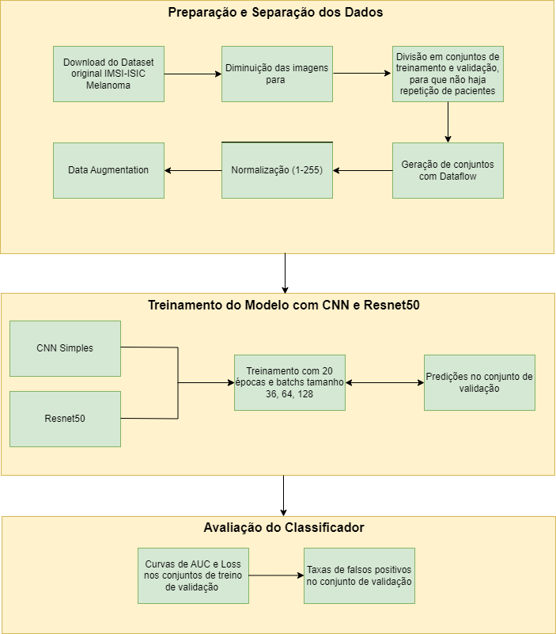
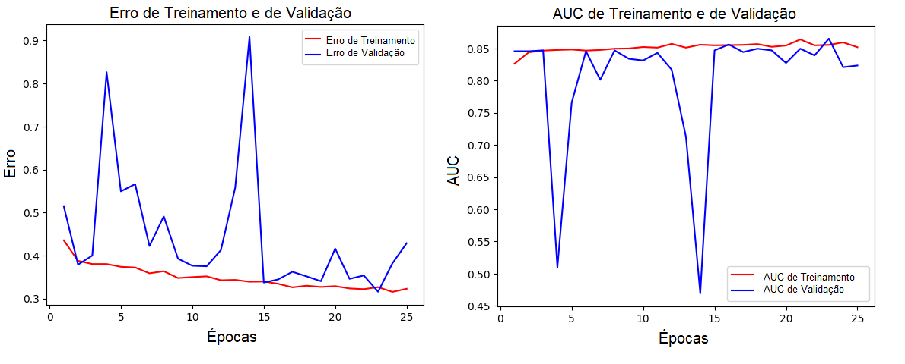
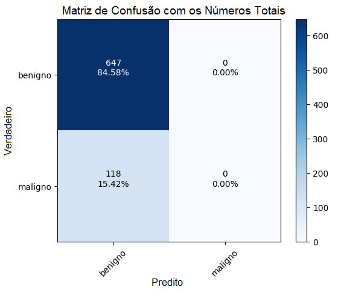
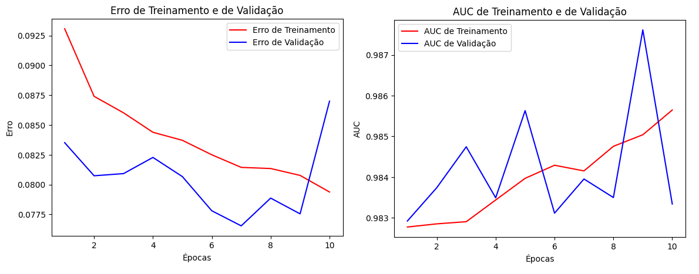
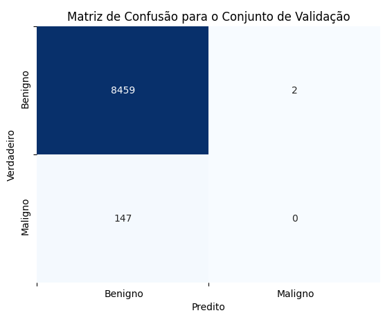
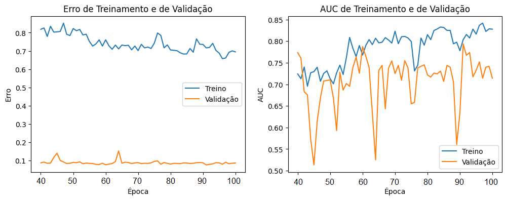
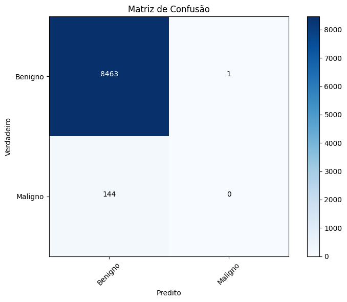

# Classificação de melanoma em imagens de lesões de pele
# Melanoma classification in skin lesions images

## Apresentação

O presente projeto foi originado no contexto das atividades da disciplina de pós-graduação *IA901 - Processamento de Imagens e Reconhecimento de Padrões*, 
oferecida no primeiro semestre de 2023, na Unicamp, sob supervisão da Profa. Dra. Leticia Rittner, do Departamento de Engenharia de Computação e Automação (DCA) da Faculdade de Engenharia Elétrica e de Computação (FEEC).. 

 |Nome  | RA | Curso|
 |--|--|--|
 | Johsac Isbac Gomez Sanchez  | 216401  | Doutorado em Engenharia Elétrica|
 | Robson Assis Colares  | 264369  | Doutorado em Engenharia Elétrica |
 | Suellen Sena da Silva  | 177261  | Mestrado em Engenharia da Computação|

## Descrição do Projeto

O objetivo do projeto é desenvolver um sistema para classificação de lesões de pele entre malignas e benignas com o uso de arquiteturas de redes neurais convolucionais. O sistema visa fornecer uma ferramenta precisa e eficiente para ajudar na detecção precoce de tumores malignos, contribuindo para o diagnóstico médico e reduzindo a taxa de falsos negativos (ou seja, classificar como benignas lesões que na verdade são malignas). Adicionalmente, garantir que o classificador tenha a sensibilidade (recall) alta também é de extrema importância para o projeto, dado que o tratamento precoce pode ser mais benéfico ao paciente do que não diagnosticá-lo e o tratamento ser tardio. 

  

**Taxa de falso negativo:** 

$$P(\hat{f}(x)=\text{Benigno} | f(x)=\text{Maligno})=\frac{FN}{FN+VN}$$

**Recall:**
$$P(\hat{f}(x)=\text{Maligno} | f(x)=\text{Maligno})=\frac{VN}{FN+VN}$$

Dessa forma, o contexto gerador do projeto consiste no desafio de validar uma arquitetura que consiga classificar lesões de pele em imagens médicas. Com uma base de dados de 33.007 imagens, das quais apenas 582 são de tumores malignos, o projeto enfrenta o desafio de lidar com um conjunto de dados altamente desequilibrado. A classificação precisa dessas imagens é essencial para identificar corretamente os casos malignos e benignos, a fim de fornecer um diagnóstico adequado e tomar decisões de tratamento adequadas.

Portanto, a motivação para esse projeto é a importância da detecção precoce de lesões de pele malignas, como o câncer de pele, que tem maior probabilidade de ser tratado com sucesso se diagnosticado em estágios iniciais. A utilização de arquiteturas de redes neurais convolucionais, combinada com técnicas avançadas de processamento de imagem, permite uma análise mais precisa e automatizada das lesões, reduzindo assim a taxa de falsos negativos. Isso pode auxiliar médicos e especialistas a tomarem decisões mais assertivas, agilizando o processo de diagnóstico e melhorando os resultados dos pacientes.

**Qual problema vocês pretendem solucionar?**

O problema que buscamos resolver é o erro de classificação de lesões malignas classificadas como benignas. Tal erro pode levar a um atraso no diagnóstico e tratamento adequado, o que é fundamental para a saúde e a sobrevida de paciente. Ao desenvolver um sistema de classificação mais preciso, buscamos identificar corretamente os casos de melanoma, o que permitirá a detecção precoce e o tratamento oportuno. 

**Qual a relevância do problema e o impacto da solução do mesmo?**

O câncer de pele é uma das formas mais comuns de câncer em todo o mundo, e a detecção precoce pode gerar um impacto positivo em taxas de mortalidade associadas a lesões malignas de pele. A solução desse problema, por meio do desenvolvimento de um sistema de classificação automatizado, possui certamente um impacto significativo na área médica. Primeiramente, proporciona uma ferramenta automatizada e precisa para auxiliar os médicos no diagnóstico de lesões de pele, aumentando a eficiência e reduzindo a possibilidade de erros humanos. Além disso, ao diminuir a taxa de falsos negativos, o sistema permite uma triagem mais eficiente, identificando corretamente os casos malignos que requerem atenção e tratamento imediato. Essa solução também pode contribuir para a redução dos custos de saúde, uma vez que a detecção precoce e correta pode evitar tratamentos desnecessários e mais invasivos.

# Metodologia

*1. Pré-processamento de dados:*

As imagems foram normalizadas, ou seja, todos os pixels foram divididos por 255.0, para padronizar os valores em pixels entre o intervalo de 0 a 1. A normalização é importante para manter a escala de pixels consistentes e facilitar o treinamento de redes complexas. Ainda, a técnica de pré processamento reduz a influência de outliers e melhorar a capacidade do modelo de generalizar para novos exemplos. 

*2. Data augmentation:*  

A avaliação de lesões de pele é realizada levando em conta características visíveis a olho nu, bem como características ampliadas por meio de técnicas de dermatoscopia ou outras ferramentas de diagnóstico. Alguns dos principais aspectos considerados são a assimetria da lesão, bordas irregulares ou mal definidas, lesões com múltiplas cores e lesões com diâmetro maior, que podem indicar malignidade.

Dessa forma, estudos que avaliam técnicas de aumento de dados com foco em lesões de pele foram considerados e foram utilizadas técnicas como cisalhamento, escalonamento de imagens para criar novas formas de lesões, espelhamento e mudança de matiz (hue). Essas transformações foram consideradas para diminuir a influência da cor da pele e do tamanho das lesões na discriminação do modelo. Além disso, foi aplicada uma função que diminui a aparência de pelos na imagem, sem comprometer as lesões, garantindo que o modelo não associe essas características com as diferentes classes

*3. Avaliação e validação:*

Para viabilizar a possibilidade de avaliar o desempenho das redes treinadas o conjunto de dados foi divido entre treinamento e validação. A escolhe de não utilizar parte do conjunto como teste parte do princípio de que os dados já são extremamente desbalanceados, então informação da classe de malignos seria perdida para o treinamento. Entretanto, existem mais conjuntos públicos com imagens de lesões com o mesmo objetivo de classificar câncer de pele, portanto conjuntos externos são utilizados como teste. 

Todo o treinamento foi realizado configurando a rede para maximizar métricas de sensibilidade e área sob a curva (AUC). Para avaliação pós treinamento, foi avaliado também metricas de precisão e a taxa de falsos negativos, além da matriz de confusão. 
- Divisão de dados: organizar o conjunto de dados em bancos de treinamento, validação e teste para avaliar e validar o desempenho do modelo. 

*4. Melhoria e refinamento:*

- Análise de erros: investigar os casos em que nosso modelo cometeu erros e analisaremos as causas subjacentes para identificar possíveis melhorias.

- Ajuste e refinamento do modelo: explorar técnicas relevantes na literatura como esembles, segmentação da lesão na imagem, além de iterações adicionais para ajustar e refinar o modelo com base nos resultados obtidos na etapa validação.

*Comentários sobre o Diagnóstico de Melanoma*

A maioria dos melanomas surge como tumores superficiais que estão confinados à epiderme, onde podem permanecer por vários anos. Nessa fase, conhecida como fase de crescimento horizontal, o melanoma é, na maioria dos casos, curável apenas com cirurgia. Os melanomas que infiltram a derme são considerados em uma fase de crescimento "vertical" e têm potencial metastático. A probabilidade de metástase com melanoma invasivo de crescimento vertical pode ser prevista pela medição da espessura do tumor (profundidade de Breslow), em milímetros, da camada de células granulares da epiderme até a célula maligna mais profunda na derme. Os melanomas são majoritariamente classificados em quatro grupos (resumido a partir do UpToDate, base de dados médicos - Melanoma: Clinical features and diagnosis):

Disseminação superficial: Subtipo comum, tumores finos e curáveis, diversas cores, pode surgir em várias partes do corpo. Representam 70% dos melanomas. São geralmente diagnosticados como tumores de espessura fina (< 1mm). Pode ocorrer em qualquer local anatômico com prevalência aumentada nas costas de homens e mulheres e extremidades inferiores das mulheres. O melanoma de disseminação superficial geralmente se apresenta como uma mácula variavelmente pigmentada ou placa fina com uma borda irregular, variando de alguns milímetros a vários centímetros de diâmetro. As lesões podem ter várias tonalidades de marrom, vermelho, azul, preto, cinza e branco. 

Nodular: Segundo mais comum, aparência uniforme, dificuldade de detecção precoce, espessura maior que 2 mm. Eles podem parecer pápulas ou nódulos pigmentados, pedunculados ou polipoides, mas frequentemente se apresentam com cor uniforme ou matiz amelânico/rosado, bordas simétricas e diâmetro relativamente pequeno, dificultando a detecção precoce. Embora a maioria dos melanomas de disseminação superficial e melanomas de lentigo maligna sejam diagnosticados com espessura inferior a 1 mm, a maioria dos melanomas nodulares têm espessura superior a 2 mm no momento do diagnóstico. Da mesma forma, mais de 50% dos melanomas com espessura superior a 2 mm são do subtipo nodular.

Lentigo maligna: Comum em áreas com danos solares crônicos, gradual aumento, cores mais escuras, mais frequente em idosos. Começa como uma mácula marrom ou castanha. A lesão gradualmente aumenta ao longo de anos e pode desenvolver áreas de pigmentação mais escuras, assimetria de cor e áreas elevadas que indicam crescimento vertical.

Acral lentiginoso: Menos comum, prevalente em pele escura, áreas palmares, plantares e subungueais, cor variada, pode se assemelhar a doenças benignas. É o tipo mais comum de melanoma em indivíduos de pele mais escura. Os melanomas acral lentiginosos aparecem inicialmente como máculas ou manchas marrom-escuro a preto-azulado irregularmente pigmentadas, com áreas elevadas, ulceração, sangramento e/ou maior diâmetro geralmente indicando invasão mais profunda na derme.

## Bases de Dados e Evolução

Base de Dados | Endereço na Web | Resumo descritivo
----- | ----- | -----
SIIM-ISIC Melanoma Classification | https://www.kaggle.com/competitions/siim-isic-melanoma-classification/data |  O conjunto possui imagens de lesões de pele, tanto de melanomas benignos quanto malignos.

A base possui 88251 imagens do tipo dicom, jpg e tfrecords, totalizando 116.16 GB de tamanho com anotações de identificador exclusivo da imagem, identificador único do paciente, sexo, idade aproximada do paciente no momento da imagem, localização do site com imagem, informações de diagnóstico detalhadas e indicador de malignidade da lesão. Para este projeto, serão utilizadas apenas as imagens jpg, totalizando 33007 arquivos.

Não houve necessidade de reanotação dos dados para o conjunto proposto. No entanto, a base possui 2056 pacientes distintos, onde muitos se repetem por possuir mais de uma lesão de pele. Ainda, é importante ressaltar que, para a separação dos conjuntos de treino e validação, garantiu-se que pacientes repetidos tivessem todas as suas imagens em apenas um dos conjuntos. Dessa forma, não há possibilidade de que a rede treinada confunda a classificação de lesões malignas ou benignas por reconhecer o padrão de pele do paciente nas fotos.

Estatísicas Qualitativas | Proporções
----- | ----- 
Sexo | 52% homens e 48% mulheres
Diagnóstico | 98% benignos e 2% malignos

Estatísticas quantitativas | Mínimo | Máximo | Média
----- | ----- | ----- | -----
Idade | 0 | 90 | 55

# Ferramentas
O projeto será realizado com o auxílio do Google Colab para treinamento das redes com GPUs. Ainda, bibliotecas como:
Keras e Tensorflow, pela facilidade de manuseio dos algoritmos de aprendizado de máquina e processamento de imagens;
Sklearn, para avaliar métricas de resultados dos classificadores;
OS e Shutil, para movimentação dos arquivos entre diretórios;
Numpy, para realização de cálculos diversos;
Matplotlib, utilizada para plotar gráficos variados; e
Draw.IO, para confecção do Workflow.

# Workflow

  

# Experimentos e Resultados Preliminares

Os experimentos foram realizados através de diferentes arquiteturas, tamanhos de batch e transformações de data augmentation. Ainda, devido à quantidade de imagens, os primeiros testes foram realizados em um conjunto diminuído de dados, visando garantir que as primeiras aplicações iriam ocorrer corretamente ao longo de todo o fluxo de pré processamento, treinamento e validação dos resultados. Dessa forma, os experimentos baseados em batch tamanho 32, otimizadores Adam e SGD (*stochastic gradient descent*) e treinamentos de 20 épocas basearam-se da seguinte forma:

Experimento 1 - CNN com o Conjunto "Benigno" Diminuído 
----- 
Para a primeira etapa do projeto, 10% do conjunto de imagens benignas foram aleatoriamente selecionadas, visando facilitar os primeiros treinamentos e garantir o fluxo do que estava sendo desenvolvido e aplicado. Com o conjunto selecionado e fixado através de uma semente, foi realizada a padronização das imagens, pois o processo garante a normalização das intensidades, reduzir vieses e melhorar a estabilidade numérica do processo de treinamento. Ainda, o data augmentation aplicado consiste em testar diferentes faixas de deslocamento horizontal e vertical, distorções de cisalhamento aleatórias nas imagens, zoom aleatório e ajustes de brilho e matiz. Por fim, uma rede desenvolvida do zero foi criada, consistindo em camadas convolucionais, normalização por batch, pooling global de média para extrair características da imagem e uma camada densa final para realizar a classificação das imagens. 

Os resultados de acurácia são significativamente bons, porém ainda há o mesmo problema de todas as amostras da classe maligna ser classificada como benigna. 

  

  

**Taxa de falso negativo:** 

$$\frac{FN}{FN+VN}=\frac{118}{118+0}=1$$

Experimento 2 - CNN com o Conjunto Completo de Dados
----- 
Com a mesma rede implementada no exemplo anteior, foi realizado o treinamento conjunto de dados completo, considerando exatamente a mesma divisão entre treinamento e validação. Nesse cenário, 24402 imagens foram utilizadas no treinamento da rede e 8608 imagens foram usadas para validação. Também a título de comparação, todas as imagens foram inseridas na rede convolucional com dimensões 224 x 224 e com a aplicação das mesmas técnicas de data augmentation.

Os resultados do experimento anterior persistiram e um dos principais problemas foi o tempo despendido para treinamento da rede neural convolucional. Ainda, obsera-se que a diminuição do desbalanceamento não conduz a um resultado favorável de classificação da classe com menores amostras.

  

  

**Taxa de falso negativo:** 

$$\frac{FN}{FN+VN}=\frac{147}{147+0}=1$$

Experimento 3 - Resnet50 para o Conjunto Completo de Dados
----- 
Ao considerar que o principal objetivo é minimizar a taxa de falsos negativos, aplicou-se uma arquitetura mais complexa no conjunto, previamente treinada em imagens. A ResNet50 é uma arquitetura de rede neural convolucional (CNN) proposta em 2015 e ainda muito utilizada no contexto de imagens. Ela é conhecida por sua capacidade de treinar redes muito profundas com maior eficiência, superando o desafio de degradação do desempenho que ocorre ao aumentar a profundidade da rede. Ainda, a rede foi pré-treinada em um grande conjunto de dados chamado ImageNet, que contém mais de um milhão de imagens rotuladas em 1000 classes diferentes. Dessa forma, utilizar essa arquitetura permite aproveitar os recursos de alto nível aprendidos durante o treinamento para extrair características relevantes das imagens e aplicá-las a novas tarefas, como detecção de objetos, segmentação de imagens e muito mais. 

Embora de grande complexidade, os resultados apresentados a seguir demonstram a dificuldade de discriminar as lesões de pele entre malignas e benignas. Os ganhos foram de apenas 6 acertos na classe de predizer corretamente lesões malignas e, consequentemente, a taxa de falsos negativos (predizer como begnigno, quando na verdade é maligno) foi de 96%.

  

  

**Taxa de falso negativo:** 

$$\frac{FN}{FN+VN}=\frac{141}{141+6}=0.96$$

# Experimentos e Resultados Intermediários

Na etapa intermiediária do projeto, o grupo optou por continuar com os testes com CNNs aumentando-se a complexidade gradativamente e observando o comportamento. Os testes foram feitos também no Google Colab e localmente, quando da indisponibilidade de recursos. Devido às limitações de recursos e ao rápido esgotamento dos mesmos, e também à grande quantidade de experimentos, o grupo optou pela compra de unidades de computação a fim de acessar GPUs mais potentes como a A100, V100 e T4, por mais tempo. Aqui são relatados os experimentos mais importantes apenas. 

Experimento 4 - CNN de Complexidade Média e Técnicas de Oversampling e Downsampling
----- 

Em vista da baixa performance de arquiteturas com CNN simples, passou-se à exploração de arquiteturas mais complexas porém com número de parâmetros ainda inferior às arquiteturas Estado da Arte, a fim de acelerar o processo de treinamento e testar técnicas de pré-processamento. Os modelos foram treinados por 100 épocas. A fim de obter mais informações acerca dos impactos do processamento e evitar maior variabilidade do modelo, o grupo optou por fixar o número de camadas nos testes intermediários e limitar a quantidade de filtros. A arquitetura utilizada é apresentada abaixo, consistindo de entrada, cinco camadas convolucionais (todas com batch normalization) e duas camadas totalmente conectadas para classificação. A técnica de dropout é aplicada para regularização. 

  

A primeira configuração foi testada com 32, 32, 256, 256 e 512 filtros nas camadas convolucionais, e a segunda configuração foi testada com 64, 64, 128, 128, 256 filtros, respectivamente. O conjunto de dados da classe benigna foi subamostrada 14 vezes ou 2396 imagens, resultando em um conjunto de dados de treinamento com 2396 imagens benignas e 426 malignas (como no caso anterior).

Os resultados de acurácia são significativamente bons, porém ainda há o mesmo problema de todas as amostras da classe maligna ser classificada como benigna. Não colocamos o percentual, já que 

Rede 1 - 32, 32, 256, 256 e 512 filtros 

  

  

Rede 2 - 64, 64, 128, 128, 256 filtros

  

  

**Taxa de falso negativo:** 

$$\frac{FN}{FN+VN}=\frac{118}{118+0}=1$$
-----
# Próximos passos
Estudos recentes avaliam a utilização de arquiteturas de redes neurais com essemble para garantir resultados superiores na classificação de lesões de pele. Dado isso, as sugestões de próximos passos são: 

- Desenvolvimento e validação de um esemble: criar um ensemble combinando previsões de redes com o modelo ResNet50 e avaliar o desempenho do ensemble usando o conjunto de validação;
- Avaliar outras diferentes arquiteturas, como Inceptions;
- Testar outras técnicas de data augmentation, como segmentação do tumor nas imagens e avaliar diferentes tamanhos de batch;
- Teste e avaliação final: aplicar a melhor arquitetura avaliada no conjunto de validação nos dados de teste e reportar se os resultados foram significativos, principalmente para a taxa de falsos positivos.

## Referências 
1. Data Augmentation for Skin Lesion Analysis, CoRR 2018, Fábio Perez, Cristina Vasconcelos, Sandra Avila, Eduardo Valle
2. Identifying Melanoma Images using EfficientNet Ensemble: Winning Solution to the SIIM-ISIC Melanoma Classification Challenge, CoRR 2020. Qishen Ha, Bo Liu, Fuxu Liu
3. SIIM-ISIC Melanoma Classification With DenseNet, 2021 IEEE 2nd International Conference on Big Data, Y. Zhang and C. Wang
4. Image classification from scratch,  Kaggle Cats vs Dogs dataset, F. Chollet.
