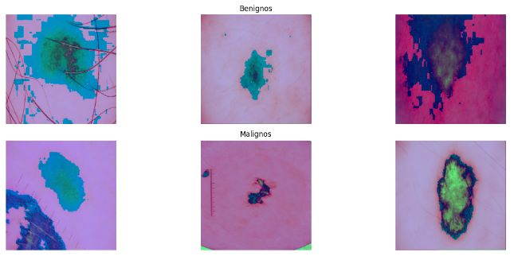

# Classificação de melanoma em imagens de lesões de pele
# Melanoma classification in skin lesions images

## Apresentação

O presente projeto foi originado no contexto das atividades da disciplina de pós-graduação *IA901 - Processamento de Imagens e Reconhecimento de Padrões*, 
oferecida no primeiro semestre de 2023, na Unicamp, sob supervisão da Profa. Dra. Leticia Rittner, do Departamento de Engenharia de Computação e Automação (DCA) da Faculdade de Engenharia Elétrica e de Computação (FEEC). 

 |Nome  | RA | Curso|
 |--|--|--|
 | Johsac Isbac Gomez Sanchez  | 216401  | Doutorado em Engenharia Elétrica|
 | Robson Assis Colares  | 264369  | Doutorado em Engenharia Elétrica |
 | Suellen Sena da Silva  | 177261  | Mestrado em Engenharia da Computação|

## Descrição do Projeto

O objetivo do projeto é desenvolver um sistema para classificação de lesões de pele entre malignas e benignas com o uso de arquiteturas de redes neurais convolucionais. O sistema visa fornecer uma ferramenta precisa e eficiente para ajudar na detecção precoce de tumores malignos, contribuindo para o diagnóstico médico e reduzindo a taxa de falsos negativos (ou seja, classificar como benignas lesões que na verdade são malignas). Adicionalmente, garantir que o classificador tenha a sensibilidade (recall) alta também é de extrema importância para o projeto, dado que o tratamento precoce pode ser mais benéfico ao paciente do que não diagnosticá-lo e o tratamento ser tardio. 

  

**Taxa de falso negativo:** 

$$P(\hat{f}(x)=\text{Benigno} | f(x)=\text{Maligno})=\frac{FN}{FN+VN}$$

**Recall:**
$$P(\hat{f}(x)=\text{Maligno} | f(x)=\text{Maligno})=\frac{VN}{FN+VN}$$

Dessa forma, o contexto gerador do projeto consiste no desafio de validar uma arquitetura que consiga classificar lesões de pele em imagens médicas. Com uma base de dados de 33.007 imagens, das quais apenas 582 são de tumores malignos, o projeto enfrenta o desafio de lidar com um conjunto de dados altamente desequilibrado. A classificação precisa dessas imagens é essencial para identificar corretamente os casos malignos e benignos, a fim de fornecer um diagnóstico adequado e tomar decisões de tratamento adequadas. É interessante apontar que a estimativa é de que médicos experientes reconheçam 70% dos casos, apenas com inspeção visual [7,8].

Portanto, a motivação para esse projeto é a importância da detecção precoce de lesões de pele malignas, como o câncer de pele, que tem maior probabilidade de ser tratado com sucesso se diagnosticado em estágios iniciais. A utilização de arquiteturas de redes neurais convolucionais, combinada com técnicas avançadas de processamento de imagem, permite uma análise mais precisa e automatizada das lesões, reduzindo assim a taxa de falsos negativos. Isso pode auxiliar médicos e especialistas a tomarem decisões mais assertivas, agilizando o processo de diagnóstico e melhorando os resultados dos pacientes.

**Qual problema vocês pretendem solucionar?**

O problema que buscamos resolver é o erro de classificação de lesões malignas classificadas como benignas. Tal erro pode levar a um atraso no diagnóstico e tratamento adequado, o que é fundamental para a saúde e a sobrevida de paciente. Ao desenvolver um sistema de classificação mais preciso, buscamos identificar corretamente os casos de melanoma, o que permitirá a detecção precoce e o tratamento oportuno. 

**Qual a relevância do problema e o impacto da solução do mesmo?**

O câncer de pele é uma das formas mais comuns de câncer em todo o mundo, e a detecção precoce pode gerar um impacto positivo em taxas de mortalidade associadas a lesões malignas de pele. A solução desse problema, por meio do desenvolvimento de um sistema de classificação automatizado, possui certamente um impacto significativo na área médica. Primeiramente, proporciona uma ferramenta automatizada e precisa para auxiliar os médicos no diagnóstico de lesões de pele, aumentando a eficiência e reduzindo a possibilidade de erros humanos. Além disso, ao diminuir a taxa de falsos negativos, o sistema permite uma triagem mais eficiente, identificando corretamente os casos malignos que requerem atenção e tratamento imediato. Essa solução também pode contribuir para a redução dos custos de saúde, uma vez que a detecção precoce e correta pode evitar tratamentos desnecessários e mais invasivos.

# Metodologia

*1. Pré-processamento de dados:*

As imagens foram normalizadas, ou seja, todos os pixels foram divididos por 255.0, para padronizar os valores em pixels entre o intervalo de 0 a 1. A normalização é importante para manter a escala de pixels consistentes e facilitar o treinamento de redes complexas. Ainda, a técnica de pré-processamento reduz a influência de outliers e melhora a capacidade do modelo de generalizar para novos exemplos. Também adotamos estratégias de downsampling da classe majoritária, oversampling da classe minoritária e combinação de ambas para testar os efeitos nas arquiteturas avaliadas.

*2. Data augmentation:*  

A avaliação de lesões de pele é realizada levando em conta características visíveis a olho nu, bem como características ampliadas por meio de técnicas de dermatoscopia ou outras ferramentas de diagnóstico. Alguns dos principais aspectos considerados são a assimetria da lesão, bordas irregulares ou mal definidas, lesões com múltiplas cores e lesões com diâmetro maior, que podem indicar malignidade. A seguir, seguem imagens do conjunto que exemplificam a dificuldade em diferenciar as lesões apenas através de sua aparência.

  

Dessa forma, estudos que avaliam técnicas de aumentação de dados com foco em lesões de pele foram considerados e foram utilizadas técnicas como cisalhamento, escalonamento de imagens para criar novas formas de lesões, espelhamento e mudança de matiz (hue). Essas transformações foram consideradas para diminuir a influência da cor da pele e do tamanho das lesões na discriminação do modelo. Além disso, foi aplicada uma função que diminui a aparência de pelos na imagem, sem comprometer as lesões, garantindo que o modelo não associe essas características com as diferentes classes. Nas próximas seções serão definidos quais transformações apresentaram os melhores resultados. Abaixo estão algumas transformações que foram consideradas para augmentation:

- *Ben Graham* 

  

- *Hair remove*

  

Alternativamente, foram consideradas as seguintes transformações nas imagens com o objetivo de torná-las menos heterogêneas, com base em estudos sobre técnicas de aumento de dados para lesões de pele:

- *width_shift_range* e *height_shift_range*: desloca horizontalmente e verticalmente, respectivamente, por uma fração da largura ou altura da imagem original, auxiliando o modelo a aprender a reconhecer objetos em diferentes posições.

- *shear_range*: aplica um cisalhamento aleatório na imagem, distorcendo-a ao longo do eixo horizontal, podendo ser útil para ensinar o modelo a lidar com objetos inclinados.

- *zoom_range*: aplica um zoom aleatório na imagem, ampliando-a ou reduzindo-a, com objetivo de treinar o modelo a aprender a reconhecer objetos em diferentes escalas.

- *brightness_range*: ajusta aleatoriamente o brilho das imagens, aumentando ou diminuindo seus valores de pixel. Isso pode ajudar o modelo a ser mais robusto em relação a variações de iluminação.

- *fill_mode*: o parâmetro determina como os pixels são preenchidos quando ocorre um deslocamento ou distorção da imagem. O valor 'nearest' preenche os pixels ausentes com o valor do pixel mais próximo.

*3. Avaliação e validação:*

Para viabilizar a possibilidade de avaliar o desempenho das redes treinadas o conjunto de dados foi divido entre treinamento e validação. A escolhe de não utilizar parte do conjunto como teste parte do princípio de que os dados já são extremamente desbalanceados, então informação da classe de malignos seria perdida para o treinamento. Entretanto, existem mais conjuntos públicos com imagens de lesões com o mesmo objetivo de classificar câncer de pele, portanto conjuntos externos podem ser utilizados como teste futuramente. 

Todo o treinamento foi realizado configurando-se a rede para maximizar métricas de sensibilidade e área sob a curva (area under curve - AUC). Para avaliação pós treinamento, foi avaliado também metricas de precisão e a taxa de falsos negativos, além da matriz de confusão. 
- Divisão de dados: organizar o conjunto de dados em bancos de treinamento, validação e teste para avaliar e validar o desempenho do modelo. 

*4. Melhoria e refinamento:*

- Análise de erros: investigar os casos em que nosso modelo cometeu erros e analisaremos as causas subjacentes para identificar possíveis melhorias.

- Ajuste e refinamento do modelo: explorar técnicas relevantes na literatura como esembles, segmentação da lesão na imagem, além de iterações adicionais para ajustar e refinar o modelo com base nos resultados obtidos na etapa validação.

- Aquisição de recursos computacionais: devido ao tempo consumido nos treinamentos sem GPU (e mesmo à impossibilidade de trabalhar com o conjunto de dados inteiro), optou-se pela aquisição de recursos computacionais esporádicos via Google Colab.

*5. Metodologia Simple-Complex:*

- Avaliar simultaneamente arquiteturas complexas e consolidadas como Resnet50, MobileNet, EfficientNet e modelos mais simples (começando com pouca profundidade e pequena quantidade de filtros), afim de realizar a tarefa com o menor custo computacional possível e possibilitar mais abordagens de pré-processamento.
  
## Bases de Dados e Evolução

Base de Dados | Endereço na Web | Resumo descritivo
----- | ----- | -----
SIIM-ISIC Melanoma Classification | https://www.kaggle.com/competitions/siim-isic-melanoma-classification/data |  O conjunto possui imagens de lesões de pele, tanto de lesões benignas quanto malignas.

A base possui 33007 imagens do tipo jpg, totalizando 20 GB de tamanho com anotações de identificador exclusivo da imagem, identificador único do paciente, sexo, idade aproximada do paciente no momento da imagem, localização do site com imagem, informações de diagnóstico detalhadas e indicador de malignidade da lesão. Para este projeto, serão utilizadas apenas as imagens jpg, totalizando 33007 arquivos.

Lesão | Frequencia | Proporção
----- | ----- | -----
Benigno | 32427 |  98%
Maligno | 580 |  2%

Não houve necessidade de reanotação dos dados para o conjunto proposto. No entanto, a base possui 2056 pacientes distintos, onde muitos se repetem por possuir mais de uma lesão de pele. Ainda, é importante ressaltar que, para a separação dos conjuntos de treino e validação, garantiu-se que pacientes repetidos tivessem todas as suas imagens em apenas um dos conjuntos. Dessa forma, não há possibilidade de que a rede treinada confunda a classificação de lesões malignas ou benignas por reconhecer o padrão de pele do paciente nas fotos.

Estatísicas Qualitativas | Proporções
----- | ----- 
Sexo | 52% homens e 48% mulheres
Diagnóstico | 98% benignos e 2% malignos

Estatísticas quantitativas | Mínimo | Máximo | Média
----- | ----- | ----- | -----
Idade | 0 | 90 | 55

# Ferramentas
O projeto será realizado com o auxílio do Google Colab para treinamento das redes com GPUs adquiridas A100, V100 e T4. Ainda, bibliotecas como:
Keras e Tensorflow, pela facilidade de manuseio dos algoritmos de aprendizado de máquina e processamento de imagens;
Sklearn, para avaliar métricas de resultados dos classificadores;
OS e Shutil, para movimentação dos arquivos entre diretórios;
Numpy, para realização de cálculos diversos;
Matplotlib, utilizada para plotar gráficos variados; e
Draw.IO, para confecção do Workflow.

# Workflow

  

# Experimentos 

Os experimentos foram realizados através de diferentes arquiteturas, tamanhos de batch e transformações de data augmentation. Ainda, devido à quantidade de imagens, os primeiros testes foram realizados em um conjunto diminuído de dados, visando garantir que as primeiras aplicações iriam ocorrer corretamente ao longo de todo o fluxo de pré processamento, treinamento e validação dos resultados. Dessa forma, os experimentos baseados em batch tamanho 32, otimizadores Adam e SGD (*stochastic gradient descent*) e treinamentos de 20 épocas basearam-se da seguinte forma:

Experimento 1 - CNN simples com downsampling da classe majoritária e   
----- 
Para a primeira etapa do projeto, 10% do conjunto de imagens benignas foram aleatoriamente selecionadas, visando facilitar os primeiros treinamentos e garantir o fluxo do que estava sendo desenvolvido e aplicado. Com o conjunto selecionado e fixado através de uma semente, foi realizada a padronização das imagens, pois o processo garante a normalização das intensidades, reduzir vieses e melhorar a estabilidade numérica do processo de treinamento. Ainda, a aumentação de dados aplicada consiste em testar diferentes faixas de deslocamento horizontal e vertical, distorções de cisalhamento aleatórias nas imagens, zoom aleatório e ajustes de brilho e matiz. Por fim, uma rede desenvolvida do zero foi criada, consistindo em camadas convolucionais, normalização por batch, pooling global de média para extrair características da imagem e uma camada densa final para realizar a classificação das imagens. 

Os resultados de acurácia são significativos, porém ainda há o mesmo problema de todas as amostras da classe maligna ser classificada como benigna. 

  

**Taxa de falso negativo:** 

$$\frac{FN}{FN+VN}=\frac{118}{118+0}=1$$

Com a mesma rede implementada no exemplo anteior, foi realizado o treinamento conjunto de dados completo, considerando exatamente a mesma divisão entre treinamento e validação. Nesse cenário, 24402 imagens foram utilizadas no treinamento da rede e 8608 imagens foram usadas para validação. Também a título de comparação, todas as imagens foram inseridas na rede convolucional com dimensões 224 x 224 e com a aplicação das mesmas técnicas de data augmentation.

Os resultados do experimento anterior persistiram e um dos principais problemas foi o tempo despendido para treinamento da rede neural convolucional. Ainda, obsera-se que a diminuição do desbalanceamento não conduz a um resultado favorável de classificação da classe com menores amostras.

  

**Taxa de falso negativo:** 

$$\frac{FN}{FN+VN}=\frac{147}{147+0}=1$$

Experimento 2 - Resnet50 conjunto completo
----- 
Ao considerar que o principal objetivo é minimizar a taxa de falsos negativos, aplicou-se uma arquitetura mais complexa no conjunto, previamente treinada em imagens. A ResNet50 é uma arquitetura de rede neural convolucional (CNN) proposta em 2015 e ainda muito utilizada no contexto de imagens. Ela é conhecida por sua capacidade de treinar redes muito profundas com maior eficiência, superando o desafio de degradação do desempenho que ocorre ao aumentar a profundidade da rede. Ainda, a rede foi pré-treinada em um grande conjunto de dados chamado ImageNet, que contém mais de um milhão de imagens rotuladas em 1000 classes diferentes. Dessa forma, utilizar essa arquitetura permite aproveitar os recursos de alto nível aprendidos durante o treinamento para extrair características relevantes das imagens e aplicá-las a novas tarefas, como detecção de objetos, segmentação de imagens e muito mais. 

Embora de grande complexidade, os resultados apresentados a seguir demonstram a dificuldade de discriminar as lesões de pele entre malignas e benignas. Os ganhos foram de apenas 6 acertos na classe de predizer corretamente lesões malignas e, consequentemente, a taxa de falsos negativos (predizer como begnigno, quando na verdade é maligno) foi de 96%.

  

**Taxa de falso negativo:** 

$$\frac{FN}{FN+VN}=\frac{141}{141+6}=0.96$$

---

Durante a etapa preliminar do projeto, o grupo enfrentou limitações de recursos e a rápida exaustão dos mesmos. Diante disso, foram consideradas alternativas que permitissem contornar essas restrições, optando por redes mais leves e eficientes para os próximos testes.

  

*Tan, Mingxing, and Quoc Le. "Efficientnet: Rethinking model scaling for convolutional neural networks."* 

Foi observado que arquiteturas como EfficientNetB3 apresentam alta eficiência mesmo com um número inferior de parâmetros em comparação com a ResNet-50, Ainda, embora não listado no gráfico, a MobileNet possui as mesmas características e também foi considerada como uma rede promissora. Com base nessa constatação, os experimentos subsequentes levaram em consideração essas arquiteturas, bem como redes mais simples, a fim de avaliar seu desempenho. No entanto, mesmo com a escolha de redes mais leves, ainda era necessário lidar com a demanda de memória RAM para processar as imagens. Para contornar essa limitação, o grupo adquiriu unidades de computação do Google Colab, permitindo o acesso a GPUs mais potentes, como A100, V100 e T4, por períodos de tempo mais longos. Essa abordagem possibilitou realizar os experimentos de forma mais eficiente e obter resultados relevantes para o projeto.

Experimento 3 - CNN de Complexidade Média e Técnicas de Oversampling e Downsampling
----- 

Em vista da baixa performance de arquiteturas com CNN simples (poucas camadas e filtros), passou-se à exploração de arquiteturas mais complexas porém com número de parâmetros ainda inferior às arquiteturas Estado da Arte, a fim de acelerar o processo de treinamento e testar técnicas de pré-processamento. Os modelos foram treinados por 100 épocas. A fim de obter mais informações acerca dos impactos do processamento e evitar maior variabilidade do modelo, o grupo optou por fixar o número de camadas nos testes intermediários e limitar a quantidade de filtros. A arquitetura utilizada é apresentada abaixo, consistindo de entrada, cinco camadas convolucionais [9] (todas com batch normalization) e duas camadas totalmente conectadas para classificação. A técnica de dropout é aplicada para regularização. 

  

A primeira configuração foi testada com 32, 32, 256, 256 e 512 filtros nas camadas convolucionais, e a segunda configuração foi testada com 64, 64, 128, 128, 256 filtros, respectivamente. O conjunto de dados da classe benigna foi subamostrada 14 vezes ou 2396 imagens, resultando em um conjunto de dados de treinamento com 2396 imagens benignas e 426 malignas (como no caso anterior).

Os resultados de acurácia são significativamente bons, porém ainda há o mesmo problema de todas as amostras da classe maligna ser classificada como benigna. A matriz de confusão foi semelhante para ambas as configurações, portanto somente uma foi plotada. 

Rede 1 - 32, 32, 256, 256 e 512 filtros; Rede 2 - 64, 64, 128, 128, 256 filtros

  

Como as CNNs simples não apresentaram bom desempenho na melhoria do Falso Negativo, caracterizamos os efeitos das variadas técnicas de augmentation nas CNNs de menor e média complexidade, avaliando a AUC para dez épocas de treinamento. Em ordem de eficácia na melhoria do falso negativo, destacam-se as técnicas de Height Shift Range, Width Shift Range e Zoom Range. As outras técnicas aplicadas mostraram pouca ou nenhuma influência quando consideradas individualmente. Buscas mais detalhadas e com mais épocas podem ser feitas para avaliar o efeito das técnicas de pré-processamento em CNNs de baixa complexidade. Para efeitos de teste, mantivemos apenas o Height Shift Range como técnica de augmentation, já que seu resultado superou o resultado das outras técnicas. 

MELHOR RESULTADO: CNN de complexidade baixa e dados completos, com Oversampling da classe minoritária
-----

Por fim, passou-se à experimentação da última técnica: oversampling considerando todo o conjunto de dados de treinamento, ou seja: 23964 imagens. Cópias foram feitas das imagens da classe "maligno", até que as classes ficassem balanceadas. Novamente os testes foram realizados a partir de uma configuração mais simples possível, composta por duas camadas convolucionais de filtros, e uma camada totalmente conectada de 100 neurônios. O resultado foi bastante surpreendente para 50 épocas, e acabou elegendo a técnica de oversampling, juntamente com normalização e técnicas de aumentação de dados, como a melhor metodologia aplicável a CNNs de baixa complexidade. Novamente devido à precariedade de recursos computacionais, este experimento com número grande de imagens foi executado por apenas 50 épocas.

  

Experimento 4 - EfficientNet B3
----- 

A EfficientNet caracteriza uma família de arquiteturas de redes neurais convolucionais projetada para alcançar um equilíbrio ideal entre precisão e eficiência computacional em tarefas de visão computacional. Essa família de redes foi desenvolvida por Mingxing Tan e Quoc V. Le, pesquisadores do Google, e sua primeira versão foi introduzida em 2019.

Baseada em um conceito chamado "escalabilidade composta" (compound scaling), a escala da rede é aumentada de forma proporcional em todas as dimensões relevantes, em vez de simplesmente aumentar a profundidade ou a largura. Isso é conseguido por meio de uma fórmula que define a relação entre as diferentes escalas, permitindo um aumento harmonioso e controlado da arquitetura. Além disso, o EfficientNet utiliza blocos residuais chamados de MBConv (Mobile Inverted Bottleneck Convolution). Esses blocos são projetados para serem computacionalmente eficientes, combinando convoluções de ponto de entrada (*input point-wise*) e convoluções de ponto de saída (*output point-wise*) com uma camada de convolução profunda no meio.

Experimento 6 - MobileNetV2
----- 

Também conhecida como uma arquitetura desenvolvida para aplicações de visão computacional em dispositivos com recursos computacionais limitados, a MobilNet foi projetada com o objetivo de alcançar um equilíbrio entre a precsão do modelo e a eficiência computacional. Para tanto, seu diferencial são camadas de convolução profunda separrável em vez de convoluções padrão, considerando duas etapas: a primeira é uam convolução em que cada filtro opera em um canal de entrada, e a sgunda etapa é uma convolução ponto a ponto, onde um filtro linear é aplicado a cada para de características separadamente. Isso permite uma redução significativa no número de parâmetros e operações em comparação com as convoluções padrão, tornando a MobileNet mais leve e rápida.

Foram considerados treinamentos com batch tamanho 32 e 64, além do peso das classes, diferentes técnicas de augmentation e aplicação de downsampling e oversampling da classe minoritária. O melhor resultado encontrado foi a partir da seguintes definiçõs:

O treinamento foi realizado por 100 épocas com batch tamanho 64, otimizador Adam, *learning rate* de 0.001 e função de perda *binary_crossentropy*. 

O Adam é um otimizador popular que combina os benefícios do algoritmo de otimização estocástica gradiente descendente (SGD) com adaptação de taxa de aprendizado. Ele ajusta a taxa de aprendizado para cada parâmetro individualmente, com base em estimativas do primeiro e segundo momento dos gradientes. Essa adaptação permite que o Adam se ajuste mais efetivamente a diferentes taxas de aprendizado para diferentes parâmetros. Ainda, a função de perda 'binary_crossentropy' é uma função de perda comumente usada para problemas de classificação binária. Ela mede a diferença entre as probabilidades preditas pelo modelo e as classes reais do problema. O objetivo é minimizar essa diferença durante o treinamento.

Por fim, a técnica de oversampling da classe de malignos não apresentou resultados significativos, causando mais confusão no modelo para discriminar as classes corretamente. Portanto, apenas o downsampling foi considerado e o modelo foi treinado apenas com 5000 da classe de benignos. 

  

Embora a rede apresente resultados positivos para classificação de tumores malignos, o modelo aumentou a taxa de de falsos positivos, ou seja, classifica muitas lesões como malignas, quando na verdade são benignas. Em um contexto médico, é considerado principalmente se a conduta irá apresentar mais benefícios ou maleficios para o paciente. Como o tratamento de lesões consideradas malignas pode ser complexo e doloroso, não é interessante considerar os resultados do algoritmo. 

$$\frac{FN}{FN+VN}=\frac{116}{116+31}=0.79$$

Ao longo dos experimentos preliminares até o resultado final deste projeto, nosso principal objetivo era reduzir a taxa de falsos negativos. Portanto, foi possível alcançar uma redução de 21% nessa taxa. Esse progresso é um reflexo dos aprendizados e melhorias contínuas realizadas ao longo do processo. 

-----
# Trabalhos Futuros

Utilizar informações adicionais disponíveis nos conjuntos públicos de melanoma, como idade, sexo, localização da lesão e cor da pele, associado com as características da própria lesão, fornece mais contexto e informações relevantes para os algoritmos de classificação. Essas informações adicionais auxiliam a identificar padrões específicos relacionados a diferentes grupos demográficos ou características específicas dos pacientes. A abordagem de ensemble permite combinar as previsões e decisões dos diferentes modelos ou fontes de informação, o que leva a resultados mais satisfatórios e confiáveis, já que diferentes modelos podem capturar diferentes aspectos da complexidade do problema.

Alternativamente, ao considerar que redes neurais devem focar e destacar as partes mais importantes de uma imagem de entrada, foi avaliado o mecanismo de *Soft-Attention*, que permite que uma rede neural alcance esse objetivo. Estudos avaliam a eficácia do Soft-Attention em arquiteturas de redes neurais profundas. O objetivo central do Soft-Attention é aumentar o valor das características importantes e suprimir as características que introduzem ruído. Redes combinadas com a ténica alcançam uma precisão de 93,7% no conjunto de dados de melanomas ISIC-2017.

## Referências 
1. Perez, F. et al. Data augmentation for skin lesion analysis. Granada, Spain, September 16 and 20, 2018, Proceedings 5 (pp. 303-311). Springer International Publishing.
2. Ha, Qishen, Bo Liu, and Fuxu Liu. "Identifying melanoma images using efficientnet ensemble: Winning solution to the siim-isic melanoma classification challenge." arXiv preprint arXiv:2010.05351 (2020).
3. Zhang, Yiming, and Chong Wang. "SIIM-ISIC melanoma classification with DenseNet." 2021 IEEE 2nd International Conference on Big Data, Artificial Intelligence and Internet of Things Engineering (ICBAIE). IEEE, 2021.
4. Tan, Mingxing, and Quoc Le. "Efficientnet: Rethinking model scaling for convolutional neural networks." International conference on machine learning. PMLR, 2019.
5. Ding, Jiaqi, et al. "Two-Stage Deep Neural Network via Ensemble Learning for Melanoma Classification." Frontiers in Bioengineering and Biotechnology 9 (2022): 1355.
6. Kanti Datta, Soumyya, et al. "Soft-Attention Improves Skin Cancer Classification Performance." arXiv e-prints (2021): arXiv-2105.
7. Dinnes, Jacqueline, et al. "Visual inspection for diagnosing cutaneous melanoma in adults." Cochrane Database of Systematic Reviews 2018.12 (1996).
8. UptoDate: https://www.uptodate.com/contents/melanoma-clinical-features-and-diagnosis
9. E. Nasr-Esfahani et al., "Melanoma detection by analysis of clinical images using convolutional neural network," 2016 38th Annual International Conference of the IEEE Engineering in Medicine and Biology Society (EMBC), Orlando, FL, USA, 2016, pp. 1373-1376, doi: 10.1109/EMBC.2016.7590963.

