# Classificação de Posturas de Yoga
# Yoga Pose Classification

## Apresentação
---
O presente projeto foi originado no contexto das atividades da disciplina de pós-graduação IA901 - Processamento de Imagens e Reconhecimento de Padrões, oferecida no primeiro semestre de 2023, na Unicamp, sob supervisão da Profa. Dra. Leticia Rittner, do Departamento de Engenharia de Computação e Automação (DCA) da Faculdade de Engenharia Elétrica e de Computação (FEEC).

Nome                           | RA     | Especialização
-------------------------------|--------|------------
Guilherme Urban Boscolo        | 155642 | Aluno Especial - Engenharia Elétrica
Sara Mirthis Dantas dos Santos | 224018 | Aluna Especial - Engenharia Elétrica
Yasmin Martins Perci           | 271281 | Aluna Especial - Engenharia Elétrica

## Descrição do Projeto
A classificação de posturas de yoga pode ser muito útil para instrutores, praticantes e para o desenvolvimento de aplicativos ou dispositivos de assistência. Além disso, esse classificador pode ser aprimorado para aplicações de monitoramento de progresso individual, correção de posturas inadequadas e, consequentemente, prevenção de lesões dos praticantes.

Trabalhos anteriores de classificação de posturas de yoga utilizam deep learning [3], [6] ou técnicas de machine learning para extrair atributos relacionados a ângulos e distância entre pontos do esqueleto e utilizam em classificadores clássicos [2], [5], [7], [12]. 

Inicialmente, o objetivo do projeto era um estudo comparativo entre o desempenho de uma CNN e uma KNN com extração de atributos para classificar 5 posturas de Yoga. A partir de processamento de imagem, com a aplicação de filtros, detecção de bordas, a KNN seria treinada com o vetor resultante do código da cadeia de Freeman, e, a partir das métricas de avaliação, o seu desempenho seria comparado com o de uma CNN.

Porém, na etapa de processamento de dados, observou-se que mesmo testando duas vertentes diferentes de extração de informações e refinando as técnicas complementares, não foram obtidos resultados satisfatórios para todas as imagens, pois muitas ainda apresentavam elementos do fundo após a segmentação. Dessa forma, concluiu-se que a estratégia escolhida para a classificação a partir da extração de atributos apresentava uma complexidade desproporcional à proposta do projeto final da disciplina.

Nesse contexto, o objetivo deste trabalho foi reformulado para realizar um estudo comparativo entre o desempenho de uma CNN com e sem o pré-processamento de dados para classificar 5 posturas de Yoga. A CNN foi treinada com as imagens processadas e, a partir das métricas de avaliação, o seu desempenho foi comparado com o de uma CNN sem pré-processamento, mas com a mesma arquitetura e hiperparâmetros.

# Metodologia

O projeto é composto por três etapas principais, sendo a primeira relacionada ao pré-processamento dos dados, onde eles são analisados, limpos e preparados. Nessa fase, é feita a análise de contaminação entre conjuntos de dados, algo de extrema importância, sobretudo ao se trabalhar com dados de domínio público. Essa contaminação pode causar dificuldades no treinamento do modelo e levar a erros no processo de classificação. Além disso, nesse estágio é feita a seleção e padronização das imagens que serão usadas no processamento.

Depois do pré-processamento de dados, desenvolveu-se uma CNN a partir do modelo MobileNet V2, onde ajustou-se apenas os hiperparâmetros após uma normalização com base na média e o desvio padrão, seguido por um redimensionamento dos dados para tamanho de (128, 128). O modelo MobileNet V2 foi escolhido pela quantidade razoável de 2.230.277 parâmetros treinados, em comparação com modelos mais complexos, como o ResNet ou o Inception. Esse valor foi considerado adequado para o tamanho do dataset, que possui poucas amostras.

 Essa arquitetura de rede neural foi inicialmente adaptada para dispositivos móveis e ambientes com recursos restritos, diminuindo significativamente o número de operações e memória necessária, mantendo uma boa precisão [10].

Posterior ao ajuste de hiperparâmetros da rede (otimizador, taxa de aprendizagem, número de épocas, tamanho do lote, regularização L2), analisou-se o desempenho com base nas curvas de acurácia e loss de treino e validação, além das métricas extraídas da matriz de confusão: F1-score, acurácia, precisão e recall.  

Analisando os resultados de validação, verificou-se a necessidade de aplicação de técnicas de processamento de imagens para melhoria do desempenho do modelo. Foram feitas algumas transformações nas imagens, além de data augmentation para balancear as classes e também aumentar os dados de treino.

Após analisar as métricas por classe, verificou-se a necessidade de balancear as classes através de data augmentation. Por fim, foi feito data augmentation em todas as classes no dataset de teste, a fim de aumentar a quantidade de imagens e melhorar o treinamento. 

Com as imagens já processadas, aplicou-se a mesma CNN e comparou-se o desempenho sem e com o processamento de imagens.

## Bases de Dados e Evolução
A base de dados utilizada no projeto foi a "Yoga Poses Dataset", contendo as cinco mais conhecidas poses de Yoga: cachorro olhando para baixo (classe "downdog"), deusa (classe "goddess"), árvore (classe "tree"), prancha (classe "plank") e guerreiro (classe "warrior2").

Ela foi obtida na plataforma Kaggle, disponibilizada pela Niharika Pandit, sob a licença Open Database.

Base de Dados | Endereço na Web | Resumo descritivo
----- | ----- | -----
Título da Base | https://www.kaggle.com/datasets/niharika41298/yoga-poses-dataset | Conjunto de 5 classes com um total de 1551 amostras, sendo 1081 de treino e 470 de teste, nos formatos .jpg, .png e .jpeg.

Abaixo, são mostradas uma imagem de exemplo de cada classe.

Classe downdog |  Classe goddess   | Classe plank | Classe tree | Classe warrior2
:-------------------------:|:-------------------------:|:-------------------------:|:-------------------------:|:-------------------------:
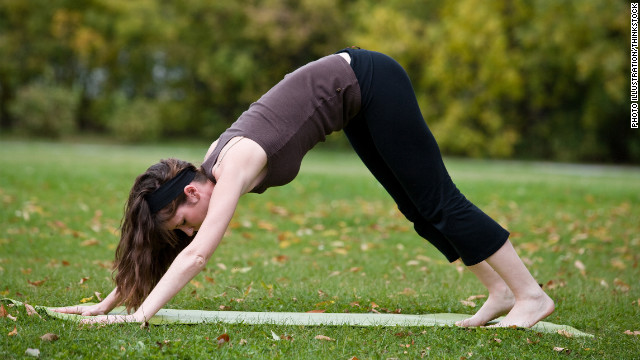  |  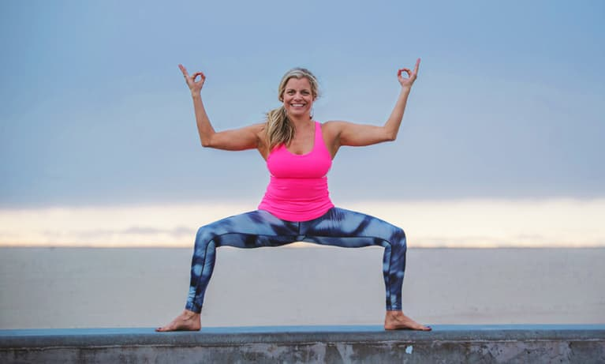 | 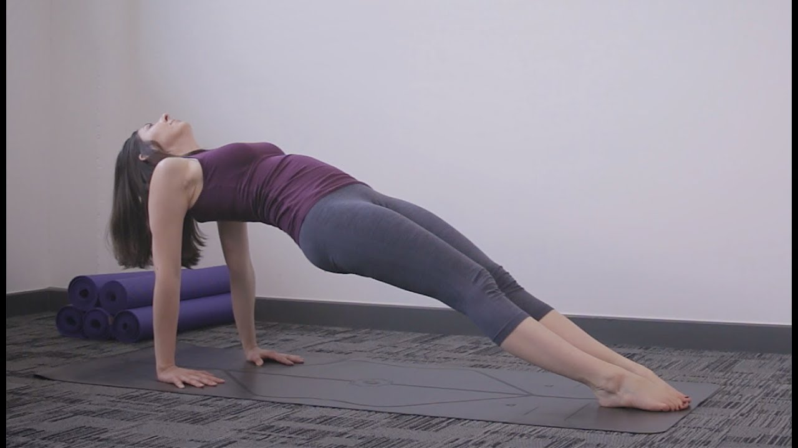 | 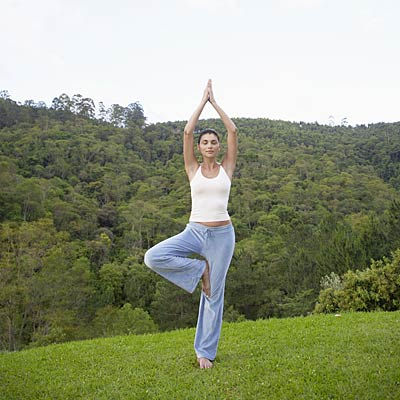 | 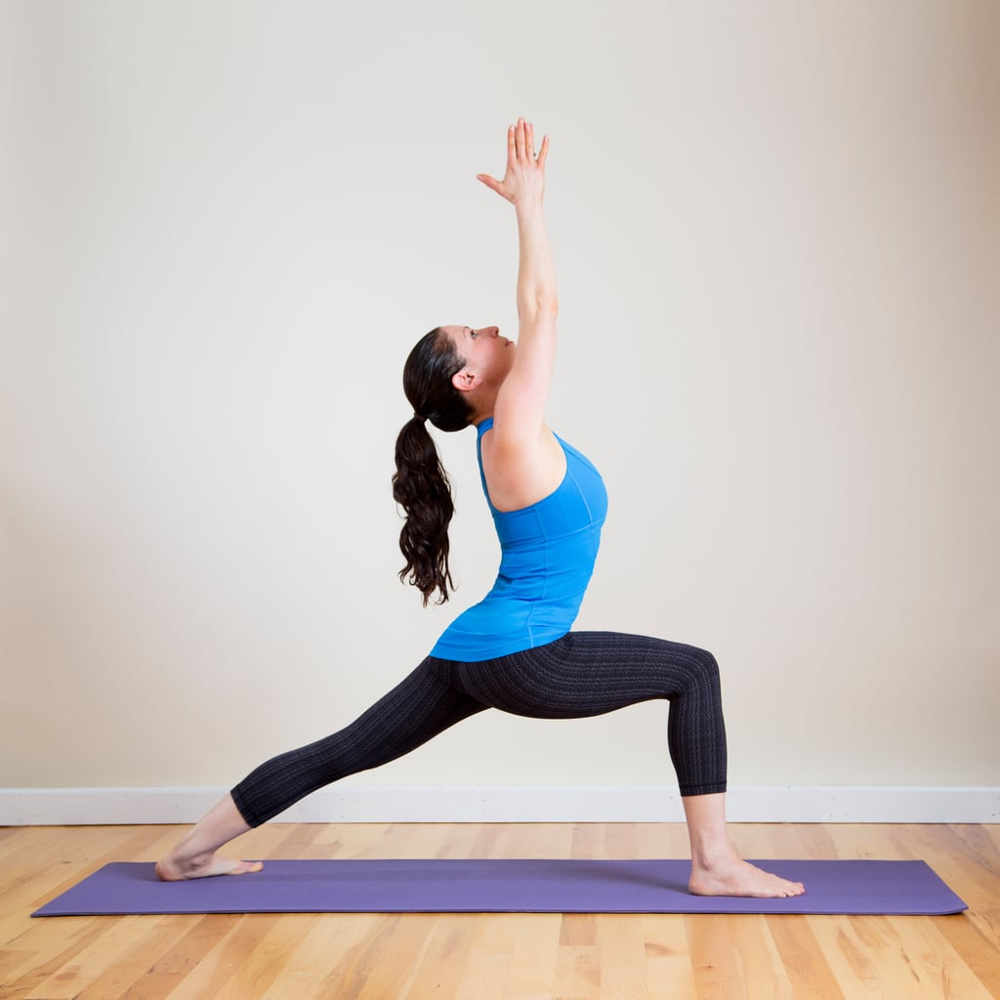

Como o conjunto de dados já estava separado em pastas de treino e teste e em subpastas com as classes, a primeira etapa consistiu em realizar uma inspeção visual dos dados, onde foi analisado que existia contaminação, ou seja, a mesma informação na pasta de treino e teste, às vezes variando apenas o tamanho das imagens.

Dessa forma, foi criado um *script* para automatizar a limpeza dos dados. Inicialmente, foi feita uma padronização das imagens, visto que elas possuem tamanho e formatos variados. Apenas as imagens RGB no formato PNG foram selecionadas, e em seguida redimensionadas para o tamanho 128x128.

A métrica SSIM (*Structural Similarity Index Method*) foi utilizada a fim de analisar o nível de similaridade entre as imagens no conjunto de treino e teste. Ela compara características estruturais das imagens, levando em consideração elementos como texturas, contrastes e detalhes visuais. O valor do SSIM varia entre -1 até 1, sendo 1 o valor resultante quando as duas imagens comparadas são idênticas, e -1 quando são completamente diferentes. Nesse caso, as imagens com SSIM acima de 0.95 foram consideradas semelhantes e removidas do conjunto de treinamento. 

Por fim, para se obter um conjunto de validação, a pasta de treino desse novo conjunto de dados foi dividida aleatoriamente em treino e validação, na proporção 80%-20%. 

O conjunto de treino representa 55.17% do total de dados, validação 13.04% e teste 31.78%, como pode ser visto na tabela abaixo.

Conjunto de dados   | Quantidade de imagens
----------------------------|----------------------
Treino                       |  736                  
Validação                  | 174                  
Teste                         | 424                  

Em todas as imagens dos conjuntos foi feito um processo de normalização com relação a transformações visuais. Foram analisadas as mudanças de brilho, contraste, matiz e saturação, entretanto os melhores resultados foram obtidos apenas com o aumento de 10% do contraste.

Abaixo, temos como ficou distribuído cada classe em cada conjunto de dados. Como pode-se observar as classes "tree" e "goddess" possuem menos imagens em todos os conjuntos de dados. Apesar de não ser um grande desbalanceamento, essa diferença prejudica a classificação dessas classes.

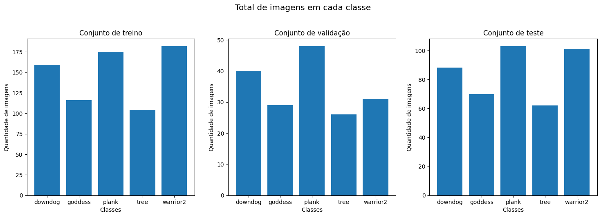

Por esta razão, foi feito um balanceamento dessas classes através de *data augmentation*, aplicando em 50% das imagens, de forma aleatória, um dos seguintes processamentos: flip horizontal, rotação, zoom, ruído gaussiano e blur, na proporção de 20%. 
 
Em seguida, foi feito um aumento de todas as classes, a fim de aumentar o conjunto de dados de treinamento. As mesmas transformações foram aplicadas em 80% do conjunto de dados pós-balanceamento, agora podendo ter mais de um tipo de processamento em cada nova imagem. Desses 80%, cada processamento foi aplicado na seguinte proporção:
* Rotação: 20%
* Flip horizontal: 80% 
* Zoom: 50%
* Ruído aleatório: 40%
* Blur: 40%

A imagem a seguir mostra como ficou a distribuição dos dados finais, após todo o processamento.

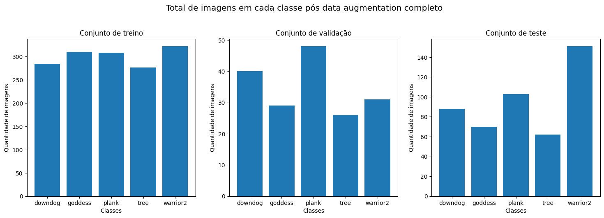

# Ferramentas
No pré-processamento de dados, utilizou-se a biblioteca “os” para interagir com o sistema operacional e realizar ações como acessar, ler arquivos, entre outros. A fim de eliminar a contaminação dos dados, utilizou-se o módulo “skimage.metrics” da biblioteca “skimage” para calcular índices de similaridade das imagens (SSIM), métrica escolhida devido a sua sensibilidade quanto a informações de luminância, contraste e estrutura. A “shutil”, junto a biblioteca “random”, foi utilizada para aleatoriamente fazer a separação dos dados  originalmente de treinamento em treinamento e validação.

A CNN foi implementada utilizando a biblioteca “pytorch”, por ser mais flexível para o desenvolvimento de modelos. Também utilizou-se a biblioteca “torchvision” para utilizar as arquiteturas de modelo e transformações de imagem presentes nesta biblioteca. Além disso, utilizou-se a biblioteca “torchsummary” para imprimir os parâmetros treináveis ​​e não treináveis do modelo. Para o acompanhamento das alterações nos modelos, utilizou-se a biblioteca “torch.utils.tensorboard” que possui utilitários que permitem o registro de modelos e métricas do PyTorch em um diretório para visualização na interface do TensorBoard.

Na etapa de processamento dos dados, aplicou-se a biblioteca “torchsummary” a qual contém as funções para se fazer ajustes no brilho, contraste, matiz e saturação nas imagens. Para o processo de aumento dos dados, utilizou-se bibliotecas e pacotes, como PIL (Python Imaging Library) e Pillow (fork moderno e ativo do PIL), que permitiram rotacionar, flipar, modificar o brilho, aplicar fatores de zoom e introduzir ruídos e borrões nas imagens.

Por fim, para avaliar o desempenho da CNN com e sem processamento foram utilizadas as métricas de acurácia, acurácia balanceada, F1-score ponderado, precisão ponderada e matriz de confusão calculadas por meio de módulos da biblioteca “sklearn”. Também foram analisadas as métricas individuais de cada classe (precisão, recall e F1-score), através da função “classification_report”.

# Workflow

O Workflow é um documento que faz todo o mapeamento de como executar todos os códigos desenvolvidos durante o projeto. Seu desenho foi feito na ferramenta Draw.io e está acessível para visualização como .PNG e .SVG. 

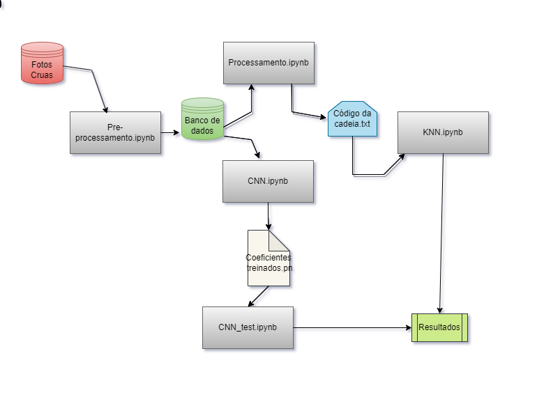

O fluxo de trabalho começa com as imagens da pasta "raw", que são um conjunto de imagens de domínio público. Essas imagens passam por uma etapa de pré-processamento "pre-processing.ipynb" para identificar e remover contaminações entre os dados de treinamento e teste, além de filtrar o formato de imagem desejado. O resultado desse processo é o conjunto "interim/filtered".

Em seguida, o conjunto de imagens gerado passa por duas etapas independentes. A primeira etapa, chamada "CNN_no_process.ipynb", treina a MobileNet V2 com esses dados, e a etapa "normalizing.ipynb" é aplicada ao conjunto para gerar outro conjunto chamado "interim/normalized".

O resultado da etapa "CNN_no_process_ipymnb" é um arquivo chamado "coeficients_no_process.pt". Esse arquivo é usado como entrada em dois códigos. O primeiro código avalia o desempenho da rede no conjunto de dados de validação "CNN_val_no_process.ipynb", resultando em métricas que são salvas em "result_val_no_process.csv". O segundo código, "CNN_test_no_process.ipynb", gera métricas de avaliação para o conjunto de dados de teste e salva essas informações em "results.csv".

Os dados do conjunto "interim/normalized" são então usados como entrada para o código "class_balancing.ipynb", que tem como objetivo balancear as classes que possuem menos dados. O resultado desse processo é o conjunto "interim/balanced". Em seguida, é feito um aumento dos dados de treinamento com o código "data_augmentation_train.ipynb", gerando a pasta final chamada "processed".

Por fim, o código "CNN.pynb" utiliza o modelo MobileNet V2 selecionado, tendo como entrada o conjunto "processed", e gera o arquivo "coeficients_process.pt". Esse arquivo é processado pelo código "CNN_val_process.ipynb", que gera as métricas avaliativas para o conjunto de dados de validação e as salva em "results_val_process.cvs". O código "CNN_test_process.ipynb" gera as métricas de desempenho da rede para os dados de teste e as salva em "results_test_process.csv".

# Experimentos e Resultados preliminares

Após o pré-processamento de dados, foi realizado o treinamento de uma rede neural convolucional (CNN) do tipo MobileNet V2, pré-treinada. Para o processamento das imagens, foi realizado um redimensionamento para o tamanho (128, 128) e aplicada uma etapa de normalização estruturada na média e no desvio padrão dos dados de treinamento. Isso foi feito com o objetivo de padronizar os dados de entrada e melhorar o aprendizado da rede.

Após análise das curvas de acurácia e de loss, os hiperparâmetros foram ajustados da seguinte forma:

* Tamanho do lote: 32;
* Otimizador: Adam;
* Weight decay ou Regularização L2: 0.00001;
* Taxa de aprendizagem: 0.000005;
* Período de declínio da taxa de aprendizado: 10;
* Fator multiplicativo da queda da taxa de aprendizado: 0.8;
* Número de épocas: 55.

O tamanho do lote foi escolhido de modo que o custo computacional fosse reduzido, mas que fosse evitado o overfitting. Em relação aos otimizadores, observou-se que o Adam convergiu mais rápido para o mínimo global devido aos recursos adaptativos. A taxa de aprendizagem escolhida foi de 0.000005, considerada baixa, para evitar oscilações bruscas no treinamento que atrapalham a convergência do processo de aprendizado. Por estar associada ao otimizador Adam, essa taxa de aprendizado baixa não ocasionou lentidão do treinamento. Dessa forma, em apenas 55 épocas já foi alcançada uma acurácia de validação de 93,7% e 91,95% e loss de 25% e 34,43%, considerando os datasets com e sem processamento respectivamente, conforme observado na figura abaixo.

Dataset com processamento de imagem
Acurácia |  Loss 
| :-------------------------:|:-------------------------:
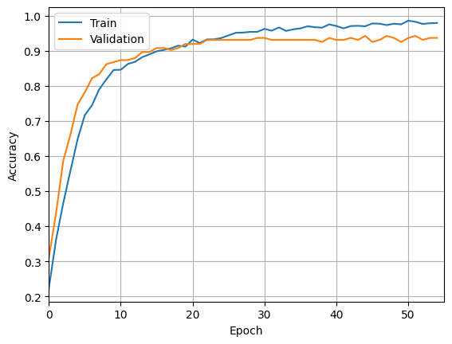  |  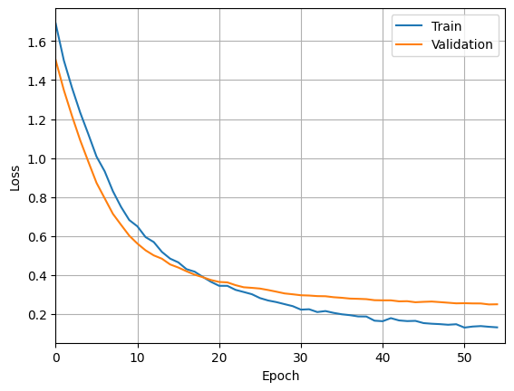

Dataset sem processamento de imagem	
Acurácia |  Loss 
| :-------------------------:|:-------------------------:
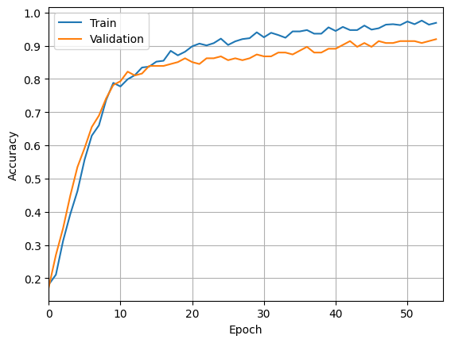  |  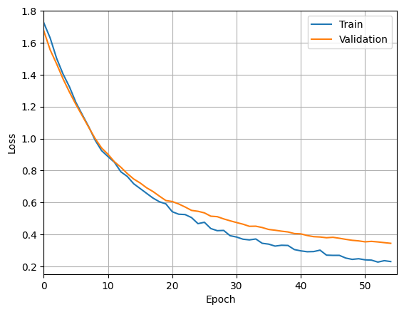 

Também analisaram-se os dados de validação a partir da matriz de confusão e das métricas, como mostram as Figuras 3 e 4. 

Dataset com processamento de imagem
Matriz de confusão |  Principais métricas de classificação 
| :-------------------------:|:-------------------------:
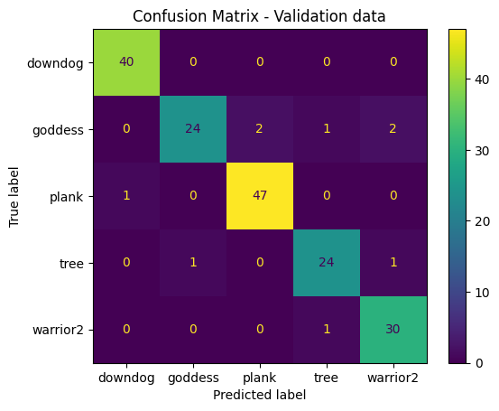  |  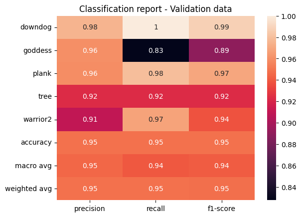

Dataset sem processamento de imagem	
Matriz de confusão |  Principais métricas de classificação 
| :-------------------------:|:-------------------------:
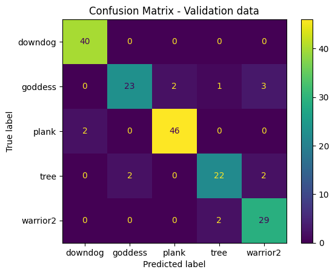 |  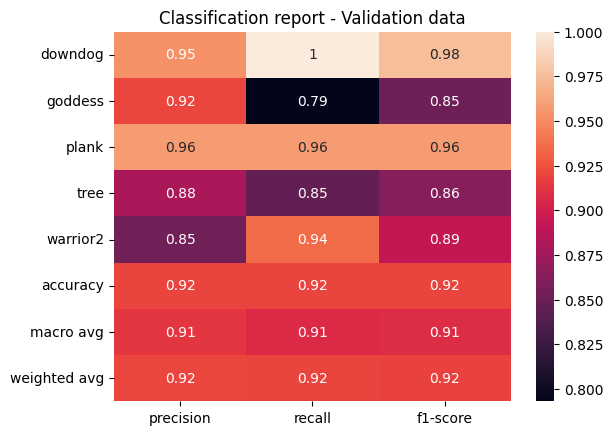 

Analisando a matriz de confusão nas figuras acima, foi possível observar que o modelo apresentou uma maior quantidade de acertos para as classes “downdog”, “plank” e “warrior2”, ao passo que nas classes “tree” e “goddess” observou-se uma maior taxa de erros, com os dois conjuntos de dados. Entretanto, considerando os dados com processamento, verificou-se que o modelo acertou mais casos.

Isso foi confirmado pela análise das métricas, onde as classes “tree” e “goddess” apresentaram um desempenho inferior para o conjunto de dados sem processamento, com F1-score de 86% e 85% respectivamente. Em comparação, observou-se uma melhora dessas classes no conjunto com processamento, obtendo F1-score de 92% e 89% para “tree” e “goddess” respectivamente.
Por fim, aplicou-se o modelo ajustado aos dados de teste e calcularam-se as métricas apresentadas abaixo, onde verificou-se uma melhora significativa de 2% em média com processamento de imagens.

Dataset com processamento de imagem
Matriz de confusão  |  Principais métricas de classificação 
| :-------------------------:|:-------------------------:
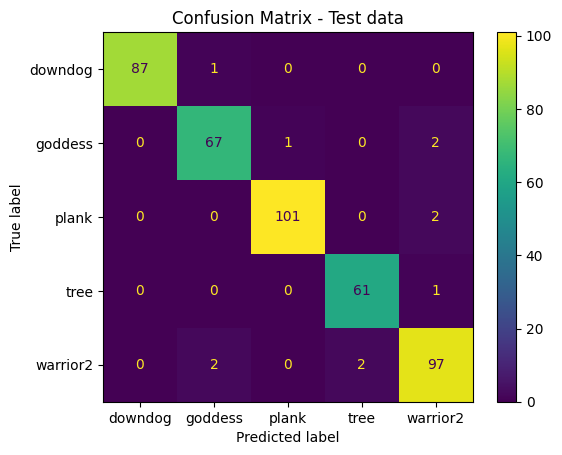  |  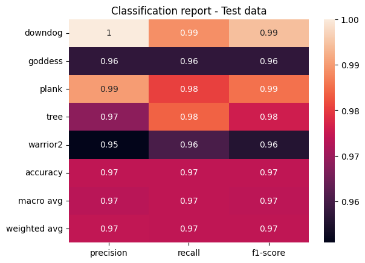

Dataset sem processamento de imagem	
Matriz de confusão |  Principais métricas de classificação 
| :-------------------------:|:-------------------------:
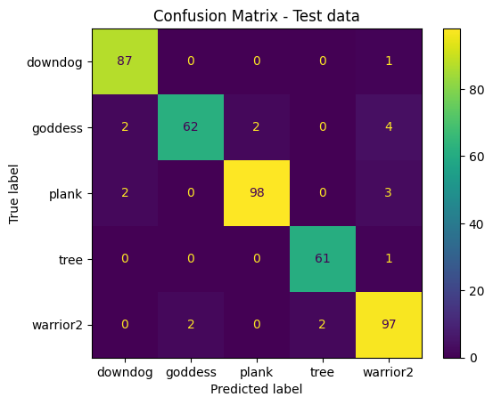 |  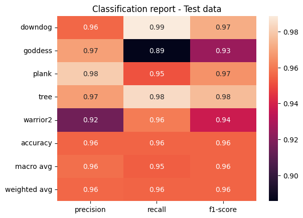 

# Próximos passos

Na etapa de processamento de dados, observou-se que mesmo testando duas vertentes diferentes de extração de informações e refinando as técnicas complementares, não foram obtidos resultados satisfatórios para todas as imagens, pois muitas ainda apresentavam elementos do fundo após a segmentação. Além disso, analisando trabalhos anteriores com propostas semelhantes, verificou-se que os autores utilizaram técnicas de machine learning para extrair atributos relacionados a ângulos e distâncias entre pontos do esqueleto [2], [5], [7], [12]. Isso corrobora com a ideia de que a estratégia escolhida para a aplicação de técnicas de processamento de imagens apresenta uma complexidade desproporcional à proposta do projeto final da disciplina.

Por esses motivos, decidiu-se alterar a ideia do projeto. Nesse contexto, o objetivo deste trabalho foi reformulado para realizar um estudo comparativo entre o desempenho de uma CNN com e sem o pré-processamento de dados para classificar 5 posturas de Yoga. A partir do processamento de imagem, a CNN será treinada com as imagens processadas e, a partir das métricas de avaliação, o seu desempenho será comparado com o de uma CNN sem pré-processamento, mas com a mesma arquitetura.

Portanto, os próximos passos incluem uma modificação dos códigos de processamento de dados, adaptando as técnicas já utilizadas, retirando as etapas de segmentação e código da cadeia para utilizar as imagens processadas como entrada da CNN. Além disso, serão realizados mais experimentos com a CNN a fim de obter um melhor desempenho sem o uso de redes pré-treinadas.

# Referências

[1] ACHARYA, Akruti. Guide to Image Segmentation in Computer Vision: Best Practices. 2023. Disponível em: https://encord.com/blog/image-segmentation-for-computer-vision-best-practice-guide/. Acesso em: 10 maio 2023.

[2] AGRAWAL, Yash; SHAH, Yash; SHARMA, Abhishek. Implementation of machine learning technique for identification of yoga poses. In: 2020 IEEE 9th international conference on communication systems and network technologies (CSNT). IEEE, 2020. p. 40-43. https://doi.org/10.1109/CSNT48778.2020.9115758 

[3] ASHRAF, Faisal Bin et al. Yonet: A neural network for yoga pose classification. SN Computer Science, v. 4, n. 2, p. 198, 2023. https://doi.org/10.1007/s42979-022-01618-8 

[4] DEEPIKA, Yamuna. Python OpenCV – Pose Estimation. Disponível em: https://www.geeksforgeeks.org/python-opencv-pose-estimation/. Acesso em: 09 maio 2023.

[5] DESAI, Miral; MEWADA, Hiren. A novel approach for yoga pose estimation based on in-depth analysis of human body joint detection accuracy. PeerJ Computer Science, v. 9, p. e1152, 2023. https://peerj.com/articles/cs-1152/

[6] GARG, Shubham; SAXENA, Aman; GUPTA, Richa. Yoga pose classification: a CNN and MediaPipe inspired deep learning approach for real-world application. Journal of Ambient Intelligence and Humanized Computing, p. 1-12, 2022.https://doi.org/10.1007/s12652-022-03910-0

[7] PALANIMEERA, J.; PONMOZHI, K. Classification of yoga pose using machine learning techniques. Materials Today: Proceedings, v. 37, p. 2930-2933, 2021. https://doi.org/10.1016/j.matpr.2020.08.700  

[8] PEDRINI, Hélio; SCHWARTZ, William Robson. Análise de imagens digitais: princípios, algoritmos e aplicações. Cengage Learning, 2008.

[9] RAJENDRAN, Arun Kumar; SETHURAMAN, Sibi Chakkaravarthy. A Survey on Yogic Posture Recognition. IEEE Access, v. 11, p. 11183-11223, 2023.https://doi.org/10.1109/ACCESS.2023.3240769 

[10] SANDLER, Mark et al. Mobilenetv2: Inverted residuals and linear bottlenecks. In: Proceedings of the IEEE conference on computer vision and pattern recognition. 2018. p. 4510-4520. https://doi.org/10.48550/arXiv.1801.04381 

[11] WALIA, Mrinal Singh. Guide to Image Segmentation in Computer Vision: Best Practices. 2022. Disponível em: https://www.analyticsvidhya.com/blog/2022/01/a-comprehensive-guide-on-human-pose-estimation/. Acesso em: 10 maio 2023.

[12] WU, Yubin et al. A computer vision-based yoga pose grading approach using contrastive skeleton feature representations. In: Healthcare. MDPI, 2021. p. 36. https://doi.org/10.3390/healthcare10010036 
