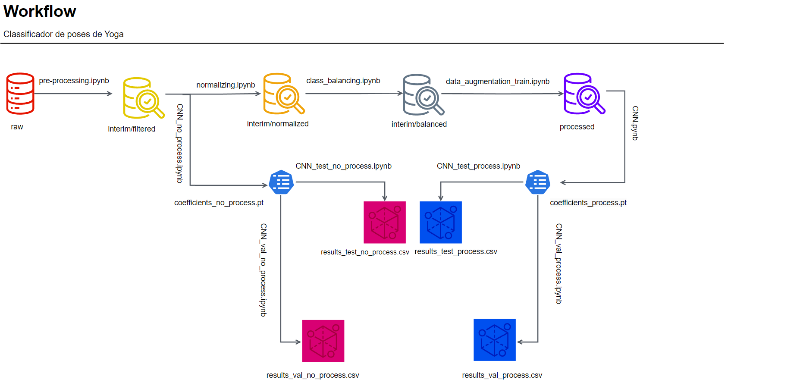

# Classificação de Posturas de Yoga
# Yoga Pose Classification

## Apresentação
---
O presente projeto foi originado no contexto das atividades da disciplina de pós-graduação IA901 - Processamento de Imagens e Reconhecimento de Padrões, oferecida no primeiro semestre de 2023, na Unicamp, sob supervisão da Profa. Dra. Leticia Rittner, do Departamento de Engenharia de Computação e Automação (DCA) da Faculdade de Engenharia Elétrica e de Computação (FEEC).

Nome                           | RA     | Especialização
-------------------------------|--------|------------
Guilherme Urban Boscolo        | 155642 | Aluno Especial - Engenharia Elétrica
Sara Mirthis Dantas dos Santos | 224018 | Aluna Especial - Engenharia Elétrica
Yasmin Martins Perci           | 271281 | Aluna Especial - Engenharia Elétrica

## Descrição do Projeto
A classificação de posturas de yoga pode ser muito útil para instrutores, praticantes e para o desenvolvimento de aplicativos ou dispositivos de assistência. Além disso, esse classificador pode ser aprimorado para aplicações de monitoramento de progresso individual, correção de posturas inadequadas e, consequentemente, prevenção de lesões dos praticantes.

Trabalhos anteriores de classificação de posturas de yoga utilizam deep learning [3], [6] ou técnicas de machine learning para extrair atributos relacionados a ângulos e distância entre pontos do esqueleto e utilizam em classificadores clássicos [2], [5], [7], [12]. 

Inicialmente, o objetivo do projeto era um estudo comparativo entre o desempenho de uma CNN e uma KNN com extração de atributos para classificar 5 posturas de Yoga. A partir de processamento de imagem, com a aplicação de filtros, detecção de bordas, a KNN seria treinada com o vetor resultante do código da cadeia de Freeman, e, a partir das métricas de avaliação, o seu desempenho seria comparado com o de uma CNN.

Porém, na etapa de processamento de dados, observou-se que mesmo testando duas vertentes diferentes de extração de informações e refinando as técnicas complementares, não foram obtidos resultados satisfatórios para todas as imagens, pois muitas ainda apresentavam elementos do fundo após a segmentação. Dessa forma, concluiu-se que a estratégia escolhida para a classificação a partir da extração de atributos apresentava uma complexidade desproporcional à proposta do projeto final da disciplina.

Nesse contexto, o objetivo deste trabalho foi reformulado para realizar um estudo comparativo entre o desempenho de uma CNN com e sem o pré-processamento de dados para classificar 5 posturas de Yoga. A CNN foi treinada com as imagens processadas e, a partir das métricas de avaliação, o seu desempenho foi comparado com o de uma CNN sem pré-processamento, mas com a mesma arquitetura e hiperparâmetros.

# Metodologia

O projeto é composto por três etapas principais, sendo a primeira relacionada ao pré-processamento dos dados, onde eles são analisados, limpos e preparados. Nessa fase, é feita a análise de contaminação entre conjuntos de dados, algo de extrema importância, sobretudo ao se trabalhar com dados de domínio público. Essa contaminação pode causar dificuldades no treinamento do modelo e levar a erros no processo de classificação. Além disso, nesse estágio é feita a seleção e padronização das imagens que serão usadas no processamento.

Depois do pré-processamento de dados, desenvolveu-se uma CNN a partir do modelo MobileNet V2, onde ajustou-se apenas os hiperparâmetros após uma normalização com base na média e o desvio padrão, seguido por um redimensionamento dos dados para tamanho de (128, 128). O modelo MobileNet V2 foi escolhido pela quantidade razoável de 2.230.277 parâmetros treinados, em comparação com modelos mais complexos, como o ResNet ou o Inception. Esse valor foi considerado adequado para o tamanho do dataset, que possui poucas amostras.

 Essa arquitetura de rede neural foi inicialmente adaptada para dispositivos móveis e ambientes com recursos restritos, diminuindo significativamente o número de operações e memória necessária, mantendo uma boa precisão [10].

Posterior ao ajuste de hiperparâmetros da rede (otimizador, taxa de aprendizagem, número de épocas, tamanho do lote, regularização L2), analisou-se o desempenho com base nas curvas de acurácia e loss de treino e validação, além das métricas extraídas da matriz de confusão: F1-score, acurácia, precisão e recall.  

Analisando os resultados de validação, verificou-se a necessidade de aplicação de técnicas de processamento de imagens para melhoria do desempenho do modelo. Foram feitas algumas transformações nas imagens, além de data augmentation para balancear as classes e também aumentar os dados de treino.

Após analisar as métricas por classe, verificou-se a necessidade de balancear as classes através de data augmentation. Por fim, foi feito data augmentation em todas as classes no dataset de teste, a fim de aumentar a quantidade de imagens e melhorar o treinamento. 

Com as imagens já processadas, aplicou-se a mesma CNN e comparou-se o desempenho sem e com o processamento de imagens.

**Processamento:**

Nesta etapa, utilizou-se métodos de processamento de imagens para distinguir as pessoas do restante da imagem, separando-as do plano de fundo. Isso é essencial para isolar as regiões de interesse e facilitar a análise. Uma vez que as pessoas foram detectadas, aplicou-se métodos de extração de características para capturar informações relevantes que possibilitem a classificação das poses que cada pessoa está realizando. Foram abordadas 2 vertentes: extração das posições das articulações através de um esqueleto e o resultante do código da cadeia de Freeman.

O esqueleto de uma imagem é uma forma afinada da mesma, a fim de obter uma representação mais simples da forma de um objeto que facilite a extração de algumas características. A partir da imagem dos esqueletos, os pontos finais e ramificados de cada imagem podem ser extraidos para serem usados como entrada de uma rede como a KNN.

Já o código da cadeia representa a borda de um objeto a partir da posição relativa entre os pixels vizinhos da borda ao invés da coordenada absoluta dos pixels. O código retorna uma sequência formada pelas direções entre cada pixel e o seu consecutivo, até que toda a borda seja analisada. Pode-se ter vizinhança-4 ou vizinhaça-8, conforme mostrado abaixo.

A fim de facilitar o desenvolvimento desta fase, ela foi subdivididas em cinco etapas principais: Remoção de ruídos das imagens, transformações para realce, segmentação, detecção de bordas e extração de características.

A primeira etapa envolve a remoção de ruídos das imagens. Isso é importante para eliminar interferências e imperfeições que possam prejudicar a detecção das pessoas nas imagens, para esse método optou-se por estudar quatro diferentes filtros, sendo eles média, gaussiana, bilateral e filtro morfológico ASF (abertura e fechamento), para então levantar qual deveria ser utilizado no projeto.

Levantou-se um estudo do canal apropriado a ser trabalhado (Matiz, saturação, níveis de cinza), com o intuito de melhorar os realces na imagem e facilitar o processo de segmentação das pessoas.

A etapa de segmentação usou-se diferentes técnicas, a fim de separar a pessoa do plano de fundo e de outros objetos indesejáveis. Entre as técnicas investigadas estão limiarização usando OTSU, *Adaptive Mean*, *Watershed* e *Histogram-based segmentation*.

Após a segmentação, detectou-se as bordas das imagens utilizando o método Canny.

Por fim, avaliou-se qual caminho de técnicas fornece características relevantes para servirem de treinamento na KNN.

**Desenvolvimento da CNN:** 

Com o objetivo de criar um estudo comparativo entre os métodos de processamento de imagem e o uso de uma rede convolucional, desenvolveu-se uma CNN a partir do modelo MobileNet V2,onde ajustou-se apenas os hiperparâmetros após uma normalização e redimensionamento dos dados. O modelo MobileNet V2 foi escolhido pela quantidade razoável de 2.230.277 parâmetros treinados, sendo considerado adequado para o tamanho do dataset, por possuir poucas amostras. Essa arquitetura de rede neural foi inicialmente adaptada para dispositivos móveis e ambientes com recursos restritos, diminuindo significativamente o número de operações e memória necessária, mantendo uma boa precisão.

Com relação ao processamento das imagens, realizou-se um redimensionamento para o tamanho (128,128) e uma normalização. Após realizar testes variando os hiperparâmetros da rede (otimizador, taxa de aprendizagem, número de épocas, tamanho do lote), analisou-se o desempenho da rede, com base na curva de acurácia x *loss*.

## Bases de Dados e Evolução
A base de dados utilizada no projeto foi a "Yoga Poses Dataset", contendo as cinco mais conhecidas poses de Yoga: cachorro olhando para baixo (classe "downdog"), deusa (classe "goddess"), árvore (classe "tree"), prancha (classe "plank") e guerreiro (classe "warrior2").

Ela foi obtida na plataforma Kaggle, disponibilizada pela Niharika Pandit, sob a licença Open Database.

Base de Dados | Endereço na Web | Resumo descritivo
----- | ----- | -----
Título da Base | https://www.kaggle.com/datasets/niharika41298/yoga-poses-dataset | Conjunto de 5 classes com um total de 1551 amostras, sendo 1081 de treino e 470 de teste, nos formatos .jpg, .png e .jpeg.

Abaixo, são mostradas uma imagem de exemplo de cada classe.

Classe downdog |  Classe goddess   | Classe plank | Classe tree | Classe warrior2
:-------------------------:|:-------------------------:|:-------------------------:|:-------------------------:|:-------------------------:
  |   |  |  | 

Como o conjunto de dados já estava separado em pastas de treino e teste e em subpastas com as classes, a primeira etapa consistiu em realizar uma inspeção visual dos dados, onde foi analisado que existia contaminação, ou seja, a mesma informação na pasta de treino e teste, às vezes variando apenas o tamanho das imagens.

Dessa forma, foi criado um *script* para automatizar a limpeza dos dados. Inicialmente, foi feita uma padronização das imagens, visto que elas possuem tamanho e formatos variados. Apenas as imagens RGB no formato PNG foram selecionadas, e em seguida redimensionadas para o tamanho 120x120.

A métrica SSIM (*Structural Similarity Index Method*) foi utilizada a fim de analisar o nível de similaridade entre as imagens no conjunto de treino e teste. Ela compara características estruturais das imagens, levando em consideração elementos como texturas, contrastes e detalhes visuais. O valor do SSIM varia entre -1 até 1, sendo 1 o valor resultante quando as duas imagens comparadas são idênticas, e -1 quando são completamente diferentes. Nesse caso, as imagem com SSIM acima de 0.95 foram consideradas semelhantes e removidas do conjunto de treinamento. 

Por fim, para se obter um conjunto de validação, a pasta de treino desse novo conjunto de dados foi dividida aleatoriamente em treino e validação, na proporção 80%-20%. 

O conjunto de treino representa 55.17% do total de dados, validação 13.04% e teste 31.78%, como pode ser visto na tabela abaixo.

Conjunto de dados   | Quantidade de imagens
--------------------|----------------------
Treino              | 736                  
Validação           | 174                  
Teste               | 424                  

A figura abaixo mostra como ficou distribuido cada classe em cada conjunto de dados. Como pode-se observar, não há um grande desbalanceamento entre classes, porém há menos imagens das classes "tree" e "goddess" em todos os conjuntos de dados.

Por esta razão, foi feito um balanceamento dessas classes através de *data augmentation*, aplicando em 50% das imagens, de forma aleatória, um dos seguintes processamentos: flip horizontal, rotação, zoom, ruído gaussiano, blur. 
Em seguida, foi feito um aumento de todas as classes, a fim de aumentar o conjunto de dados de treinamento. As mesmas transformações foram aplicadas em 80% do conjunto de dados pós-balanceamento, agora podendo ter mais de um tipo de processamento em cada nova imagem.

# Ferramentas

No pré-processamento de dados, utilizou-se a biblioteca “os” para interagir com o sistema operacional e realizar ações como acessar, ler arquivos, entre outros. A fim de eliminar a contaminação dos dados, utilizou-se o módulo “skimage.metrics” da biblioteca “skimage” para calcular índices de similaridade das imagens. A “shutil” foi utilizada para mover as imagens na etapa de divisão dos dados de treinamento em treinamento e validação e a biblioteca “random” para fazer a seleção aleatória das imagens a serem separadas em treinamento e validação.

Para o processamento de imagens, utilizou-se a biblioteca “opencv” para realizar alterações de forma, limiarização, detecção de bordas e outros processamentos, a fim de realizar a segmentação das imagens. De forma complementar, utilizou-se a biblioteca “skimage”, por meio de  módulos referentes a mudanças nas cores e alterações morfológicas. 

Para desenvolver a KNN, utilizou-se o módulo “sklearn.neighbors” da biblioteca “sklearn”. Já a rede CNN foi implementada utilizando a biblioteca “pytorch”, por ser mais flexível para o desenvolvimento de modelos. Também utilizou-se a biblioteca “torchvision” para utilizar as arquiteturas de modelo e transformações de imagem presentes nessa biblioteca. Além disso, utilizou-se a biblioteca “torchsummary” para imprimir os parâmetros treináveis ​​e não treináveis do modelo. Para o acompanhamento das alterações nos modelos, utilizou-se a biblioteca “torch.utils.tensorboard” que possui utilitários que permitem o registro de modelos e métricas do PyTorch em um diretório para visualização na interface do TensorBoard.

Por fim, para avaliar o desempenho da KNN e da CNN foram utilizadas as métricas de acurácia, acurácia balanceada, F1-score e matriz de confusão calculadas por meio de módulos da biblioteca “sklearn”.

# Workflow

O Workflow é um documento que faz todo o mapeamento de como executar todos os códigos desenvolvidos durante o projeto. Ele foi feito na ferramenta Draw.io e está acessível para visualização no formato .png.

O diagrama presente no Workflow inicia-se com as "Fotos Cruas" (pasta data/raw) que representa o conjunto de fotos de domínio público. Essas imagens são a entrada do código "Pré-processamento.pynb", responsável por identificar e remover contaminações entre os dados de treinamento e teste, assim como filtrar o formato de imagem que será usada.  

O resultado deste processo é representado como "Banco de dados"(pasta data/interim) no diagrama, e nele estão contidas as imagens que serão efetivamente usadas durante o projeto. Os códigos "Processamento.pynb" e "CNN.pynb" fazem usos diferentes deste banco de dados. O primeiro executa vários métodos e técnicas de processamento de imagem para obter o "código da cadeia.txt" das imagens do dataset, o que é enviado posteriormente para o código "KNN.pynb" que extrai as informações de classes. O segundo treina uma rede convolucional e gera o arquivo "Coeficientes treinados.pn" que será usado no código "CNN_test.pynb" para gerar os resultados das classes. 

A seguir, é mostrado o workflow do projeto.

# Experimentos e Resultados preliminares

A estrutura de processamento de dados final foi determinada por meio da análise dos resultados obtidos ao aplicar diferentes métodos e técnicas de processamento de imagem. O objetivo era otimizar a detecção de pessoas nas imagens. A seguir, descreveremos os resultados obtidos em cada etapa do processamento de dados.

Na etapa de remoção de ruídos, foi escolhido o filtro bilateral devido à sua capacidade de preservar as bordas e remover os ruídos das imagens. Por outro lado, as técnicas de abertura e fechamento não se mostraram tão eficazes, destacando bordas indesejadas de outros objetos na imagem.

Na seleção do canal apropriado para melhorar os realces na imagem e facilitar a segmentação das pessoas, foram analisadas as representações HSV e escala de cinza. Inicialmente, considerou-se a saturação como o canal prioritário devido ao contraste da cor da pele humana. No entanto, devido à variação do cenário de fundo, a saturação se mostrou menos eficiente, pois algumas regiões das pessoas se confundiam com o fundo. Assim, optou-se pelo uso exclusivo do canal de escala de cinza por meio de uma simples conversão das imagens.

Após a análise comparativa das técnicas de segmentação, a de limiarização por OTSU se destacou como a mais eficaz. Essa técnica conseguiu automaticamente encontrar o valor aceitável de limiar, considerando a distribuição dos níveis de cinza na imagem. Para algumas imagens mais complexas, como com marca d'água, textos e fundo com bastante textura, não foi possível separar totalmente a pessoa na imagem do restante dos objetos.

Com relação a detecção da borda, entre os diversos métodos disponíveis, o Canny se mostrou mais adequado para a tarefa, proporcionando resultados satisfatórios. Além de detectar a borda por meio do gradiente, ele aplica um filtro gaussiano que contribui para remoção de artefatos indesejáveis na imagem.

Comparando as duas vertentes analisadas para a extração de características, optou-se pelo uso do código da cadeia com uma vizinhança de 8. Entretanto, verificou-se que, devido à presença de bordas de outros objetos na imagem, ele acabou representando apenas uma pequena parte das pessoas nas imagens. É importante ressaltar que para a detecção do código da cadeia, foi usado uma transformada morfológica de abertura para a limpeza da imagem e extração do gradiente, para a alimentação do código da cadeia.

A figura a seguir mostra as bordas de uma imagem de teste após processamento, com o resultado do código da cadeia abaixo.

Em seguida, a KNN foi implementada para receber os vetores que representam as imagens do código da cadeia, porém essa etapa foi postergada para melhorar a fase de processamento de dados.

Em paralelo, foi realizado o treinamento de uma rede neural convolucional (CNN) do tipo MobileNet V2, pré-treinada. Para o processamento das imagens, foi realizado apenas um redimensionamento para o tamanho (128,128) e aplicada uma etapa de normalização. Isso foi feito com o objetivo de padronizar os dados de entrada e melhorar o aprendizado da rede.

Durante os experimentos, diversos hiperparâmetros foram variados, incluindo o otimizador, a taxa de aprendizagem, o número de épocas e o tamanho do lote (*batch size*). Após análise das curvas de acurácia e de *loss*, os hiperparâmetros foram ajustados da seguinte forma: 

* Tamanho do lote: 32;
* Otimizador: Adam;
* Taxa de aprendizagem: 0.000015;
* Número de épocas: 40. 

O tamanho do lote foi escolhido de modo que o custo computacional fosse reduzido, mas que fosse evitado o overfitting. Em relação aos otimizadores, observou-se que o Adam convergiu mais rápido para o mínimo global devido aos recursos adaptativos. A taxa de aprendizagem escolhida foi de 0.000015, considerada baixa, para evitar oscilações bruscas no treinamento que atrapalham a convergência do processo de aprendizado. Por estar associada ao otimizador Adam, essa taxa de aprendizado baixa não ocasionou lentidão do treinamento. Dessa forma, em apenas 40 épocas já foi alcançada uma acurácia de validação de 94% e *loss* de 22%, conforme observado nas figuras abaixo. 

A partir dessas figuras observou-se que a convergência ocorreu de forma gradual, em que a *loss* de treinamento ficou muito próxima de 0% e a de validação estabilizou-se em 22%. Com relação a acurácia, a de treinamento alcançou 100%, mas sem apresentar *overfitting*, visto que a curva de loss de validação não aumentou ao longo das épocas, representando que os parâmetros da rede estavam adequados tanto para o conjunto de treinamento quanto para o conjunto de validação. 

# Próximos passos

Na etapa de processamento de dados, observou-se que mesmo testando duas vertentes diferentes de extração de informações e refinando as técnicas complementares, não foram obtidos resultados satisfatórios para todas as imagens, pois muitas ainda apresentavam elementos do fundo após a segmentação. Além disso, analisando trabalhos anteriores com propostas semelhantes, verificou-se que os autores utilizaram técnicas de machine learning para extrair atributos relacionados a ângulos e distâncias entre pontos do esqueleto [2], [5], [7], [12]. Isso corrobora com a ideia de que a estratégia escolhida para a aplicação de técnicas de processamento de imagens apresenta uma complexidade desproporcional à proposta do projeto final da disciplina.

Por esses motivos, decidiu-se alterar a ideia do projeto. Nesse contexto, o objetivo deste trabalho foi reformulado para realizar um estudo comparativo entre o desempenho de uma CNN com e sem o pré-processamento de dados para classificar 5 posturas de Yoga. A partir do processamento de imagem, a CNN será treinada com as imagens processadas e, a partir das métricas de avaliação, o seu desempenho será comparado com o de uma CNN sem pré-processamento, mas com a mesma arquitetura.

Portanto, os próximos passos incluem uma modificação dos códigos de processamento de dados, adaptando as técnicas já utilizadas, retirando as etapas de segmentação e código da cadeia para utilizar as imagens processadas como entrada da CNN. Além disso, serão realizados mais experimentos com a CNN a fim de obter um melhor desempenho sem o uso de redes pré-treinadas.

# Referências

[1] ACHARYA, Akruti. Guide to Image Segmentation in Computer Vision: Best Practices. 2023. Disponível em: https://encord.com/blog/image-segmentation-for-computer-vision-best-practice-guide/. Acesso em: 10 maio 2023.

[2] AGRAWAL, Yash; SHAH, Yash; SHARMA, Abhishek. Implementation of machine learning technique for identification of yoga poses. In: 2020 IEEE 9th international conference on communication systems and network technologies (CSNT). IEEE, 2020. p. 40-43. https://doi.org/10.1109/CSNT48778.2020.9115758 

[3] ASHRAF, Faisal Bin et al. Yonet: A neural network for yoga pose classification. SN Computer Science, v. 4, n. 2, p. 198, 2023. https://doi.org/10.1007/s42979-022-01618-8 

[4] DEEPIKA, Yamuna. Python OpenCV – Pose Estimation. Disponível em: https://www.geeksforgeeks.org/python-opencv-pose-estimation/. Acesso em: 09 maio 2023.

[5] DESAI, Miral; MEWADA, Hiren. A novel approach for yoga pose estimation based on in-depth analysis of human body joint detection accuracy. PeerJ Computer Science, v. 9, p. e1152, 2023. https://peerj.com/articles/cs-1152/

[6] GARG, Shubham; SAXENA, Aman; GUPTA, Richa. Yoga pose classification: a CNN and MediaPipe inspired deep learning approach for real-world application. Journal of Ambient Intelligence and Humanized Computing, p. 1-12, 2022.https://doi.org/10.1007/s12652-022-03910-0

[7] PALANIMEERA, J.; PONMOZHI, K. Classification of yoga pose using machine learning techniques. Materials Today: Proceedings, v. 37, p. 2930-2933, 2021. https://doi.org/10.1016/j.matpr.2020.08.700  

[8] PEDRINI, Hélio; SCHWARTZ, William Robson. Análise de imagens digitais: princípios, algoritmos e aplicações. Cengage Learning, 2008.

[9] RAJENDRAN, Arun Kumar; SETHURAMAN, Sibi Chakkaravarthy. A Survey on Yogic Posture Recognition. IEEE Access, v. 11, p. 11183-11223, 2023.https://doi.org/10.1109/ACCESS.2023.3240769 

[10] SANDLER, Mark et al. Mobilenetv2: Inverted residuals and linear bottlenecks. In: Proceedings of the IEEE conference on computer vision and pattern recognition. 2018. p. 4510-4520. https://doi.org/10.48550/arXiv.1801.04381 

[11] WALIA, Mrinal Singh. Guide to Image Segmentation in Computer Vision: Best Practices. 2022. Disponível em: https://www.analyticsvidhya.com/blog/2022/01/a-comprehensive-guide-on-human-pose-estimation/. Acesso em: 10 maio 2023.

[12] WU, Yubin et al. A computer vision-based yoga pose grading approach using contrastive skeleton feature representations. In: Healthcare. MDPI, 2021. p. 36. https://doi.org/10.3390/healthcare10010036 
