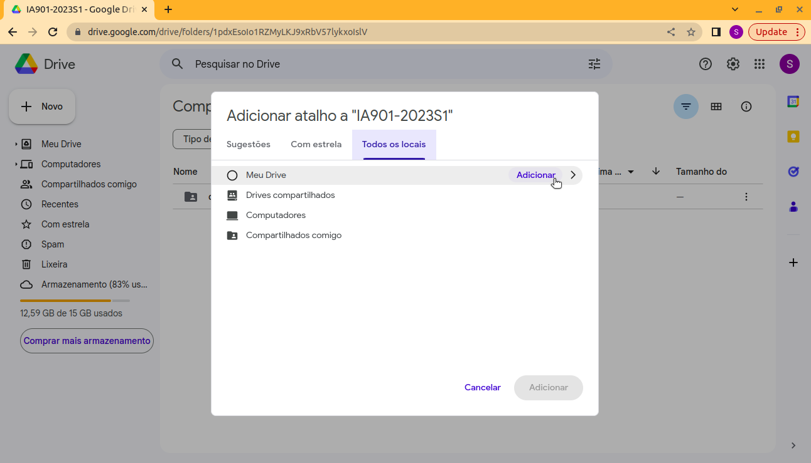

# Instruções

Esta pasta contém 10 imagens de exemplos em cada um conjunto de dados.
Para ter acesso a todas as amostras para executar os notebooks, é necessário acessar a seguinte página no Google Drive: https://drive.google.com/drive/folders/1pdxEsoIo1RZMyLKJ9xRbV57lykxoIslV?usp=sharing

Após acessar o link, é necessário adicionar um atalho dessa pasta ao "Meu Drive", conforme mostrado abaixo:

# Organização da pasta
A pasta "data" é organizada da seguinte forma:

~~~
├── data
    ├── raw            <- dados originais sem modificações
    ├── interim        <- dados intermediários
    |   ├── filtered   <- dados filtrados (saída do notebook pre-processing.ipynb)
    |   ├── normalized <- dados normalizados (saída do notebook normalizing.ipynb)
    |   └── balanced   <- dados com classes balanceadas (saída do notebook class_balacing.ipynb)
    ├── processed      <- dados finais processados (saída do notebook data_augmentation_train.ipynb)
    ├── weights        <- pesos dos modelos (saída dos notebook CNN.ipynb e CNN_no_process.ipynb)
    ├── results        <- métricas dos modelos (saída dos notebook CNN_val_process.ipynb, CNN_val_no_process.ipynb, CNN_test_process.ipynb e CNN_test_no_process.ipynb)
    └── README.md      <- instruções da pasta
~~~